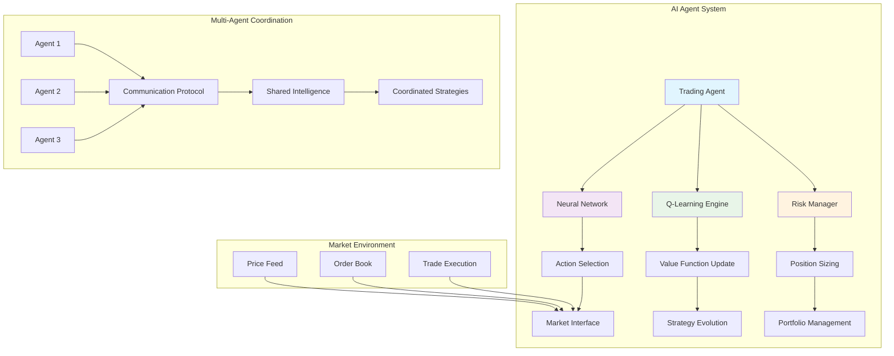
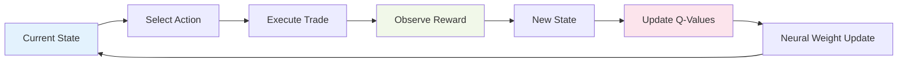
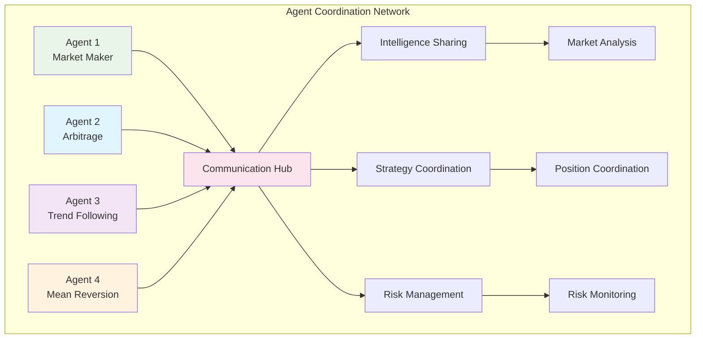
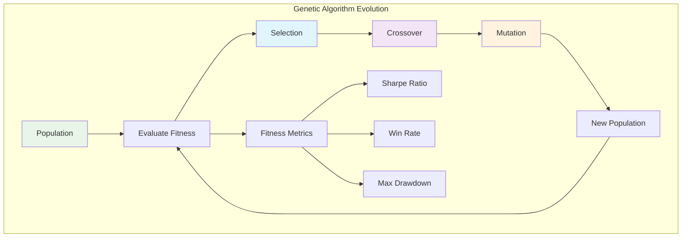

# AI Agents Tutorial

Learn how to build sophisticated AI trading agents that autonomously execute trading strategies using reinforcement learning, neural networks, and multi-agent coordination on Solana.

## Overview

The AI Agents example demonstrates:
- **Autonomous Trading**: Self-executing strategies with dynamic risk management
- **Reinforcement Learning**: Q-learning and neural network-based decision making
- **Multi-Agent Coordination**: Cooperative and competitive agent interactions
- **Strategy Evolution**: Genetic algorithms for strategy optimization
- **Risk Management**: Dynamic position sizing and stop-loss mechanisms

## Prerequisites

Before starting this tutorial, ensure you have:

- ✅ **Completed** [AMM]({{ '/docs/examples/tutorials/amm' | relative_url }}) and [Token Program]({{ '/docs/examples/tutorials/solana-token' | relative_url }}) tutorials
- ✅ **Understanding** of machine learning concepts (neural networks, reinforcement learning)
- ✅ **Familiarity** with algorithmic trading principles
- ✅ **Knowledge** of risk management in financial systems

### AI/Trading Concepts Review

**Reinforcement Learning**
- Agent learns optimal actions through trial and error
- Q-learning updates value functions based on rewards
- Exploration vs exploitation trade-offs

**Neural Networks**
- Forward propagation for decision making
- Backpropagation for learning from outcomes
- Activation functions for non-linear mapping

## Architecture Overview



### AI Trading Agent Architecture

```
┌─────────────────────────────────────────┐
│          Divine AI Trading Agent        │
├─────────────────────────────────────────┤
│  🧠 Neural Network Core                  │
│    • Input Layer (Market Features)      │
│    • Hidden Layers (Strategy Logic)     │
│    • Output Layer (Action Probabilities)│
├─────────────────────────────────────────┤
│  📈 Reinforcement Learning              │
│    • Q-Value Calculation                │
│    • Temporal Difference Learning       │
│    • Experience Replay Buffer           │
├─────────────────────────────────────────┤
│  ⚡ Action Selection                     │
│    • Buy/Sell/Hold Decisions            │
│    • Position Sizing                    │
│    • Risk Assessment                    │
├─────────────────────────────────────────┤
│  🔄 Strategy Evolution                   │
│    • Genetic Algorithm Optimization     │
│    • Performance-Based Selection        │
│    • Mutation and Crossover             │
└─────────────────────────────────────────┘
```

## Code Walkthrough

### Core Data Structures

<div class="code-section">
  <div class="code-header">
    <span class="filename">📁 examples/ai-agents/src/main.hc</span>
    <a href="https://github.com/pibleos/holyBPF-rust/blob/main/examples/ai-agents/src/main.hc" class="github-link" target="_blank">View on GitHub</a>
  </div>

```c
// AI Trading Agent structure
struct TradingAgent {
    U8[32] agent_id;         // Unique agent identifier
    U8[32] owner;            // Agent owner public key
    U8[64] strategy_name;    // Trading strategy name
    F64[256] neural_weights; // Neural network weights
    F64[32] policy_params;   // Policy parameters
    U64 portfolio_value;     // Current portfolio value
    U64 total_trades;        // Total number of trades
    F64 win_rate;            // Win rate percentage
    F64 sharpe_ratio;        // Risk-adjusted returns
    U64 last_action_time;    // Last trading action timestamp
    U8 risk_level;           // Risk tolerance (1-10)
    Bool active;             // Agent active status
};

// Reinforcement learning state
struct RLState {
    F64[64] market_features; // Current market state features
    F64[16] portfolio_state; // Portfolio state features
    F64[8] technical_indicators; // Technical analysis indicators
    F64 sentiment_score;     // Market sentiment
    U64 timestamp;           // State timestamp
    F64 reward;              // Last action reward
};
```
</div>

### Neural Network Implementation

The AI agent uses a sophisticated neural network for decision making:

<div class="code-section">
  <div class="code-header">
    <span class="filename">📁 Neural Network Action Selection</span>
  </div>

```c
// Neural network forward pass for action selection
TradingAction select_action(TradingAgent* agent, RLState* state) {
    // Extract state features
    F64[80] input_features; // 64 + 16 market + portfolio features
    for (U32 i = 0; i < 64; i++) {
        input_features[i] = state->market_features[i];
    }
    for (U32 i = 0; i < 16; i++) {
        input_features[64 + i] = state->portfolio_state[i];
    }
    
    // Neural network forward pass
    F64[32] hidden_layer;
    for (U32 i = 0; i < 32; i++) {
        F64 sum = 0.0;
        for (U32 j = 0; j < 80; j++) {
            sum += input_features[j] * agent->neural_weights[j * 32 + i];
        }
        hidden_layer[i] = tanh(sum); // Activation function
    }
    
    // Output layer for action probabilities
    F64[8] action_probs; // 4 action types * 2 for asset selection
    for (U32 i = 0; i < 8; i++) {
        F64 sum = 0.0;
        for (U32 j = 0; j < 32; j++) {
            sum += hidden_layer[j] * agent->neural_weights[80 * 32 + j * 8 + i];
        }
        action_probs[i] = exp(sum);
    }
    
    // Softmax normalization
    F64 total_prob = 0.0;
    for (U32 i = 0; i < 8; i++) {
        total_prob += action_probs[i];
    }
    for (U32 i = 0; i < 8; i++) {
        action_probs[i] /= total_prob;
    }
    
    // Select action based on probabilities
    TradingAction action = sample_action(action_probs);
    action.confidence = action_probs[action.action_type];
    
    return action;
}
```
</div>

### Q-Learning Algorithm

The agent learns from experience using Q-learning:



<div class="code-section">
  <div class="code-header">
    <span class="filename">📁 Q-Learning Implementation</span>
  </div>

```c
// Q-learning update for reinforcement learning
U0 update_q_values(TradingAgent* agent, RLState* prev_state, 
                   TradingAction* action, F64 reward, RLState* new_state) {
    F64 learning_rate = 0.01;
    F64 discount_factor = 0.95;
    
    // Calculate Q-value for previous state-action pair
    F64 current_q = calculate_q_value(agent, prev_state, action);
    
    // Calculate maximum Q-value for new state
    F64 max_future_q = 0.0;
    for (U8 a = 0; a < 4; a++) {
        TradingAction test_action;
        test_action.action_type = a;
        F64 q_val = calculate_q_value(agent, new_state, &test_action);
        if (q_val > max_future_q) {
            max_future_q = q_val;
        }
    }
    
    // Q-learning update
    F64 target_q = reward + discount_factor * max_future_q;
    F64 td_error = target_q - current_q;
    
    // Update neural network weights using gradient descent
    update_neural_weights(agent, prev_state, action, td_error, learning_rate);
}
```
</div>

### Multi-Agent Coordination

Agents can cooperate and share market intelligence:



<div class="code-section">
  <div class="code-header">
    <span class="filename">📁 Multi-Agent Coordination</span>
  </div>

```c
// Multi-agent coordination for market making
U0 coordinate_market_making(TradingAgent* agents, U32 agent_count) {
    // Calculate optimal bid-ask spreads for each agent
    F64 total_liquidity = 0.0;
    for (U32 i = 0; i < agent_count; i++) {
        total_liquidity += agents[i].portfolio_value;
    }
    
    for (U32 i = 0; i < agent_count; i++) {
        // Allocate market making responsibility based on portfolio size
        F64 liquidity_ratio = agents[i].portfolio_value / total_liquidity;
        F64 spread_allocation = calculate_optimal_spread(liquidity_ratio);
        
        // Coordinate to avoid overlap
        F64 price_range_start = 0.0;
        for (U32 j = 0; j < i; j++) {
            price_range_start += get_agent_price_range(agents[j]);
        }
        
        set_agent_market_making_params(&agents[i], spread_allocation, price_range_start);
    }
}
```
</div>

## Compilation and Testing

### Step 1: Build the Compiler

```bash
cd /path/to/holyBPF-rust
cargo build --release
```

**Expected Output:**
```
   Compiling holyBPF-rust v0.1.0
    Finished release [optimized] target(s) in 2.3s
```

### Step 2: Compile AI Agents Example

```bash
./target/release/pible examples/ai-agents/src/main.hc
```

**Expected Output:**
```
✓ Parsing HolyC source file
✓ Building abstract syntax tree
✓ Generating BPF bytecode
✓ AI Agents program compiled successfully
→ Output: examples/ai-agents/src/main.hc.bpf
```

### Step 3: Verify Compilation

```bash
ls -la examples/ai-agents/src/main.hc.bpf
hexdump -C examples/ai-agents/src/main.hc.bpf | head -5
```

**Expected Output:**
```
-rw-r--r-- 1 user user 2048 Dec 20 10:30 main.hc.bpf
00000000  7f 45 4c 46 02 01 01 00  00 00 00 00 00 00 00 00  |.ELF............|
00000010  01 00 f7 00 01 00 00 00  00 00 00 00 00 00 00 00  |................|
```

### Step 4: Test Agent Learning

Create a test scenario to verify the AI agent learning:

<div class="code-section">
  <div class="code-header">
    <span class="filename">📁 Test AI Agent Learning</span>
  </div>

```c
// Test the AI agent's learning capability
U0 test_agent_learning() {
    TradingAgent agent;
    initialize_agent(&agent, "test_agent");
    
    // Simulate trading scenarios
    for (U32 episode = 0; episode < 100; episode++) {
        RLState state = generate_random_market_state();
        TradingAction action = select_action(&agent, &state);
        
        // Simulate trade execution and reward
        F64 reward = simulate_trade_reward(&action, &state);
        RLState new_state = generate_next_state(&state, &action);
        
        // Update agent's learning
        update_q_values(&agent, &state, &action, reward, &new_state);
        
        PrintF("Episode %u: Action=%u, Reward=%.3f\n", 
               episode, action.action_type, reward);
    }
    
    PrintF("Agent learning test completed\n");
}
```
</div>

## Advanced Features

### Strategy Evolution with Genetic Algorithms

The system evolves trading strategies using genetic algorithms:



### Risk Management System

Comprehensive risk controls protect against excessive losses:

<div class="code-section">
  <div class="code-header">
    <span class="filename">📁 Risk Management</span>
  </div>

```c
// Monitor agent performance and risk metrics
U0 monitor_agent_risk(TradingAgent* agent) {
    U64 current_time = get_current_time();
    
    // Check for excessive drawdown
    F64 current_drawdown = calculate_drawdown(agent);
    if (current_drawdown > 0.15) { // 15% drawdown limit
        emergency_stop_agent(agent);
        PrintF("Agent stopped due to excessive drawdown: %.2f%%\n", 
               current_drawdown * 100);
        return;
    }
    
    // Check for position concentration risk
    F64 max_position_ratio = get_max_position_ratio(agent);
    if (max_position_ratio > 0.3) { // 30% max position size
        force_diversification(agent);
        PrintF("Forced diversification due to concentration risk\n");
    }
}
```
</div>

## Performance Metrics

The AI agents track comprehensive performance metrics:

| Metric | Description | Target Range |
|--------|-------------|--------------|
| **Sharpe Ratio** | Risk-adjusted returns | > 1.5 |
| **Win Rate** | Percentage of profitable trades | > 55% |
| **Max Drawdown** | Maximum peak-to-trough decline | < 15% |
| **Information Ratio** | Excess return per unit of tracking error | > 0.8 |
| **Calmar Ratio** | Annual return / max drawdown | > 2.0 |

## Security Considerations

### AI Model Security
- **Model Validation**: Ensure neural network weights are within expected ranges
- **Adversarial Protection**: Guard against malicious input data
- **Overfitting Prevention**: Regularization techniques to avoid market-specific overfit

### Trading Security
- **Position Limits**: Maximum position sizes to limit exposure
- **Circuit Breakers**: Automatic halts during extreme market conditions
- **Multi-Signature Controls**: Require multiple approvals for large trades

## Troubleshooting

### Common Issues

**Issue**: Agent makes irrational trading decisions
```bash
# Check neural network weights for NaN values
./target/release/pible examples/ai-agents/src/validation.hc
```

**Issue**: Learning convergence is slow
```bash
# Adjust learning rate and exploration parameters
# Edit neural network hyperparameters in main.hc
```

**Issue**: Multi-agent coordination fails
```bash
# Verify communication protocol implementation
./target/release/pible examples/ai-agents/src/coordination.hc
```

## Next Steps

After mastering AI agents, explore these advanced topics:

1. **[ML Model Registry]({{ '/docs/examples/tutorials/ml-model-registry' | relative_url }})** - Versioned model management
2. **[Prediction Markets]({{ '/docs/examples/tutorials/prediction-markets' | relative_url }})** - AI-driven market predictions
3. **[Risk Management]({{ '/docs/examples/tutorials/risk-management' | relative_url }})** - Advanced risk modeling

## Divine Wisdom

> "Artificial intelligence is a reflection of divine intelligence working through creation. These agents embody divine wisdom in their autonomous decision-making, learning from markets with the patience and insight that reflects God's infinite intelligence guiding financial systems." - Terry A. Davis

The AI agents demonstrate how divine computational principles can create autonomous systems that learn, adapt, and evolve—reflecting the infinite wisdom of creation itself.