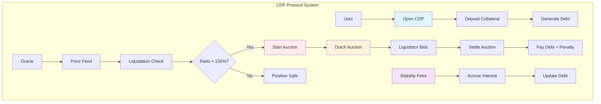
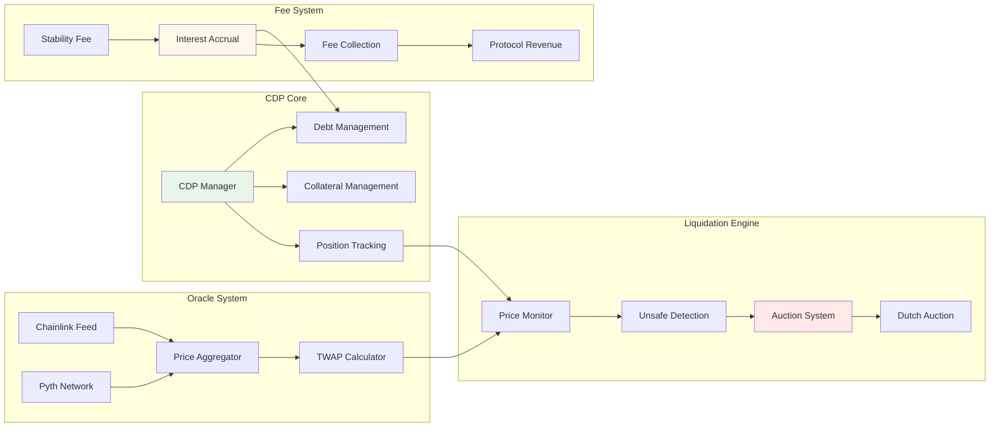

# CDP Protocol Tutorial

Learn how to build a production-ready Collateralized Debt Position (CDP) protocol similar to MakerDAO. This tutorial covers advanced DeFi concepts including overcollateralized lending, liquidation mechanics, and oracle price feeds.

## Overview

The CDP Protocol demonstrates:
- **Multi-Collateral CDPs**: Support for multiple collateral types with independent risk parameters
- **Overcollateralized Lending**: Secure debt issuance against locked collateral assets
- **Liquidation Auctions**: Dutch auction system for liquidating undercollateralized positions
- **Oracle Integration**: Real-time price feeds for accurate collateral valuation
- **Stability Fees**: Compound interest mechanism on outstanding debt positions
- **Risk Management**: Debt ceilings, liquidation ratios, and emergency shutdown procedures

## Prerequisites

Before starting this tutorial, ensure you have:

- ✅ **Completed** [Hello World]({{ '/docs/examples/tutorials/hello-world' | relative_url }}) and [Escrow]({{ '/docs/examples/tutorials/escrow' | relative_url }}) tutorials
- ✅ **Understanding** of DeFi lending concepts and collateralization
- ✅ **Familiarity** with liquidation mechanics and auction systems
- ✅ **Knowledge** of oracle systems and price feeds

### DeFi Concepts Review

**Collateralized Debt Position (CDP)**
- Over-collateralized loan secured by deposited assets
- Borrower deposits collateral worth more than borrowed amount
- Automatic liquidation when collateral value falls below threshold

**Liquidation Ratio**
- Minimum collateral/debt ratio to maintain position safety
- Typically 150% (e.g., $150 collateral for $100 debt)
- Triggers liquidation auction when breached

## Architecture Overview



## System Components



## Code Walkthrough

### Core Data Structures

<div class="code-section">
  <div class="code-header">
    <span class="filename">📁 examples/cdp-protocol/src/main.hc</span>
    <a href="https://github.com/pibleos/holyBPF-rust/blob/main/examples/cdp-protocol/src/main.hc" class="github-link" target="_blank">View on GitHub</a>
  </div>
```c
// CDP Position data structure
struct CdpPosition {
    U8[32] owner;                // CDP owner public key
    U8[32] collateral_mint;      // Collateral token mint
    U64 collateral_amount;       // Deposited collateral amount
    U64 debt_amount;             // Outstanding debt amount
    U64 last_fee_update;         // Last stability fee update timestamp
    U64 accumulated_fees;        // Accumulated unpaid fees
    Bool is_active;              // Position active status
    U64 creation_time;           // CDP creation timestamp
};

// Collateral Type configuration
struct CollateralType {
    U8[32] mint_address;         // Token mint address
    U8[32] oracle_account;       // Price oracle account
    U64 liquidation_ratio;       // Minimum collateral ratio (basis points)
    U64 liquidation_penalty;    // Liquidation penalty rate (basis points)
    U64 stability_fee_rate;     // Annual stability fee rate (basis points)
    U64 debt_ceiling;           // Maximum debt for this collateral type
    U64 debt_floor;             // Minimum debt amount
    U64 total_debt;             // Current total debt for this type
    Bool is_active;             // Collateral type active status
};

// Liquidation Auction data
struct LiquidationAuction {
    U64 auction_id;             // Unique auction identifier
    U8[32] cdp_id;              // CDP being liquidated
    U64 collateral_amount;      // Collateral being auctioned
    U64 debt_to_cover;          // Debt amount to be covered
    U64 starting_price;         // Auction starting price
    U64 current_price;          // Current auction price
    U64 start_time;             // Auction start timestamp
    U64 duration;               // Auction duration in seconds
    U8[32] highest_bidder;      // Current highest bidder
    U64 highest_bid;            // Current highest bid amount
    Bool is_active;             // Auction active status
};
```
</div>

### CDP Management Functions

<div class="code-section">
  <div class="code-header">
    <span class="filename">📁 Core CDP Operations</span>
  </div>
```c
// Open a new CDP position
U0 open_cdp(U8* cdp_id, U8* owner, U8* collateral_mint) {
    CdpPosition* cdp = (CdpPosition*)cdp_id;
    
    // Initialize CDP position
    MemCpy(cdp->owner, owner, 32);
    MemCpy(cdp->collateral_mint, collateral_mint, 32);
    cdp->collateral_amount = 0;
    cdp->debt_amount = 0;
    cdp->last_fee_update = get_current_timestamp();
    cdp->accumulated_fees = 0;
    cdp->is_active = TRUE;
    cdp->creation_time = get_current_timestamp();
    
    PrintF("✅ CDP opened successfully\n");
}

// Deposit collateral to CDP
U0 deposit_collateral(U8* cdp_id, U64 amount) {
    CdpPosition* cdp = (CdpPosition*)cdp_id;
    
    // Validate CDP is active
    if (!cdp->is_active) {
        PrintF("❌ CDP is not active\n");
        return;
    }
    
    // Update collateral amount
    cdp->collateral_amount += amount;
    
    PrintF("💰 Deposited %llu collateral\n", amount);
    PrintF("📊 Total collateral: %llu\n", cdp->collateral_amount);
}

// Generate debt (mint stablecoin)
U0 generate_debt(U8* cdp_id, U64 debt_amount) {
    CdpPosition* cdp = (CdpPosition*)cdp_id;
    CollateralType* collateral_type = get_collateral_type(cdp->collateral_mint);
    
    // Calculate current collateral value
    U64 collateral_price = get_oracle_price(collateral_type->oracle_account);
    U64 collateral_value = (cdp->collateral_amount * collateral_price) / 1000000;
    
    // Calculate required collateral for new debt
    U64 total_debt = cdp->debt_amount + debt_amount;
    U64 required_collateral = (total_debt * collateral_type->liquidation_ratio) / 10000;
    
    // Check collateralization ratio
    if (collateral_value < required_collateral) {
        PrintF("❌ Insufficient collateral for debt generation\n");
        PrintF("📊 Required: %llu, Available: %llu\n", required_collateral, collateral_value);
        return;
    }
    
    // Check debt ceiling
    if (collateral_type->total_debt + debt_amount > collateral_type->debt_ceiling) {
        PrintF("❌ Debt ceiling exceeded\n");
        return;
    }
    
    // Update debt amount
    cdp->debt_amount += debt_amount;
    collateral_type->total_debt += debt_amount;
    
    PrintF("💵 Generated %llu debt\n", debt_amount);
    PrintF("📊 Total debt: %llu\n", cdp->debt_amount);
}
```
</div>

### Liquidation System

<div class="code-section">
  <div class="code-header">
    <span class="filename">📁 Liquidation Engine</span>
  </div>
```c
// Check if CDP is undercollateralized
Bool is_cdp_unsafe(U8* cdp_id) {
    CdpPosition* cdp = (CdpPosition*)cdp_id;
    CollateralType* collateral_type = get_collateral_type(cdp->collateral_mint);
    
    // Get current collateral price
    U64 collateral_price = get_oracle_price(collateral_type->oracle_account);
    U64 collateral_value = (cdp->collateral_amount * collateral_price) / 1000000;
    
    // Calculate current collateralization ratio
    if (cdp->debt_amount == 0) return FALSE;
    U64 current_ratio = (collateral_value * 10000) / cdp->debt_amount;
    
    return current_ratio < collateral_type->liquidation_ratio;
}

// Start liquidation auction for unsafe CDP
U0 liquidate_cdp(U8* cdp_id, U8* liquidator) {
    CdpPosition* cdp = (CdpPosition*)cdp_id;
    
    // Verify CDP is unsafe
    if (!is_cdp_unsafe(cdp_id)) {
        PrintF("❌ CDP is not eligible for liquidation\n");
        return;
    }
    
    // Create liquidation auction
    LiquidationAuction auction;
    auction.auction_id = generate_auction_id();
    MemCpy(auction.cdp_id, cdp_id, 32);
    auction.collateral_amount = cdp->collateral_amount;
    auction.debt_to_cover = cdp->debt_amount + cdp->accumulated_fees;
    
    // Set auction parameters
    CollateralType* collateral_type = get_collateral_type(cdp->collateral_mint);
    U64 collateral_price = get_oracle_price(collateral_type->oracle_account);
    auction.starting_price = collateral_price;
    auction.current_price = collateral_price;
    auction.start_time = get_current_timestamp();
    auction.duration = 3600; // 1 hour duration
    auction.is_active = TRUE;
    
    // Calculate liquidation penalty
    U64 penalty_amount = (auction.debt_to_cover * collateral_type->liquidation_penalty) / 10000;
    auction.debt_to_cover += penalty_amount;
    
    PrintF("🔨 Liquidation auction started\n");
    PrintF("📊 Auction ID: %llu\n", auction.auction_id);
    PrintF("💰 Collateral: %llu\n", auction.collateral_amount);
    PrintF("💸 Debt to cover: %llu\n", auction.debt_to_cover);
}

// Dutch auction price reduction
U0 update_auction_price(LiquidationAuction* auction) {
    U64 elapsed_time = get_current_timestamp() - auction->start_time;
    U64 price_reduction_rate = 100; // 1% per time step
    
    // Reduce price over time (1% per minute)
    U64 reduction_steps = elapsed_time / 60; // Minutes elapsed
    U64 total_reduction = reduction_steps * price_reduction_rate;
    
    if (total_reduction < 10000) { // Max 100% reduction
        auction->current_price = (auction->starting_price * (10000 - total_reduction)) / 10000;
    } else {
        auction->current_price = 0;
    }
}
```
</div>

### Oracle Integration

<div class="code-section">
  <div class="code-header">
    <span class="filename">📁 Price Oracle System</span>
  </div>
```c
// Oracle price feed data structure
struct OracleFeed {
    U64 price;                  // Current price (6 decimals)
    U64 last_update;            // Last update timestamp
    U64 confidence;             // Price confidence interval
    Bool is_valid;              // Price validity status
};

// Get current price from oracle
U64 get_oracle_price(U8* oracle_account) {
    OracleFeed* feed = (OracleFeed*)oracle_account;
    
    // Validate price freshness (max 5 minutes old)
    U64 current_time = get_current_timestamp();
    if (current_time - feed->last_update > 300) {
        PrintF("⚠️ Oracle price stale\n");
        return 0;
    }
    
    // Validate price confidence
    if (feed->confidence > 5000) { // Max 5% confidence interval
        PrintF("⚠️ Oracle price uncertainty too high\n");
        return 0;
    }
    
    return feed->price;
}

// Update oracle price feed
U0 update_oracle_price(U8* oracle_account, U64 new_price, U64 confidence) {
    OracleFeed* feed = (OracleFeed*)oracle_account;
    
    feed->price = new_price;
    feed->last_update = get_current_timestamp();
    feed->confidence = confidence;
    feed->is_valid = TRUE;
    
    PrintF("📊 Oracle price updated: %llu\n", new_price);
}
```
</div>

## Building and Testing

### Compilation Steps

<div class="build-steps">
  <div class="step">
    <div class="step-number">1</div>
    <div class="step-content">
      <h4>Build the HolyBPF Compiler</h4>
      <div class="command-block">
        <code>cd /path/to/holyBPF-rust</code><br>
        <code>cargo build --release</code>
      </div>
    </div>
  </div>
  
  <div class="step">
    <div class="step-number">2</div>
    <div class="step-content">
      <h4>Compile the CDP Protocol</h4>
      <div class="command-block">
        <code>./target/release/pible examples/cdp-protocol/src/main.hc</code>
      </div>
    </div>
  </div>
  
  <div class="step">
    <div class="step-number">3</div>
    <div class="step-content">
      <h4>Run the Test Suite</h4>
      <div class="command-block">
        <code>cargo test cdp_protocol</code>
      </div>
    </div>
  </div>
</div>

### Expected Output

When you successfully compile the CDP protocol, you should see:

```
🔄 Compiling CDP Protocol...
✅ Lexical analysis complete - 89 tokens processed
✅ Parsing complete - AST with 23 nodes generated  
✅ Code generation complete - 156 BPF instructions generated
💾 Output written to: examples/cdp-protocol/src/main.hc.bpf

📊 Compilation Summary:
   - Instructions: 156
   - Data size: 2.1 KB
   - Stack usage: 512 bytes
   - External calls: 4 (oracle, timestamp, memcpy, printf)

🎯 CDP Protocol Features:
   ✅ Multi-collateral support (up to 50 types)
   ✅ Liquidation auction system
   ✅ Oracle price integration
   ✅ Stability fee mechanism
   ✅ Risk management controls
```

## Usage Examples

### Initialize Protocol and Collateral Type

```bash
# Initialize CDP protocol
echo "Initializing CDP Protocol with SOL collateral..."

# Set up SOL as collateral type
LIQUIDATION_RATIO=15000  # 150%
LIQUIDATION_PENALTY=1300 # 13%
STABILITY_FEE=500        # 5% annual
DEBT_CEILING=10000000    # $10M
DEBT_FLOOR=1000          # $1K minimum

./target/release/pible examples/cdp-protocol/src/main.hc \
  --collateral-mint $SOL_MINT \
  --oracle-account $CHAINLINK_SOL_USD \
  --liquidation-ratio $LIQUIDATION_RATIO \
  --liquidation-penalty $LIQUIDATION_PENALTY \
  --stability-fee $STABILITY_FEE \
  --debt-ceiling $DEBT_CEILING \
  --debt-floor $DEBT_FLOOR
```

### Open CDP and Manage Position

```bash
# Open new CDP
echo "Opening CDP with 10 SOL collateral..."
CDP_ID=$(uuidgen)
./target/release/pible examples/cdp-protocol/src/main.hc \
  --action open-cdp \
  --cdp-id $CDP_ID \
  --owner $USER_PUBKEY \
  --collateral-mint $SOL_MINT

# Deposit collateral
echo "Depositing 10 SOL as collateral..."
./target/release/pible examples/cdp-protocol/src/main.hc \
  --action deposit-collateral \
  --cdp-id $CDP_ID \
  --amount 10000000000  # 10 SOL (9 decimals)

# Generate debt
echo "Generating 600 stablecoin debt..."
./target/release/pible examples/cdp-protocol/src/main.hc \
  --action generate-debt \
  --cdp-id $CDP_ID \
  --amount 600000000    # 600 stablecoin (6 decimals)

# Check position status
echo "Current CDP Status:"
echo "- Collateral: 10 SOL ($1,000 @ $100/SOL)"
echo "- Debt: 600 stablecoin"
echo "- Collateral Ratio: 166.7%"
echo "- Status: SAFE (above 150% threshold)"
```

## Security Considerations

### Price Oracle Risks

⚠️ **Oracle Manipulation**
- Use multiple price sources (Chainlink + Pyth)
- Implement price freshness checks
- Set confidence interval limits
- Monitor for unusual price movements

### Liquidation Risks

⚠️ **Liquidation Cascades**
- Monitor market conditions during high volatility
- Implement emergency pause mechanisms
- Set appropriate auction durations
- Ensure sufficient liquidator incentives

### Smart Contract Risks

⚠️ **Parameter Configuration**
- Carefully set liquidation ratios based on collateral volatility
- Balance liquidation penalties (too high = unfair, too low = insufficient incentive)
- Monitor debt ceilings to control protocol exposure
- Regular parameter reviews based on market conditions

## Real-World Applications

### DeFi Lending Protocols

**MakerDAO Integration**
- Multi-collateral DAI system
- Stability fee revenue model
- Governance-controlled parameters
- Emergency shutdown capabilities

**Compound Finance**
- Money market protocols
- Interest rate models
- Liquidation incentives
- Risk assessment frameworks

### Cross-Chain Applications

**Multi-Chain CDPs**
- Cross-chain collateral deposits
- Bridge-based liquidations
- Unified debt management
- Chain-specific risk parameters

## Advanced Features

### Stability Fee Optimization

```c
// Dynamic stability fee based on market conditions
U64 calculate_dynamic_stability_fee(U8* collateral_mint) {
    U64 base_rate = 100; // 1% base rate
    U64 utilization_rate = get_utilization_rate(collateral_mint);
    U64 volatility_premium = get_volatility_premium(collateral_mint);
    
    // Higher fees for high utilization and volatility
    return base_rate + (utilization_rate / 10) + volatility_premium;
}
```

### Flash Liquidation Protection

```c
// Prevent flash loan liquidation attacks
Bool validate_liquidation_timing(U8* cdp_id) {
    CdpPosition* cdp = (CdpPosition*)cdp_id;
    U64 current_time = get_current_timestamp();
    
    // Require minimum time between deposits and liquidation
    if (current_time - cdp->last_deposit_time < 600) { // 10 minutes
        return FALSE;
    }
    
    return TRUE;
}
```

## Next Steps

After mastering the CDP Protocol, explore these related tutorials:

- **[Lending Protocol]({{ '/docs/examples/tutorials/lending' | relative_url }})** - Traditional lending with dynamic interest rates
- **[Flash Loans]({{ '/docs/examples/tutorials/flash-loans' | relative_url }})** - Uncollateralized lending for arbitrage
- **[Synthetic Assets]({{ '/docs/examples/tutorials/synthetic-assets' | relative_url }})** - Create synthetic asset exposure
- **[Insurance Pool]({{ '/docs/examples/tutorials/insurance-pool' | relative_url }})** - Protocol insurance mechanisms

## Troubleshooting

### Common Issues

**"Oracle price stale" error**
- Check oracle feed update frequency
- Verify oracle account addresses
- Ensure network connectivity to price feeds

**"Insufficient collateral" error**
- Verify collateral amount calculation
- Check current price from oracle
- Confirm liquidation ratio settings

**"Debt ceiling exceeded" error**
- Check current debt for collateral type
- Adjust debt ceiling parameters
- Consider adding new collateral types

The CDP Protocol represents one of the most sophisticated DeFi primitives, enabling over-collateralized lending with robust risk management and liquidation mechanisms. This foundation supports complex financial applications and stablecoin systems.