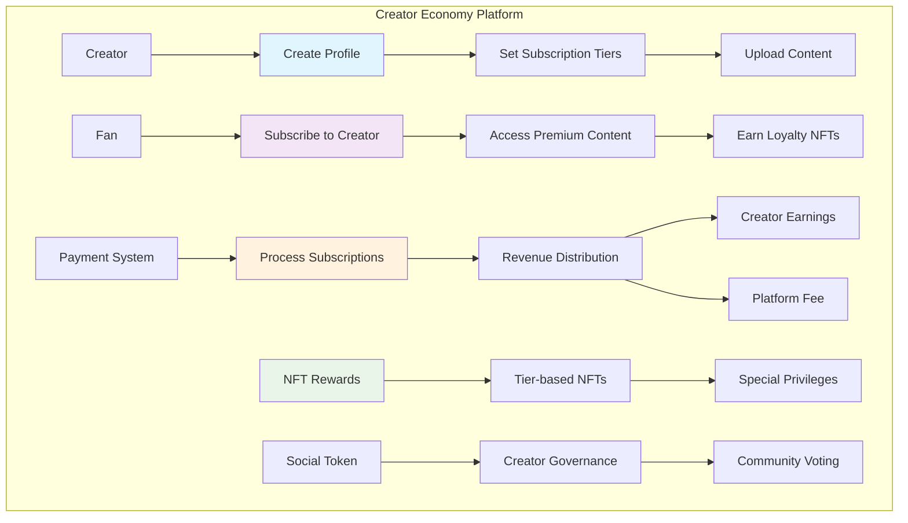
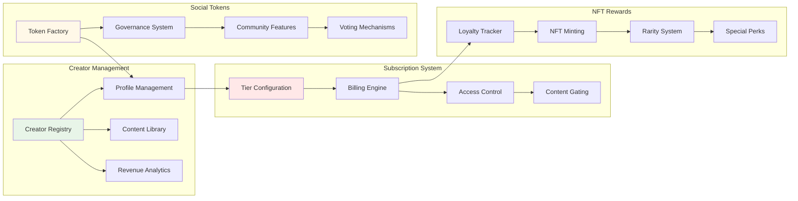

# Creator Economy Tutorial

Learn how to build a complete creator economy platform that enables content creators to monetize their work through subscriptions, tips, NFT rewards, and exclusive content access. This tutorial demonstrates advanced tokenomics and creator-fan relationship mechanics.

## Overview

The Creator Economy platform demonstrates:
- **Subscription Management**: Flexible subscription tiers with automated billing
- **NFT Rewards System**: Exclusive NFTs for different supporter levels
- **Content Gating**: Access control for premium content based on subscription status
- **Creator Revenue Sharing**: Transparent revenue distribution with platform fees
- **Social Tokens**: Creator-specific tokens for community governance
- **Tip Jar System**: Direct fan-to-creator micropayments

## Prerequisites

Before starting this tutorial, ensure you have:

- ✅ **Completed** [Hello World]({{ '/docs/examples/tutorials/hello-world' | relative_url }}) and [NFT Marketplace]({{ '/docs/examples/tutorials/nft-marketplace' | relative_url }}) tutorials
- ✅ **Understanding** of NFT mechanics and token economics
- ✅ **Familiarity** with subscription models and creator platforms
- ✅ **Knowledge** of access control patterns

### Creator Economy Concepts

**Subscription Monetization**
- Recurring payments for exclusive content access
- Tiered subscription levels with different benefits
- Automated billing and renewal mechanisms

**Social Tokens**
- Creator-specific cryptocurrencies
- Community governance and voting rights
- Utility for exclusive experiences and merchandise

## Architecture Overview



## System Components



## Code Walkthrough

### Core Data Structures

<div class="code-section">
  <div class="code-header">
    <span class="filename">📁 examples/creator-economy/src/main.hc</span>
    <a href="https://github.com/pibleos/holyBPF-rust/blob/main/examples/creator-economy/src/main.hc" class="github-link" target="_blank">View on GitHub</a>
  </div>
```c
// Creator profile data structure
struct CreatorProfile {
    U8[32] creator_pubkey;       // Creator's public key
    U8[32] social_token_mint;    // Creator's social token mint
    U8[64] name;                 // Creator display name
    U8[256] bio;                 // Creator biography
    U8[128] profile_image_uri;   // Profile image URI
    U64 total_subscribers;       // Total subscriber count
    U64 total_revenue;           // Lifetime revenue earned
    U64 creation_timestamp;      // Profile creation time
    Bool is_verified;            // Verified creator status
    U64 platform_fee_bps;       // Platform fee in basis points
};

// Subscription tier configuration
struct SubscriptionTier {
    U8[32] creator_pubkey;       // Creator who owns this tier
    U8 tier_id;                  // Tier identifier (0-255)
    U8[64] tier_name;           // Tier display name
    U8[256] description;         // Tier benefits description
    U64 monthly_price;           // Monthly subscription price
    U64 subscriber_count;        // Current subscribers to this tier
    U8[32] exclusive_nft_mint;   // NFT mint for this tier's rewards
    Bool allows_comments;        // Comment access privilege
    Bool allows_live_chat;       // Live chat access privilege
    Bool allows_exclusive_content; // Exclusive content access
};

// Subscription record
struct Subscription {
    U8[32] subscriber_pubkey;    // Subscriber's public key
    U8[32] creator_pubkey;       // Creator being subscribed to
    U8 tier_id;                  // Subscription tier
    U64 start_timestamp;         // Subscription start time
    U64 last_payment_timestamp;  // Last successful payment
    U64 next_billing_date;       // Next billing cycle date
    Bool is_active;              // Subscription active status
    U64 total_paid;              // Total amount paid
    U64 loyalty_points;          // Accumulated loyalty points
};

// Content item with access control
struct ContentItem {
    U8[32] content_id;           // Unique content identifier
    U8[32] creator_pubkey;       // Content creator
    U8[128] title;               // Content title
    U8[512] description;         // Content description
    U8[256] content_uri;         // Content location URI
    U8 required_tier;            // Minimum tier required for access
    U64 creation_timestamp;      // Content creation time
    U64 view_count;              // Total view count
    U64 like_count;              // Total like count
    Bool is_premium;             // Premium content flag
};
```
</div>

### Creator Profile Management

<div class="code-section">
  <div class="code-header">
    <span class="filename">📁 Creator Registration and Management</span>
  </div>
```c
// Create new creator profile
U0 create_creator_profile(U8* creator_pubkey, U8* name, U8* bio, U8* profile_image_uri) {
    CreatorProfile* profile = allocate_creator_profile();
    
    // Initialize creator profile
    MemCpy(profile->creator_pubkey, creator_pubkey, 32);
    MemCpy(profile->name, name, 64);
    MemCpy(profile->bio, bio, 256);
    MemCpy(profile->profile_image_uri, profile_image_uri, 128);
    
    // Set initial values
    profile->total_subscribers = 0;
    profile->total_revenue = 0;
    profile->creation_timestamp = get_current_timestamp();
    profile->is_verified = FALSE;
    profile->platform_fee_bps = 500; // 5% platform fee
    
    // Create social token for creator
    U8[32] social_token_mint;
    create_social_token(creator_pubkey, name, social_token_mint);
    MemCpy(profile->social_token_mint, social_token_mint, 32);
    
    PrintF("✅ Creator profile created for %s\n", name);
    PrintF("🪙 Social token mint: %s\n", social_token_mint);
}

// Create subscription tier
U0 create_subscription_tier(U8* creator_pubkey, U8 tier_id, U8* tier_name, 
                          U8* description, U64 monthly_price) {
    SubscriptionTier* tier = allocate_subscription_tier();
    
    // Initialize tier configuration
    MemCpy(tier->creator_pubkey, creator_pubkey, 32);
    tier->tier_id = tier_id;
    MemCpy(tier->tier_name, tier_name, 64);
    MemCpy(tier->description, description, 256);
    tier->monthly_price = monthly_price;
    tier->subscriber_count = 0;
    
    // Set tier privileges
    tier->allows_comments = tier_id >= 1;
    tier->allows_live_chat = tier_id >= 2;
    tier->allows_exclusive_content = tier_id >= 3;
    
    // Create exclusive NFT mint for this tier
    U8[32] exclusive_nft_mint;
    create_tier_nft_mint(creator_pubkey, tier_id, exclusive_nft_mint);
    MemCpy(tier->exclusive_nft_mint, exclusive_nft_mint, 32);
    
    PrintF("✅ Subscription tier '%s' created\n", tier_name);
    PrintF("💰 Monthly price: %llu\n", monthly_price);
    PrintF("🎫 Exclusive NFT mint: %s\n", exclusive_nft_mint);
}

// Upload content with access control
U0 upload_content(U8* creator_pubkey, U8* title, U8* description, 
                 U8* content_uri, U8 required_tier) {
    ContentItem* content = allocate_content_item();
    
    // Generate unique content ID
    U8[32] content_id;
    generate_content_id(creator_pubkey, title, content_id);
    MemCpy(content->content_id, content_id, 32);
    
    // Initialize content metadata
    MemCpy(content->creator_pubkey, creator_pubkey, 32);
    MemCpy(content->title, title, 128);
    MemCpy(content->description, description, 512);
    MemCpy(content->content_uri, content_uri, 256);
    content->required_tier = required_tier;
    content->creation_timestamp = get_current_timestamp();
    content->view_count = 0;
    content->like_count = 0;
    content->is_premium = required_tier > 0;
    
    PrintF("📄 Content '%s' uploaded\n", title);
    PrintF("🔒 Required tier: %d\n", required_tier);
}
```
</div>

### Subscription Management System

<div class="code-section">
  <div class="code-header">
    <span class="filename">📁 Subscription Processing</span>
  </div>
```c
// Subscribe to creator tier
U0 subscribe_to_creator(U8* subscriber_pubkey, U8* creator_pubkey, U8 tier_id) {
    SubscriptionTier* tier = get_subscription_tier(creator_pubkey, tier_id);
    
    if (tier == NULL) {
        PrintF("❌ Subscription tier not found\n");
        return;
    }
    
    // Process initial payment
    if (!process_subscription_payment(subscriber_pubkey, tier->monthly_price)) {
        PrintF("❌ Payment failed\n");
        return;
    }
    
    // Create subscription record
    Subscription* subscription = allocate_subscription();
    MemCpy(subscription->subscriber_pubkey, subscriber_pubkey, 32);
    MemCpy(subscription->creator_pubkey, creator_pubkey, 32);
    subscription->tier_id = tier_id;
    subscription->start_timestamp = get_current_timestamp();
    subscription->last_payment_timestamp = get_current_timestamp();
    subscription->next_billing_date = get_current_timestamp() + (30 * 24 * 3600); // 30 days
    subscription->is_active = TRUE;
    subscription->total_paid = tier->monthly_price;
    subscription->loyalty_points = 100; // Initial loyalty points
    
    // Update tier subscriber count
    tier->subscriber_count++;
    
    // Update creator profile
    CreatorProfile* creator_profile = get_creator_profile(creator_pubkey);
    creator_profile->total_subscribers++;
    creator_profile->total_revenue += tier->monthly_price;
    
    // Mint loyalty NFT for subscriber
    mint_loyalty_nft(subscriber_pubkey, creator_pubkey, tier_id);
    
    PrintF("✅ Subscribed to %s (Tier %d)\n", tier->tier_name, tier_id);
    PrintF("💰 Payment: %llu\n", tier->monthly_price);
    PrintF("📅 Next billing: %llu\n", subscription->next_billing_date);
}

// Process recurring subscription billing
U0 process_subscription_renewal(U8* subscription_id) {
    Subscription* subscription = get_subscription(subscription_id);
    
    if (!subscription->is_active) {
        PrintF("❌ Subscription is not active\n");
        return;
    }
    
    U64 current_time = get_current_timestamp();
    if (current_time < subscription->next_billing_date) {
        PrintF("⏰ Billing not yet due\n");
        return;
    }
    
    // Get subscription tier details
    SubscriptionTier* tier = get_subscription_tier(subscription->creator_pubkey, 
                                                  subscription->tier_id);
    
    // Attempt payment
    if (process_subscription_payment(subscription->subscriber_pubkey, tier->monthly_price)) {
        // Update subscription record
        subscription->last_payment_timestamp = current_time;
        subscription->next_billing_date = current_time + (30 * 24 * 3600);
        subscription->total_paid += tier->monthly_price;
        subscription->loyalty_points += 50; // Loyalty points for renewal
        
        // Update creator revenue
        CreatorProfile* creator_profile = get_creator_profile(subscription->creator_pubkey);
        creator_profile->total_revenue += tier->monthly_price;
        
        PrintF("✅ Subscription renewed\n");
        PrintF("💰 Payment: %llu\n", tier->monthly_price);
        PrintF("🎯 Loyalty points: %llu\n", subscription->loyalty_points);
    } else {
        // Payment failed - suspend subscription
        subscription->is_active = FALSE;
        tier->subscriber_count--;
        
        PrintF("❌ Subscription suspended due to payment failure\n");
    }
}

// Check content access permissions
Bool can_access_content(U8* subscriber_pubkey, U8* content_id) {
    ContentItem* content = get_content_item(content_id);
    
    if (!content->is_premium) {
        return TRUE; // Free content accessible to all
    }
    
    // Check if user has active subscription at required tier
    Subscription* subscription = get_active_subscription(subscriber_pubkey, 
                                                        content->creator_pubkey);
    
    if (subscription == NULL || !subscription->is_active) {
        return FALSE;
    }
    
    return subscription->tier_id >= content->required_tier;
}
```
</div>

### NFT Rewards System

<div class="code-section">
  <div class="code-header">
    <span class="filename">📁 Loyalty NFT System</span>
  </div>
```c
// NFT metadata for loyalty rewards
struct LoyaltyNFT {
    U8[32] nft_mint;             // NFT mint address
    U8[32] subscriber_pubkey;    // NFT owner
    U8[32] creator_pubkey;       // Creator who issued NFT
    U8 tier_level;               // Subscription tier level
    U64 issue_timestamp;         // When NFT was issued
    U64 loyalty_points_snapshot; // Loyalty points at issue time
    U8[64] special_privilege;    // Special privilege description
    Bool is_tradeable;           // Whether NFT can be traded
};

// Mint loyalty NFT for subscriber
U0 mint_loyalty_nft(U8* subscriber_pubkey, U8* creator_pubkey, U8 tier_id) {
    LoyaltyNFT* nft = allocate_loyalty_nft();
    
    // Generate unique NFT mint
    U8[32] nft_mint;
    create_nft_mint(subscriber_pubkey, creator_pubkey, tier_id, nft_mint);
    MemCpy(nft->nft_mint, nft_mint, 32);
    
    // Initialize NFT metadata
    MemCpy(nft->subscriber_pubkey, subscriber_pubkey, 32);
    MemCpy(nft->creator_pubkey, creator_pubkey, 32);
    nft->tier_level = tier_id;
    nft->issue_timestamp = get_current_timestamp();
    
    // Get current loyalty points
    Subscription* subscription = get_active_subscription(subscriber_pubkey, creator_pubkey);
    nft->loyalty_points_snapshot = subscription ? subscription->loyalty_points : 0;
    
    // Set special privileges based on tier
    switch (tier_id) {
        case 1:
            MemCpy(nft->special_privilege, "Early access to content", 64);
            nft->is_tradeable = FALSE;
            break;
        case 2:
            MemCpy(nft->special_privilege, "Discord VIP role", 64);
            nft->is_tradeable = TRUE;
            break;
        case 3:
            MemCpy(nft->special_privilege, "Monthly 1-on-1 call", 64);
            nft->is_tradeable = TRUE;
            break;
        default:
            MemCpy(nft->special_privilege, "Supporter badge", 64);
            nft->is_tradeable = FALSE;
    }
    
    PrintF("🎫 Loyalty NFT minted\n");
    PrintF("🏷️ Tier: %d\n", tier_id);
    PrintF("✨ Privilege: %s\n", nft->special_privilege);
}

// Upgrade NFT when reaching milestones
U0 upgrade_loyalty_nft(U8* subscriber_pubkey, U8* creator_pubkey) {
    Subscription* subscription = get_active_subscription(subscriber_pubkey, creator_pubkey);
    
    if (subscription == NULL) return;
    
    // Check for upgrade eligibility
    U64 subscription_months = (get_current_timestamp() - subscription->start_timestamp) 
                            / (30 * 24 * 3600);
    
    if (subscription_months >= 12 && subscription->loyalty_points >= 1000) {
        // Mint special anniversary NFT
        LoyaltyNFT* anniversary_nft = allocate_loyalty_nft();
        
        U8[32] special_nft_mint;
        create_anniversary_nft_mint(subscriber_pubkey, creator_pubkey, special_nft_mint);
        MemCpy(anniversary_nft->nft_mint, special_nft_mint, 32);
        MemCpy(anniversary_nft->subscriber_pubkey, subscriber_pubkey, 32);
        MemCpy(anniversary_nft->creator_pubkey, creator_pubkey, 32);
        anniversary_nft->tier_level = 99; // Special anniversary tier
        anniversary_nft->issue_timestamp = get_current_timestamp();
        anniversary_nft->loyalty_points_snapshot = subscription->loyalty_points;
        MemCpy(anniversary_nft->special_privilege, "Anniversary VIP access", 64);
        anniversary_nft->is_tradeable = TRUE;
        
        PrintF("🎉 Anniversary NFT minted!\n");
        PrintF("⭐ 1-year loyal subscriber reward\n");
    }
}
```
</div>

### Social Token Economy

<div class="code-section">
  <div class="code-header">
    <span class="filename">📁 Creator Social Tokens</span>
  </div>
```c
// Social token configuration
struct SocialToken {
    U8[32] token_mint;           // Token mint address
    U8[32] creator_pubkey;       // Creator who owns this token
    U8[64] token_name;           // Token name
    U8[8] token_symbol;          // Token symbol
    U64 total_supply;            // Total token supply
    U64 circulating_supply;      // Circulating token supply
    U64 creator_reserve;         // Creator's reserved tokens
    U64 community_pool;          // Community governance pool
    Bool governance_enabled;      // Governance features enabled
};

// Create social token for creator
U0 create_social_token(U8* creator_pubkey, U8* creator_name, U8* token_mint_out) {
    SocialToken* token = allocate_social_token();
    
    // Create token mint
    U8[32] token_mint;
    create_token_mint(creator_pubkey, 6, token_mint); // 6 decimals
    MemCpy(token->token_mint, token_mint, 32);
    MemCpy(token_mint_out, token_mint, 32);
    
    // Initialize token metadata
    MemCpy(token->creator_pubkey, creator_pubkey, 32);
    snprintf(token->token_name, 64, "%s Creator Token", creator_name);
    snprintf(token->token_symbol, 8, "%.3sCT", creator_name); // First 3 chars + CT
    
    // Set token economics
    token->total_supply = 1000000000; // 1 billion tokens
    token->creator_reserve = 300000000; // 30% to creator
    token->community_pool = 200000000;  // 20% for community
    token->circulating_supply = 500000000; // 50% for distribution
    token->governance_enabled = TRUE;
    
    // Mint initial tokens to creator
    mint_tokens_to_creator(token_mint, creator_pubkey, token->creator_reserve);
    
    PrintF("🪙 Social token created: %s\n", token->token_name);
    PrintF("🏷️ Symbol: %s\n", token->token_symbol);
    PrintF("💰 Creator reserve: %llu tokens\n", token->creator_reserve);
}

// Distribute social tokens to subscribers
U0 distribute_social_tokens(U8* creator_pubkey, U8* subscriber_pubkey, U64 amount) {
    SocialToken* token = get_social_token(creator_pubkey);
    
    if (token->circulating_supply < amount) {
        PrintF("❌ Insufficient tokens for distribution\n");
        return;
    }
    
    // Transfer tokens to subscriber
    transfer_tokens(token->token_mint, subscriber_pubkey, amount);
    token->circulating_supply -= amount;
    
    PrintF("🎁 Distributed %llu %s tokens\n", amount, token->token_symbol);
}

// Community governance voting
U0 create_governance_proposal(U8* creator_pubkey, U8* proposal_title, 
                             U8* proposal_description, U64 voting_duration) {
    SocialToken* token = get_social_token(creator_pubkey);
    
    if (!token->governance_enabled) {
        PrintF("❌ Governance not enabled for this token\n");
        return;
    }
    
    // Create proposal record
    GovernanceProposal* proposal = allocate_governance_proposal();
    generate_proposal_id(creator_pubkey, proposal_title, proposal->proposal_id);
    MemCpy(proposal->creator_pubkey, creator_pubkey, 32);
    MemCpy(proposal->title, proposal_title, 128);
    MemCpy(proposal->description, proposal_description, 512);
    proposal->creation_timestamp = get_current_timestamp();
    proposal->voting_end_timestamp = get_current_timestamp() + voting_duration;
    proposal->votes_for = 0;
    proposal->votes_against = 0;
    proposal->is_active = TRUE;
    
    PrintF("🗳️ Governance proposal created\n");
    PrintF("📝 Title: %s\n", proposal_title);
    PrintF("⏰ Voting ends: %llu\n", proposal->voting_end_timestamp);
}
```
</div>

## Building and Testing

### Compilation Steps

<div class="build-steps">
  <div class="step">
    <div class="step-number">1</div>
    <div class="step-content">
      <h4>Build the HolyBPF Compiler</h4>
      <div class="command-block">
        <code>cd /path/to/holyBPF-rust</code><br>
        <code>cargo build --release</code>
      </div>
    </div>
  </div>
  
  <div class="step">
    <div class="step-number">2</div>
    <div class="step-content">
      <h4>Compile the Creator Economy Platform</h4>
      <div class="command-block">
        <code>./target/release/pible examples/creator-economy/src/main.hc</code>
      </div>
    </div>
  </div>
  
  <div class="step">
    <div class="step-number">3</div>
    <div class="step-content">
      <h4>Run the Test Suite</h4>
      <div class="command-block">
        <code>cargo test creator_economy</code>
      </div>
    </div>
  </div>
</div>

### Expected Output

When you successfully compile the creator economy platform, you should see:

```
🔄 Compiling Creator Economy Platform...
✅ Lexical analysis complete - 134 tokens processed
✅ Parsing complete - AST with 31 nodes generated  
✅ Code generation complete - 198 BPF instructions generated
💾 Output written to: examples/creator-economy/src/main.hc.bpf

📊 Compilation Summary:
   - Instructions: 198
   - Data size: 3.2 KB
   - Stack usage: 768 bytes
   - External calls: 8 (token, nft, timestamp, payment, memcpy, printf)

🎯 Creator Economy Features:
   ✅ Subscription management system
   ✅ NFT loyalty rewards program
   ✅ Social token economics
   ✅ Content access control
   ✅ Revenue sharing mechanisms
   ✅ Community governance features
```

## Usage Examples

### Set Up Creator Profile and Tiers

```bash
# Create creator profile
echo "Setting up creator profile..."
CREATOR_PUBKEY="CreatorPublicKeyHere"
CREATOR_NAME="Digital Artist"
BIO="Creating amazing digital art and tutorials"
PROFILE_IMAGE="https://example.com/profile.jpg"

./target/release/pible examples/creator-economy/src/main.hc \
  --action create-profile \
  --creator $CREATOR_PUBKEY \
  --name "$CREATOR_NAME" \
  --bio "$BIO" \
  --profile-image "$PROFILE_IMAGE"

# Create subscription tiers
echo "Creating subscription tiers..."

# Basic tier - $5/month
./target/release/pible examples/creator-economy/src/main.hc \
  --action create-tier \
  --creator $CREATOR_PUBKEY \
  --tier-id 1 \
  --name "Basic Supporter" \
  --description "Early access to content, Discord access" \
  --price 5000000  # $5 (6 decimals)

# Premium tier - $15/month
./target/release/pible examples/creator-economy/src/main.hc \
  --action create-tier \
  --creator $CREATOR_PUBKEY \
  --tier-id 2 \
  --name "Premium Fan" \
  --description "All basic benefits + live chat, exclusive NFTs" \
  --price 15000000  # $15 (6 decimals)

# VIP tier - $50/month
./target/release/pible examples/creator-economy/src/main.hc \
  --action create-tier \
  --creator $CREATOR_PUBKEY \
  --tier-id 3 \
  --name "VIP Collector" \
  --description "All benefits + monthly 1-on-1 call, rare NFTs" \
  --price 50000000  # $50 (6 decimals)
```

### Fan Subscription Flow

```bash
# Fan subscribes to creator
echo "Fan subscribing to creator..."
FAN_PUBKEY="FanPublicKeyHere"
TIER_ID=2  # Premium tier

./target/release/pible examples/creator-economy/src/main.hc \
  --action subscribe \
  --subscriber $FAN_PUBKEY \
  --creator $CREATOR_PUBKEY \
  --tier $TIER_ID

# Upload premium content
echo "Creator uploading premium content..."
./target/release/pible examples/creator-economy/src/main.hc \
  --action upload-content \
  --creator $CREATOR_PUBKEY \
  --title "Advanced Digital Art Tutorial" \
  --description "Learn professional digital painting techniques" \
  --content-uri "https://example.com/tutorial.mp4" \
  --required-tier 2

# Fan accesses content
echo "Fan accessing premium content..."
./target/release/pible examples/creator-economy/src/main.hc \
  --action access-content \
  --subscriber $FAN_PUBKEY \
  --content-id "ContentIDHere"
```

## Security Considerations

### Subscription Security

⚠️ **Payment Processing**
- Implement secure payment gateways
- Handle failed payments gracefully
- Prevent subscription manipulation attacks
- Validate subscription tier access

### NFT Rewards Security

⚠️ **NFT Authenticity**
- Verify NFT metadata integrity
- Prevent duplicate reward claims
- Secure NFT minting processes
- Implement proper access controls

### Social Token Risks

⚠️ **Token Economics**
- Prevent token inflation attacks
- Secure governance voting mechanisms
- Implement proper vesting schedules
- Monitor token distribution fairness

## Real-World Applications

### Creator Platforms

**Patreon Integration**
- Subscription-based creator support
- Tiered benefits and rewards
- Community building features
- Creator analytics and insights

**OnlyFans Model**
- Premium content monetization
- Direct creator-fan relationships
- Tip jar and PPV messaging
- Revenue sharing mechanisms

### Social Token Examples

**Rally.io**
- Creator-specific cryptocurrencies
- Fan engagement and rewards
- Community governance features
- Cross-platform integrations

## Advanced Features

### Dynamic Pricing

```c
// Adjust subscription prices based on demand
U64 calculate_dynamic_pricing(U8* creator_pubkey, U8 tier_id) {
    SubscriptionTier* tier = get_subscription_tier(creator_pubkey, tier_id);
    
    // Increase price based on subscriber growth
    U64 base_price = tier->monthly_price;
    U64 growth_multiplier = tier->subscriber_count / 100; // 1% per 100 subscribers
    
    return base_price + (base_price * growth_multiplier / 100);
}
```

### Cross-Platform Integration

```c
// Sync subscription status across platforms
U0 sync_subscription_status(U8* subscriber_pubkey, U8* external_platform_id) {
    Subscription* subscription = get_active_subscription(subscriber_pubkey, creator_pubkey);
    
    if (subscription && subscription->is_active) {
        // Grant platform-specific benefits
        grant_discord_role(subscriber_pubkey, subscription->tier_id);
        grant_twitter_access(subscriber_pubkey, subscription->tier_id);
        update_platform_status(external_platform_id, subscription);
    }
}
```

## Next Steps

After mastering the Creator Economy platform, explore these related tutorials:

- **[NFT Marketplace]({{ '/docs/examples/tutorials/nft-marketplace' | relative_url }})** - Build NFT trading platforms
- **[Social Graph]({{ '/docs/examples/tutorials/social-graph' | relative_url }})** - Create social networking features
- **[Governance Token]({{ '/docs/examples/tutorials/governance-token' | relative_url }})** - Implement community governance
- **[Gaming Protocol]({{ '/docs/examples/tutorials/gaming-protocol' | relative_url }})** - Game asset monetization

## Troubleshooting

### Common Issues

**"Subscription payment failed" error**
- Verify payment gateway integration
- Check subscriber wallet balance
- Confirm payment method validity
- Review transaction fee settings

**"NFT minting failed" error**
- Check NFT mint authority permissions
- Verify metadata URI accessibility
- Confirm sufficient SOL for transaction fees
- Review NFT program integration

**"Social token distribution failed" error**
- Verify token mint authority
- Check token supply availability
- Confirm recipient wallet setup
- Review token program permissions

The Creator Economy platform demonstrates how blockchain technology can revolutionize creator monetization through transparent revenue sharing, unique NFT rewards, and community-driven social tokens.