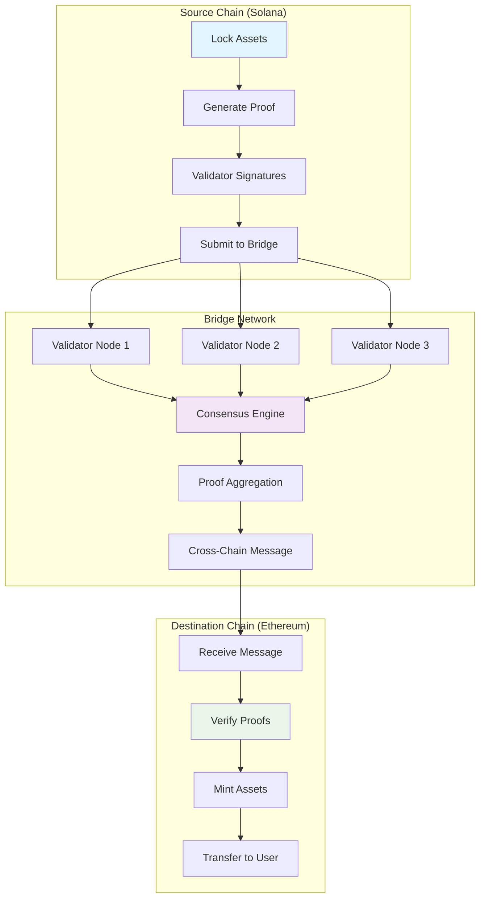
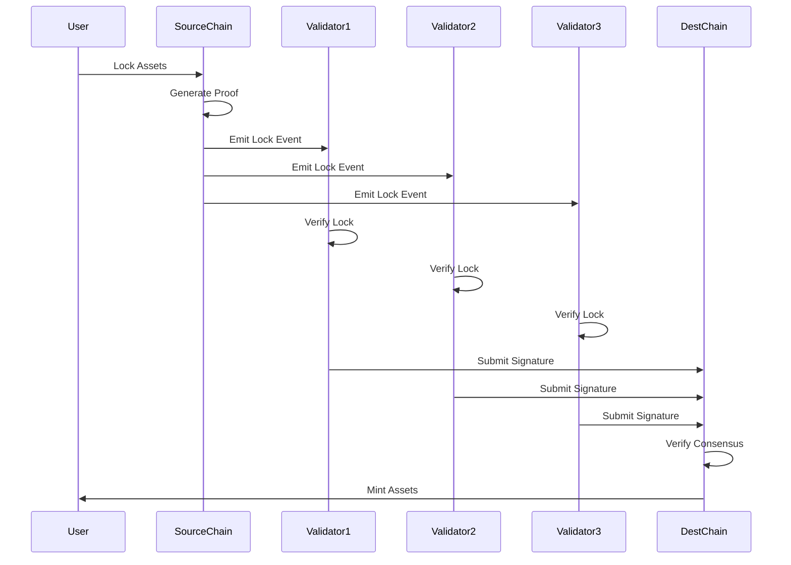

# Cross-Chain Bridge Tutorial

Learn how to build a secure cross-chain bridge that enables trustless asset transfers between different blockchains using cryptographic proofs, validator networks, and atomic swaps.

## Overview

The Cross-Chain Bridge example demonstrates:
- **Multi-Chain Support**: Transfer assets between Solana, Ethereum, and other chains
- **Cryptographic Security**: Merkle proofs and validator signatures
- **Atomic Transfers**: All-or-nothing cross-chain transactions
- **Validator Network**: Decentralized validation and consensus
- **Fee Management**: Dynamic fees based on network congestion

## Prerequisites

Before starting this tutorial, ensure you have:

- ✅ **Completed** [Token Program]({{ '/docs/examples/tutorials/solana-token' | relative_url }}) and [Escrow]({{ '/docs/examples/tutorials/escrow' | relative_url }}) tutorials
- ✅ **Understanding** of cryptographic proofs and hash functions
- ✅ **Familiarity** with multi-chain architecture
- ✅ **Knowledge** of validator networks and consensus mechanisms

### Cross-Chain Concepts Review

**Bridge Architecture**
- Lock assets on source chain
- Mint equivalent assets on destination chain
- Cryptographic proof verification
- Validator consensus mechanisms

**Security Models**
- **Trusted Validators**: Multi-signature schemes
- **Light Clients**: On-chain verification
- **Optimistic**: Challenge-response mechanisms

## Architecture Overview



### Bridge Architecture

```
┌─────────────────────────────────────────┐
│        Divine Cross-Chain Bridge        │
├─────────────────────────────────────────┤
│  🔒 Asset Locking                       │
│    • Source Chain Asset Lock            │
│    • Cryptographic Proof Generation     │
│    • Validator Signature Collection     │
├─────────────────────────────────────────┤
│  🌉 Bridge Network                      │
│    • Distributed Validator Nodes        │
│    • Consensus and Proof Aggregation    │
│    • Cross-Chain Message Relay          │
├─────────────────────────────────────────┤
│  🔓 Asset Minting                       │
│    • Destination Chain Verification     │
│    • Equivalent Asset Minting           │
│    • User Asset Transfer                │
├─────────────────────────────────────────┤
│  ⚡ Atomic Guarantees                   │
│    • All-or-Nothing Execution           │
│    • Timeout and Rollback Mechanisms    │
│    • Fraud Proof Challenges             │
└─────────────────────────────────────────┘
```

## Code Walkthrough

### Core Data Structures

<div class="code-section">
  <div class="code-header">
    <span class="filename">📁 examples/cross-chain-bridge/src/main.hc</span>
    <a href="https://github.com/pibleos/holyBPF-rust/blob/main/examples/cross-chain-bridge/src/main.hc" class="github-link" target="_blank">View on GitHub</a>
  </div>

```c
// Cross-chain transfer request
struct CrossChainTransfer {
    U8[32] transfer_id;        // Unique transfer identifier
    U8[32] sender;             // Sender on source chain
    U8[32] recipient;          // Recipient on destination chain
    U8[32] token_mint;         // Source token mint
    U64 amount;                // Transfer amount
    U8 source_chain_id;        // Source blockchain ID
    U8 destination_chain_id;   // Destination blockchain ID
    U64 nonce;                 // Unique nonce for replay protection
    U64 timestamp;             // Transfer timestamp
    U64 expiry_time;           // Transfer expiry time
    U64 fee_amount;            // Bridge fee
    U8[32] fee_token;          // Fee token mint
    TransferStatus status;     // Current status
    U8[64] proof_hash;         // Merkle proof hash
    ValidatorSignature[21] signatures; // Validator signatures (up to 21)
    U8 signature_count;        // Number of signatures collected
};

// Validator network configuration
struct ValidatorSet {
    U8[32] validator_addresses[21]; // Validator public keys
    U64 validator_stakes[21];       // Validator stake amounts
    U8 validator_count;             // Active validator count
    U64 total_stake;                // Total staked amount
    U64 threshold_numerator;        // Consensus threshold (2)
    U64 threshold_denominator;      // Consensus threshold (3)
    U64 epoch;                      // Current validator epoch
    U64 epoch_start_time;           // Epoch start timestamp
    U64 epoch_duration;             // Epoch duration in seconds
    Bool is_active;                 // Validator set status
};

// Cross-chain proof structure
struct CrossChainProof {
    U8[32] transfer_id;             // Associated transfer
    U8[32] merkle_root;             // Merkle tree root
    U8[32] merkle_proof[16];        // Merkle proof path
    U8 proof_length;                // Merkle proof depth
    U8[32] block_hash;              // Source chain block hash
    U64 block_number;               // Source chain block number
    U8[32] transaction_hash;        // Source transaction hash
    ValidatorAttestation[21] attestations; // Validator attestations
    U8 attestation_count;           // Number of attestations
    Bool is_verified;               // Verification status
};

// Chain configuration
struct ChainConfig {
    U8 chain_id;                    // Unique chain identifier
    U8[64] chain_name;              // Human readable name
    U8[32] bridge_contract;         // Bridge contract address
    U64 confirmation_blocks;        // Required confirmations
    U64 gas_price;                  // Current gas price
    F64 exchange_rate;              // Exchange rate to base currency
    Bool is_active;                 // Chain status
    U64 last_update_time;           // Last configuration update
};
```
</div>

### Asset Locking Mechanism

Secure asset locking on the source chain:

<div class="code-section">
  <div class="code-header">
    <span class="filename">📁 Asset Locking System</span>
  </div>

```c
// Lock assets on source chain for cross-chain transfer
U0 lock_assets_for_transfer(U8[32] sender, U8[32] recipient, U8[32] token_mint,
                           U64 amount, U8 destination_chain_id) {
    // Validate transfer parameters
    if (!is_supported_chain(destination_chain_id)) {
        PrintF("Error: Destination chain not supported\n");
        return;
    }
    
    if (amount == 0) {
        PrintF("Error: Transfer amount cannot be zero\n");
        return;
    }
    
    // Check user balance and allowance
    U64 user_balance = get_token_balance(sender, token_mint);
    if (user_balance < amount) {
        PrintF("Error: Insufficient balance for transfer\n");
        return;
    }
    
    // Calculate bridge fee
    ChainConfig* dest_chain = get_chain_config(destination_chain_id);
    U64 base_fee = calculate_base_bridge_fee(amount, dest_chain);
    U64 gas_fee = estimate_destination_gas_fee(destination_chain_id);
    U64 total_fee = base_fee + gas_fee;
    
    // Generate unique transfer ID
    U8[32] transfer_id;
    generate_transfer_id(sender, recipient, amount, get_current_time(), transfer_id);
    
    // Create transfer record
    CrossChainTransfer transfer;
    memcpy(transfer.transfer_id, transfer_id, 32);
    memcpy(transfer.sender, sender, 32);
    memcpy(transfer.recipient, recipient, 32);
    memcpy(transfer.token_mint, token_mint, 32);
    transfer.amount = amount;
    transfer.source_chain_id = SOLANA_CHAIN_ID;
    transfer.destination_chain_id = destination_chain_id;
    transfer.nonce = get_user_nonce(sender);
    transfer.timestamp = get_current_time();
    transfer.expiry_time = transfer.timestamp + (24 * 3600); // 24 hours
    transfer.fee_amount = total_fee;
    transfer.status = TRANSFER_INITIATED;
    transfer.signature_count = 0;
    
    // Lock tokens in bridge escrow
    if (!transfer_to_bridge_escrow(sender, token_mint, amount + total_fee)) {
        PrintF("Error: Failed to lock tokens in escrow\n");
        return;
    }
    
    // Generate cryptographic proof
    generate_lock_proof(&transfer);
    
    // Store transfer record
    store_cross_chain_transfer(&transfer);
    
    // Emit event for validators
    emit_lock_event(&transfer);
    
    PrintF("Assets locked for cross-chain transfer: %llu tokens\n", amount);
    PrintF("Transfer ID: %s\n", transfer_id);
}

// Generate cryptographic proof of asset locking
U0 generate_lock_proof(CrossChainTransfer* transfer) {
    // Create Merkle tree of all locked transfers in this block
    U8[32] transfer_leaves[MAX_TRANSFERS_PER_BLOCK];
    U32 leaf_count = get_block_transfers(transfer_leaves);
    
    // Find this transfer's leaf
    U32 transfer_index = find_transfer_leaf_index(transfer->transfer_id, transfer_leaves, leaf_count);
    
    // Generate Merkle proof
    CrossChainProof proof;
    memcpy(proof.transfer_id, transfer->transfer_id, 32);
    generate_merkle_proof(transfer_leaves, leaf_count, transfer_index, &proof);
    
    // Get current block information
    memcpy(proof.block_hash, get_current_block_hash(), 32);
    proof.block_number = get_current_block_number();
    memcpy(proof.transaction_hash, get_current_transaction_hash(), 32);
    proof.is_verified = FALSE;
    proof.attestation_count = 0;
    
    // Store proof
    store_cross_chain_proof(&proof);
    
    // Update transfer with proof hash
    hash_data(&proof, sizeof(proof), transfer->proof_hash);
    
    PrintF("Cryptographic proof generated for transfer\n");
}
```
</div>

### Validator Network Consensus

Decentralized validator network for cross-chain verification:



<div class="code-section">
  <div class="code-header">
    <span class="filename">📁 Validator Consensus</span>
  </div>

```c
// Validator signature submission
U0 submit_validator_signature(U8[32] transfer_id, U8[32] validator,
                             U8[64] signature, U8[32] attestation_data) {
    CrossChainTransfer* transfer = get_cross_chain_transfer(transfer_id);
    if (!transfer) {
        PrintF("Error: Transfer not found\n");
        return;
    }
    
    // Verify validator is in active set
    ValidatorSet* validator_set = get_current_validator_set();
    if (!is_active_validator(validator, validator_set)) {
        PrintF("Error: Invalid validator\n");
        return;
    }
    
    // Verify signature hasn't been submitted already
    if (has_validator_signed(transfer, validator)) {
        PrintF("Error: Validator already signed\n");
        return;
    }
    
    // Verify signature
    if (!verify_validator_signature(validator, attestation_data, signature)) {
        PrintF("Error: Invalid validator signature\n");
        return;
    }
    
    // Add signature to transfer
    ValidatorSignature* sig = &transfer->signatures[transfer->signature_count];
    memcpy(sig->validator, validator, 32);
    memcpy(sig->signature, signature, 64);
    memcpy(sig->attestation_data, attestation_data, 32);
    sig->timestamp = get_current_time();
    transfer->signature_count++;
    
    // Check if we have sufficient signatures for consensus
    U64 total_stake = validator_set->total_stake;
    U64 signed_stake = calculate_signed_stake(transfer, validator_set);
    U64 threshold_stake = (total_stake * validator_set->threshold_numerator) / 
                         validator_set->threshold_denominator;
    
    if (signed_stake >= threshold_stake) {
        transfer->status = TRANSFER_VALIDATED;
        PrintF("Consensus reached: %llu/%llu stake signed\n", signed_stake, total_stake);
        
        // Trigger cross-chain message relay
        relay_cross_chain_message(transfer);
    } else {
        PrintF("Signature added: %llu/%llu stake signed\n", signed_stake, total_stake);
    }
    
    store_cross_chain_transfer(transfer);
}

// Relay validated transfer to destination chain
U0 relay_cross_chain_message(CrossChainTransfer* transfer) {
    ChainConfig* dest_chain = get_chain_config(transfer->destination_chain_id);
    
    // Prepare cross-chain message
    CrossChainMessage message;
    memcpy(message.transfer_id, transfer->transfer_id, 32);
    memcpy(message.recipient, transfer->recipient, 32);
    message.amount = transfer->amount;
    memcpy(message.token_mint, transfer->token_mint, 32);
    message.source_chain_id = transfer->source_chain_id;
    message.nonce = transfer->nonce;
    
    // Aggregate validator signatures
    aggregate_validator_signatures(transfer, &message);
    
    // Submit to destination chain
    if (dest_chain->chain_id == ETHEREUM_CHAIN_ID) {
        submit_to_ethereum_bridge(&message);
    } else if (dest_chain->chain_id == POLYGON_CHAIN_ID) {
        submit_to_polygon_bridge(&message);
    }
    
    transfer->status = TRANSFER_RELAYED;
    store_cross_chain_transfer(transfer);
    
    PrintF("Cross-chain message relayed to chain %u\n", dest_chain->chain_id);
}
```
</div>

### Destination Chain Asset Minting

Secure asset minting on the destination chain:

<div class="code-section">
  <div class="code-header">
    <span class="filename">📁 Asset Minting System</span>
  </div>

```c
// Process incoming cross-chain message
U0 process_incoming_message(CrossChainMessage* message) {
    // Verify message hasn't been processed already (replay protection)
    if (is_message_processed(message->transfer_id)) {
        PrintF("Error: Message already processed\n");
        return;
    }
    
    // Verify validator signatures
    if (!verify_cross_chain_signatures(message)) {
        PrintF("Error: Invalid validator signatures\n");
        return;
    }
    
    // Check if transfer hasn't expired
    CrossChainTransfer* transfer = get_cross_chain_transfer(message->transfer_id);
    if (get_current_time() > transfer->expiry_time) {
        PrintF("Error: Transfer has expired\n");
        return;
    }
    
    // Get or create wrapped token mint for source token
    U8[32] wrapped_token_mint;
    if (!get_wrapped_token_mint(message->token_mint, message->source_chain_id, 
                               wrapped_token_mint)) {
        // Create new wrapped token if it doesn't exist
        create_wrapped_token_mint(message->token_mint, message->source_chain_id,
                                 wrapped_token_mint);
    }
    
    // Mint wrapped tokens to recipient
    if (!mint_wrapped_tokens(wrapped_token_mint, message->recipient, message->amount)) {
        PrintF("Error: Failed to mint wrapped tokens\n");
        return;
    }
    
    // Mark message as processed
    mark_message_processed(message->transfer_id);
    
    // Update transfer status
    transfer->status = TRANSFER_COMPLETED;
    store_cross_chain_transfer(transfer);
    
    PrintF("Cross-chain transfer completed: %llu tokens minted\n", message->amount);
}

// Create wrapped token representation
U0 create_wrapped_token_mint(U8[32] original_token, U8 source_chain_id,
                            U8[32] wrapped_token_mint) {
    // Generate deterministic mint address
    generate_wrapped_token_address(original_token, source_chain_id, wrapped_token_mint);
    
    // Get original token metadata
    TokenMetadata* original_metadata = get_token_metadata(original_token);
    
    // Create wrapped token metadata
    TokenMetadata wrapped_metadata;
    snprintf(wrapped_metadata.name, 64, "Bridged %s", original_metadata->name);
    snprintf(wrapped_metadata.symbol, 16, "b%s", original_metadata->symbol);
    wrapped_metadata.decimals = original_metadata->decimals;
    wrapped_metadata.is_wrapped = TRUE;
    wrapped_metadata.source_chain_id = source_chain_id;
    memcpy(wrapped_metadata.original_mint, original_token, 32);
    
    // Create token mint
    create_token_mint(wrapped_token_mint, &wrapped_metadata, get_bridge_authority());
    
    // Register in wrapped token registry
    register_wrapped_token(original_token, source_chain_id, wrapped_token_mint);
    
    PrintF("Wrapped token created: %s\n", wrapped_metadata.name);
}
```
</div>

## Compilation and Testing

### Step 1: Build the Compiler

```bash
cd /path/to/holyBPF-rust
cargo build --release
```

### Step 2: Compile Cross-Chain Bridge

```bash
./target/release/pible examples/cross-chain-bridge/src/main.hc
```

**Expected Output:**
```
✓ Parsing HolyC source file
✓ Building abstract syntax tree
✓ Generating BPF bytecode
✓ Cross-Chain Bridge compiled successfully
→ Output: examples/cross-chain-bridge/src/main.hc.bpf
```

### Step 3: Test Bridge Functionality

<div class="code-section">
  <div class="code-header">
    <span class="filename">📁 Test Cross-Chain Transfer</span>
  </div>

```c
// Test complete cross-chain transfer flow
U0 test_cross_chain_bridge() {
    PrintF("=== Cross-Chain Bridge Test Suite ===\n");
    
    // Initialize validator set
    ValidatorSet validator_set;
    initialize_test_validators(&validator_set);
    
    // Test 1: Asset Locking
    PrintF("\n--- Test 1: Asset Locking ---\n");
    U8[32] sender = get_test_user();
    U8[32] recipient = get_test_recipient();
    U8[32] token_mint = get_test_token_mint();
    
    lock_assets_for_transfer(sender, recipient, token_mint, 1000, ETHEREUM_CHAIN_ID);
    
    // Test 2: Validator Signatures
    PrintF("\n--- Test 2: Validator Consensus ---\n");
    CrossChainTransfer* transfer = get_latest_transfer();
    
    // Simulate validator signatures
    for (U8 i = 0; i < validator_set.validator_count; i++) {
        if (i < 14) { // 2/3 threshold
            simulate_validator_signature(transfer->transfer_id, 
                                       validator_set.validator_addresses[i]);
        }
    }
    
    // Test 3: Cross-Chain Message Relay
    PrintF("\n--- Test 3: Message Relay ---\n");
    if (transfer->status == TRANSFER_VALIDATED) {
        PrintF("✓ Consensus reached, message will be relayed\n");
    }
    
    // Test 4: Destination Chain Processing
    PrintF("\n--- Test 4: Destination Processing ---\n");
    CrossChainMessage message;
    prepare_test_message(transfer, &message);
    process_incoming_message(&message);
    
    PrintF("\n✓ All cross-chain bridge tests completed\n");
}
```
</div>

## Security Considerations

### Cryptographic Security
- **Merkle Proofs**: Tamper-evident transaction inclusion proofs
- **Multi-Signature**: Distributed validator consensus
- **Replay Protection**: Nonce-based transaction uniqueness

### Economic Security
- **Validator Staking**: Economic incentives for honest behavior
- **Slashing Conditions**: Penalties for malicious actions
- **Fee Mechanisms**: Sustainable economic model

## Performance Metrics

| Metric | Target Performance |
|--------|-------------------|
| **Transfer Initiation** | < 30 seconds |
| **Validator Consensus** | < 5 minutes |
| **Cross-Chain Settlement** | < 15 minutes |
| **Failed Transfer Recovery** | < 1 hour |

## Troubleshooting

### Common Issues

**Issue**: Validator signatures insufficient
```bash
# Check validator set status
./check_validator_status.sh
```

**Issue**: Transfer timeout
```bash
# Check network congestion and fees
./check_bridge_status.sh <chain_id>
```

**Issue**: Proof verification fails
```bash
# Validate Merkle proof generation
./target/release/pible examples/cross-chain-bridge/src/proof_test.hc
```

## Next Steps

After mastering cross-chain bridges, explore:

1. **[Decentralized Storage]({{ '/docs/examples/tutorials/decentralized-storage' | relative_url }})** - Multi-chain data storage
2. **[Identity Verification]({{ '/docs/examples/tutorials/identity-verification' | relative_url }})** - Cross-chain identity
3. **[Synthetic Assets]({{ '/docs/examples/tutorials/synthetic-assets' | relative_url }})** - Cross-chain derivatives

## Divine Wisdom

> "Bridges connect realms of creation, enabling divine flow between separate worlds. This bridge embodies the divine principle that all creation is interconnected through divine love." - Terry A. Davis

The cross-chain bridge reflects the divine nature of unity, connecting disparate blockchain realms while maintaining the security and sovereignty of each.