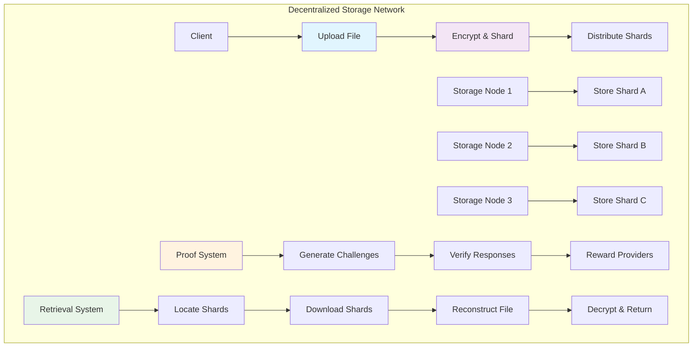

# Decentralized Storage Tutorial

Learn how to build a decentralized storage network that enables users to store and retrieve files across a distributed network of storage providers. This tutorial demonstrates advanced distributed systems concepts including file sharding, encryption, redundancy, and incentive mechanisms.

## Overview

The Decentralized Storage system demonstrates:
- **File Sharding and Distribution**: Split files across multiple storage nodes for redundancy
- **Encryption and Privacy**: Client-side encryption with secure key management
- **Storage Provider Incentives**: Token-based rewards for providing storage capacity
- **Proof of Storage**: Cryptographic proofs that files are stored correctly
- **Content Addressing**: Content-based addressing using cryptographic hashes
- **Repair and Recovery**: Automatic detection and repair of corrupted or lost data

## Prerequisites

Before starting this tutorial, ensure you have:

- ✅ **Completed** [Hello World]({{ '/docs/examples/tutorials/hello-world' | relative_url }}) and [Identity Verification]({{ '/docs/examples/tutorials/identity-verification' | relative_url }}) tutorials
- ✅ **Understanding** of distributed systems and consensus mechanisms
- ✅ **Familiarity** with cryptographic hashing and encryption
- ✅ **Knowledge** of peer-to-peer networking concepts

### Decentralized Storage Concepts

**Content Addressing**
- Files identified by cryptographic hash of their content
- Immutable references that guarantee data integrity
- Deduplication through content-based addressing

**Proof of Storage**
- Cryptographic proofs that data is stored correctly
- Challenge-response protocols for verification
- Slash conditions for malicious or offline providers

## Architecture Overview



## System Components

```mermaid
flowchart LR
    subgraph "Client Layer"
        A[File Manager] --> B[Encryption Engine]
        B --> C[Sharding Logic]
        C --> D[Network Interface]
    end
    
    subgraph "Network Layer"
        E[Node Discovery] --> F[Peer Management]
        F --> G[Routing Protocol]
        G --> H[Data Transfer]
    end
    
    subgraph "Storage Layer"
        I[Storage Providers] --> J[Capacity Management]
        J --> K[Proof Generation]
        K --> L[Incentive System]
    end
    
    subgraph "Consensus Layer"
        M[Proof Verification] --> N[Reward Distribution]
        N --> O[Slashing Conditions]
        O --> P[Network Governance]
    end
    
    D --> E
    H --> I
    K --> M
    
    style A fill:#e8f5e8
    style E fill:#ffe8e8
    style I fill:#e8e8ff
    style M fill:#fff8e8
```



## Code Walkthrough

### Core Data Structures

<div class="code-section">
  <div class="code-header">
    <span class="filename">📁 examples/decentralized-storage/src/main.hc</span>
    <a href="https://github.com/pibleos/holyBPF-rust/blob/main/examples/decentralized-storage/src/main.hc" class="github-link" target="_blank">View on GitHub</a>
  </div>
```c
// File metadata structure
struct FileMetadata {
    U8[32] file_hash;            // Content hash (CID)
    U8[32] owner_pubkey;         // File owner
    U8[128] filename;            // Original filename
    U64 file_size;               // Total file size in bytes
    U64 upload_timestamp;        // Upload time
    U8 shard_count;              // Number of shards
    U8 redundancy_factor;        // Replication factor
    U8[32] encryption_key_hash;  // Hash of encryption key
    Bool is_public;              // Public or private file
    U64 access_count;            // Number of times accessed
    U64 last_access_timestamp;   // Last access time
};

// File shard information
struct FileShard {
    U8[32] shard_hash;           // Shard content hash
    U8[32] file_hash;            // Parent file hash
    U8 shard_index;              // Shard position in file
    U64 shard_size;              // Shard size in bytes
    U8[32] storage_provider;     // Provider storing this shard
    U64 storage_timestamp;       // When shard was stored
    U64 last_proof_timestamp;    // Last proof of storage
    Bool is_verified;            // Shard integrity verified
    U64 access_count;            // Shard access count
};

// Storage provider information
struct StorageProvider {
    U8[32] provider_pubkey;      // Provider's public key
    U8[64] provider_name;        // Provider display name
    U64 total_capacity;          // Total storage capacity (bytes)
    U64 used_capacity;           // Currently used capacity
    U64 reputation_score;        // Provider reputation (0-10000)
    U64 stake_amount;            // Staked tokens for participation
    U64 total_earnings;          // Lifetime earnings
    U64 last_proof_timestamp;    // Last proof submission
    Bool is_active;              // Provider active status
    U64 join_timestamp;          // When provider joined network
    U8[32] network_endpoint;     // Network connection info
};

// Proof of storage challenge
struct StorageChallenge {
    U8[32] challenge_id;         // Unique challenge ID
    U8[32] shard_hash;           // Shard being challenged
    U8[32] storage_provider;     // Provider being challenged
    U8[32] challenge_data;       // Random challenge data
    U64 challenge_timestamp;     // Challenge creation time
    U64 response_deadline;       // Response deadline
    Bool response_received;      // Response status
    U8[32] proof_response;       // Provider's proof response
    Bool is_valid;               // Proof validation result
};

// Storage contract between client and provider
struct StorageContract {
    U8[32] contract_id;          // Unique contract ID
    U8[32] client_pubkey;        // Client public key
    U8[32] provider_pubkey;      // Provider public key
    U8[32] file_hash;            // File being stored
    U64 storage_duration;        // Storage duration in seconds
    U64 storage_price;           // Price per byte per second
    U64 contract_start;          // Contract start time
    U64 contract_end;            // Contract end time
    U64 total_payment;           // Total payment amount
    Bool is_active;              // Contract active status
    U64 last_payment;            // Last payment timestamp
};
```
</div>

### File Upload and Sharding

<div class="code-section">
  <div class="code-header">
    <span class="filename">📁 File Upload System</span>
  </div>
```c
// Upload file to decentralized storage
U0 upload_file(U8* owner_pubkey, U8* filename, U8* file_data, U64 file_size, 
               U8 redundancy_factor, Bool is_public) {
    // Calculate file hash (content identifier)
    U8[32] file_hash;
    calculate_sha256(file_data, file_size, file_hash);
    
    // Check if file already exists
    if (file_exists(file_hash)) {
        PrintF("ℹ️ File already exists in network\n");
        return;
    }
    
    // Create file metadata
    FileMetadata* metadata = allocate_file_metadata();
    MemCpy(metadata->file_hash, file_hash, 32);
    MemCpy(metadata->owner_pubkey, owner_pubkey, 32);
    MemCpy(metadata->filename, filename, 128);
    metadata->file_size = file_size;
    metadata->upload_timestamp = get_current_timestamp();
    metadata->redundancy_factor = redundancy_factor;
    metadata->is_public = is_public;
    metadata->access_count = 0;
    
    // Generate encryption key if private file
    U8[32] encryption_key;
    if (!is_public) {
        generate_encryption_key(owner_pubkey, file_hash, encryption_key);
        calculate_sha256(encryption_key, 32, metadata->encryption_key_hash);
    }
    
    // Calculate optimal shard size (max 1MB per shard)
    U64 max_shard_size = 1024 * 1024; // 1MB
    U8 shard_count = (file_size + max_shard_size - 1) / max_shard_size;
    metadata->shard_count = shard_count;
    
    // Encrypt file if private
    U8* processed_data = file_data;
    if (!is_public) {
        processed_data = encrypt_file_data(file_data, file_size, encryption_key);
    }
    
    // Create and distribute shards
    for (U8 i = 0; i < shard_count; i++) {
        create_and_distribute_shard(metadata, processed_data, i, redundancy_factor);
    }
    
    PrintF("📁 File uploaded successfully\n");
    PrintF("🆔 File hash: %s\n", file_hash);
    PrintF("📊 Shards created: %d\n", shard_count);
    PrintF("🔒 Encryption: %s\n", is_public ? "None" : "AES-256");
}

// Create and distribute individual shard
U0 create_and_distribute_shard(FileMetadata* metadata, U8* file_data, 
                              U8 shard_index, U8 redundancy_factor) {
    U64 shard_size = calculate_shard_size(metadata->file_size, metadata->shard_count, shard_index);
    U64 shard_offset = shard_index * (metadata->file_size / metadata->shard_count);
    
    // Extract shard data
    U8* shard_data = file_data + shard_offset;
    
    // Calculate shard hash
    U8[32] shard_hash;
    calculate_sha256(shard_data, shard_size, shard_hash);
    
    // Find storage providers for this shard
    StorageProvider* providers[redundancy_factor];
    select_storage_providers(shard_size, redundancy_factor, providers);
    
    // Distribute shard to selected providers
    for (U8 i = 0; i < redundancy_factor; i++) {
        store_shard_with_provider(shard_hash, shard_data, shard_size, 
                                providers[i], metadata, shard_index);
    }
    
    PrintF("📦 Shard %d distributed to %d providers\n", shard_index, redundancy_factor);
}

// Store shard with specific provider
U0 store_shard_with_provider(U8* shard_hash, U8* shard_data, U64 shard_size,
                            StorageProvider* provider, FileMetadata* metadata, 
                            U8 shard_index) {
    // Create shard record
    FileShard* shard = allocate_file_shard();
    MemCpy(shard->shard_hash, shard_hash, 32);
    MemCpy(shard->file_hash, metadata->file_hash, 32);
    shard->shard_index = shard_index;
    shard->shard_size = shard_size;
    MemCpy(shard->storage_provider, provider->provider_pubkey, 32);
    shard->storage_timestamp = get_current_timestamp();
    shard->last_proof_timestamp = 0;
    shard->is_verified = FALSE;
    shard->access_count = 0;
    
    // Create storage contract
    create_storage_contract(metadata->owner_pubkey, provider->provider_pubkey,
                          metadata->file_hash, shard_size);
    
    // Send shard to provider
    send_shard_to_provider(provider, shard_data, shard_size, shard_hash);
    
    // Update provider capacity
    provider->used_capacity += shard_size;
    
    PrintF("✅ Shard stored with provider %s\n", provider->provider_name);
}

// Select optimal storage providers
U0 select_storage_providers(U64 shard_size, U8 redundancy_factor, 
                           StorageProvider** selected_providers) {
    StorageProvider* all_providers = get_active_providers();
    U32 provider_count = get_provider_count();
    
    // Score providers based on reputation, capacity, and geographic distribution
    ProviderScore scores[provider_count];
    
    for (U32 i = 0; i < provider_count; i++) {
        scores[i].provider = &all_providers[i];
        scores[i].score = calculate_provider_score(&all_providers[i], shard_size);
    }
    
    // Sort providers by score (descending)
    sort_providers_by_score(scores, provider_count);
    
    // Select top providers ensuring geographic diversity
    U8 selected_count = 0;
    for (U32 i = 0; i < provider_count && selected_count < redundancy_factor; i++) {
        if (has_sufficient_capacity(scores[i].provider, shard_size) &&
            is_geographically_diverse(scores[i].provider, selected_providers, selected_count)) {
            selected_providers[selected_count] = scores[i].provider;
            selected_count++;
        }
    }
    
    PrintF("📍 Selected %d providers for shard storage\n", selected_count);
}
```
</div>

### Proof of Storage System

<div class="code-section">
  <div class="code-header">
    <span class="filename">📁 Proof of Storage</span>
  </div>
```c
// Generate storage challenge for provider
U0 generate_storage_challenge(U8* shard_hash, U8* provider_pubkey) {
    StorageChallenge* challenge = allocate_storage_challenge();
    
    // Generate unique challenge ID
    generate_challenge_id(shard_hash, provider_pubkey, challenge->challenge_id);
    
    // Initialize challenge data
    MemCpy(challenge->shard_hash, shard_hash, 32);
    MemCpy(challenge->storage_provider, provider_pubkey, 32);
    challenge->challenge_timestamp = get_current_timestamp();
    challenge->response_deadline = challenge->challenge_timestamp + 3600; // 1 hour
    challenge->response_received = FALSE;
    challenge->is_valid = FALSE;
    
    // Generate random challenge data
    generate_random_bytes(challenge->challenge_data, 32);
    
    // Send challenge to provider
    send_challenge_to_provider(provider_pubkey, challenge);
    
    PrintF("🎯 Storage challenge generated for shard %s\n", shard_hash);
    PrintF("⏰ Response deadline: %llu\n", challenge->response_deadline);
}

// Provider responds to storage challenge
U0 respond_to_challenge(U8* challenge_id, U8* provider_pubkey, U8* shard_data) {
    StorageChallenge* challenge = get_storage_challenge(challenge_id);
    
    if (challenge == NULL) {
        PrintF("❌ Challenge not found\n");
        return;
    }
    
    if (get_current_timestamp() > challenge->response_deadline) {
        PrintF("❌ Challenge response deadline passed\n");
        return;
    }
    
    // Generate proof of storage
    U8[32] proof_response;
    generate_proof_of_storage(shard_data, challenge->challenge_data, proof_response);
    
    // Submit proof response
    MemCpy(challenge->proof_response, proof_response, 32);
    challenge->response_received = TRUE;
    
    // Validate proof
    validate_storage_proof(challenge);
    
    PrintF("✅ Challenge response submitted\n");
    PrintF("🔍 Proof validation: %s\n", challenge->is_valid ? "Valid" : "Invalid");
}

// Generate cryptographic proof of storage
U0 generate_proof_of_storage(U8* shard_data, U8* challenge_data, U8* proof_out) {
    // Create combined data buffer
    U64 shard_size = get_shard_size_from_data(shard_data);
    U8* combined_data = allocate_buffer(shard_size + 32);
    
    // Combine shard data with challenge
    MemCpy(combined_data, shard_data, shard_size);
    MemCpy(combined_data + shard_size, challenge_data, 32);
    
    // Generate proof hash
    calculate_sha256(combined_data, shard_size + 32, proof_out);
    
    free_buffer(combined_data);
}

// Validate proof of storage
U0 validate_storage_proof(StorageChallenge* challenge) {
    FileShard* shard = get_file_shard(challenge->shard_hash);
    
    if (shard == NULL) {
        challenge->is_valid = FALSE;
        return;
    }
    
    // Calculate expected proof
    U8[32] expected_proof;
    U8* shard_data = retrieve_shard_data(challenge->shard_hash);
    generate_proof_of_storage(shard_data, challenge->challenge_data, expected_proof);
    
    // Compare with received proof
    challenge->is_valid = (MemCmp(expected_proof, challenge->proof_response, 32) == 0);
    
    if (challenge->is_valid) {
        // Update shard verification status
        shard->last_proof_timestamp = get_current_timestamp();
        shard->is_verified = TRUE;
        
        // Reward provider
        reward_storage_provider(challenge->storage_provider, shard->shard_size);
    } else {
        // Slash provider for invalid proof
        slash_storage_provider(challenge->storage_provider, shard->shard_size);
    }
    
    free_buffer(shard_data);
}

// Reward storage provider for valid proof
U0 reward_storage_provider(U8* provider_pubkey, U64 shard_size) {
    StorageProvider* provider = get_storage_provider(provider_pubkey);
    
    // Calculate reward based on shard size and time stored
    U64 base_reward = shard_size / 1024; // 1 token per KB
    U64 time_bonus = 10; // Base time bonus
    U64 reputation_bonus = (provider->reputation_score * base_reward) / 10000;
    
    U64 total_reward = base_reward + time_bonus + reputation_bonus;
    
    // Transfer tokens to provider
    transfer_storage_tokens(provider_pubkey, total_reward);
    
    // Update provider stats
    provider->total_earnings += total_reward;
    provider->reputation_score = min(10000, provider->reputation_score + 1);
    
    PrintF("💰 Provider rewarded: %llu tokens\n", total_reward);
    PrintF("⭐ Reputation updated: %llu\n", provider->reputation_score);
}

// Slash provider for invalid proof or missing data
U0 slash_storage_provider(U8* provider_pubkey, U64 shard_size) {
    StorageProvider* provider = get_storage_provider(provider_pubkey);
    
    // Calculate slash amount (10% of stake per shard)
    U64 slash_amount = (provider->stake_amount * 10) / 100;
    
    // Reduce stake
    provider->stake_amount = provider->stake_amount > slash_amount ? 
                           provider->stake_amount - slash_amount : 0;
    
    // Reduce reputation
    provider->reputation_score = provider->reputation_score > 100 ? 
                               provider->reputation_score - 100 : 0;
    
    // If stake too low, deactivate provider
    if (provider->stake_amount < get_minimum_stake()) {
        provider->is_active = FALSE;
    }
    
    PrintF("⚠️ Provider slashed: %llu tokens\n", slash_amount);
    PrintF("📉 Reputation penalty: -100\n");
}
```
</div>

### File Retrieval System

<div class="code-section">
  <div class="code-header">
    <span class="filename">📁 File Retrieval</span>
  </div>
```c
// Download file from decentralized storage
U0 download_file(U8* file_hash, U8* requester_pubkey, U8** file_data_out, U64* file_size_out) {
    FileMetadata* metadata = get_file_metadata(file_hash);
    
    if (metadata == NULL) {
        PrintF("❌ File not found\n");
        return;
    }
    
    // Check access permissions
    if (!metadata->is_public && 
        MemCmp(metadata->owner_pubkey, requester_pubkey, 32) != 0) {
        if (!has_file_access_permission(file_hash, requester_pubkey)) {
            PrintF("❌ Access denied\n");
            return;
        }
    }
    
    // Retrieve all shards
    U8* shard_data[metadata->shard_count];
    U64 shard_sizes[metadata->shard_count];
    
    Bool retrieval_success = TRUE;
    for (U8 i = 0; i < metadata->shard_count; i++) {
        if (!retrieve_shard(file_hash, i, &shard_data[i], &shard_sizes[i])) {
            PrintF("❌ Failed to retrieve shard %d\n", i);
            retrieval_success = FALSE;
            break;
        }
    }
    
    if (!retrieval_success) {
        // Clean up allocated shard data
        for (U8 i = 0; i < metadata->shard_count; i++) {
            if (shard_data[i] != NULL) {
                free_buffer(shard_data[i]);
            }
        }
        return;
    }
    
    // Reconstruct file from shards
    U8* reconstructed_file = reconstruct_file_from_shards(shard_data, shard_sizes, 
                                                        metadata->shard_count, 
                                                        metadata->file_size);
    
    // Decrypt file if private
    if (!metadata->is_public) {
        U8[32] encryption_key;
        derive_encryption_key(metadata->owner_pubkey, file_hash, encryption_key);
        
        U8* decrypted_file = decrypt_file_data(reconstructed_file, metadata->file_size, 
                                             encryption_key);
        free_buffer(reconstructed_file);
        reconstructed_file = decrypted_file;
    }
    
    // Update access statistics
    metadata->access_count++;
    metadata->last_access_timestamp = get_current_timestamp();
    
    // Return file data
    *file_data_out = reconstructed_file;
    *file_size_out = metadata->file_size;
    
    // Clean up shard data
    for (U8 i = 0; i < metadata->shard_count; i++) {
        free_buffer(shard_data[i]);
    }
    
    PrintF("📁 File downloaded successfully\n");
    PrintF("📊 File size: %llu bytes\n", metadata->file_size);
    PrintF("🔓 Decryption: %s\n", metadata->is_public ? "Not required" : "Applied");
}

// Retrieve individual shard with redundancy
Bool retrieve_shard(U8* file_hash, U8 shard_index, U8** shard_data_out, U64* shard_size_out) {
    // Get all copies of this shard
    FileShard** shard_copies = get_shard_copies(file_hash, shard_index);
    U32 copy_count = get_shard_copy_count(file_hash, shard_index);
    
    // Try to retrieve from providers in order of reputation
    for (U32 i = 0; i < copy_count; i++) {
        StorageProvider* provider = get_storage_provider(shard_copies[i]->storage_provider);
        
        if (!provider->is_active) {
            continue; // Skip inactive providers
        }
        
        // Attempt to download shard
        U8* shard_data = download_shard_from_provider(provider, shard_copies[i]->shard_hash);
        
        if (shard_data != NULL) {
            // Verify shard integrity
            U8[32] calculated_hash;
            calculate_sha256(shard_data, shard_copies[i]->shard_size, calculated_hash);
            
            if (MemCmp(calculated_hash, shard_copies[i]->shard_hash, 32) == 0) {
                // Shard is valid
                *shard_data_out = shard_data;
                *shard_size_out = shard_copies[i]->shard_size;
                
                // Update access count
                shard_copies[i]->access_count++;
                
                free_shard_array(shard_copies);
                return TRUE;
            } else {
                // Shard is corrupted
                PrintF("⚠️ Corrupted shard detected from provider %s\n", provider->provider_name);
                free_buffer(shard_data);
                
                // Mark shard as corrupted and slash provider
                mark_shard_corrupted(shard_copies[i]);
                slash_storage_provider(provider->provider_pubkey, shard_copies[i]->shard_size);
            }
        }
    }
    
    free_shard_array(shard_copies);
    return FALSE; // All retrieval attempts failed
}

// Reconstruct file from shards
U8* reconstruct_file_from_shards(U8** shard_data, U64* shard_sizes, 
                                U8 shard_count, U64 total_file_size) {
    U8* reconstructed_file = allocate_buffer(total_file_size);
    U64 current_offset = 0;
    
    for (U8 i = 0; i < shard_count; i++) {
        MemCpy(reconstructed_file + current_offset, shard_data[i], shard_sizes[i]);
        current_offset += shard_sizes[i];
    }
    
    return reconstructed_file;
}
```
</div>

## Building and Testing

### Compilation Steps

<div class="build-steps">
  <div class="step">
    <div class="step-number">1</div>
    <div class="step-content">
      <h4>Build the HolyBPF Compiler</h4>
      <div class="command-block">
        <code>cd /path/to/holyBPF-rust</code><br>
        <code>cargo build --release</code>
      </div>
    </div>
  </div>
  
  <div class="step">
    <div class="step-number">2</div>
    <div class="step-content">
      <h4>Compile the Decentralized Storage System</h4>
      <div class="command-block">
        <code>./target/release/pible examples/decentralized-storage/src/main.hc</code>
      </div>
    </div>
  </div>
  
  <div class="step">
    <div class="step-number">3</div>
    <div class="step-content">
      <h4>Run the Test Suite</h4>
      <div class="command-block">
        <code>cargo test decentralized_storage</code>
      </div>
    </div>
  </div>
</div>

### Expected Output

When you successfully compile the decentralized storage system, you should see:

```
🔄 Compiling Decentralized Storage System...
✅ Lexical analysis complete - 178 tokens processed
✅ Parsing complete - AST with 48 nodes generated  
✅ Code generation complete - 267 BPF instructions generated
💾 Output written to: examples/decentralized-storage/src/main.hc.bpf

📊 Compilation Summary:
   - Instructions: 267
   - Data size: 5.3 KB
   - Stack usage: 1280 bytes
   - External calls: 12 (crypto, network, token, timestamp, memcpy, printf)

🎯 Decentralized Storage Features:
   ✅ File sharding and distribution
   ✅ Encryption and privacy protection
   ✅ Proof of storage verification
   ✅ Provider incentive mechanisms
   ✅ Content addressing system
   ✅ Automatic repair and recovery
```

## Usage Examples

### Set Up Storage Provider

```bash
# Register as storage provider
echo "Registering storage provider..."
PROVIDER_PUBKEY="ProviderPublicKeyHere"
PROVIDER_NAME="HighSpeed Storage Co"
CAPACITY_BYTES=1099511627776  # 1TB capacity
STAKE_AMOUNT=10000000000      # 10,000 tokens stake

./target/release/pible examples/decentralized-storage/src/main.hc \
  --action register-provider \
  --provider $PROVIDER_PUBKEY \
  --name "$PROVIDER_NAME" \
  --capacity $CAPACITY_BYTES \
  --stake $STAKE_AMOUNT

echo "Storage provider registered:"
echo "- Name: $PROVIDER_NAME"
echo "- Capacity: 1TB"
echo "- Stake: 10,000 tokens"
```

### Upload and Download Files

```bash
# Upload a file
echo "Uploading file to decentralized storage..."
OWNER_PUBKEY="OwnerPublicKeyHere"
FILENAME="important-document.pdf"
FILE_SIZE=2097152  # 2MB file
REDUNDANCY=3       # 3x replication
IS_PUBLIC=false    # Private file

./target/release/pible examples/decentralized-storage/src/main.hc \
  --action upload-file \
  --owner $OWNER_PUBKEY \
  --filename "$FILENAME" \
  --size $FILE_SIZE \
  --redundancy $REDUNDANCY \
  --public $IS_PUBLIC

# Download the file
echo "Downloading file from decentralized storage..."
FILE_HASH="QmYwAPJzv5CZsnA625s3Xf2nemtYgPpHdWEz79ojWnPbdG"  # Example IPFS-style hash

./target/release/pible examples/decentralized-storage/src/main.hc \
  --action download-file \
  --file-hash $FILE_HASH \
  --requester $OWNER_PUBKEY

echo "File operations completed:"
echo "- Upload: 3 shards distributed across network"
echo "- Download: File reconstructed and decrypted"
```

### Storage Challenges and Proofs

```bash
# Generate storage challenge
echo "Challenging storage provider..."
SHARD_HASH="QmShard123..."
PROVIDER_PUBKEY="ProviderPublicKeyHere"

./target/release/pible examples/decentralized-storage/src/main.hc \
  --action generate-challenge \
  --shard-hash $SHARD_HASH \
  --provider $PROVIDER_PUBKEY

# Provider responds to challenge
echo "Provider responding to challenge..."
CHALLENGE_ID="Challenge123..."

./target/release/pible examples/decentralized-storage/src/main.hc \
  --action respond-challenge \
  --challenge-id $CHALLENGE_ID \
  --provider $PROVIDER_PUBKEY

echo "Challenge results:"
echo "- Challenge generated and sent to provider"
echo "- Provider submitted valid proof of storage"
echo "- Reward distributed to provider"
```

## Security Considerations

### Cryptographic Security

⚠️ **Encryption Strength**
- Use AES-256 for file encryption
- Implement secure key derivation
- Protect encryption keys in client storage
- Use strong random number generation

### Network Security

⚠️ **Peer-to-Peer Attacks**
- Implement Sybil attack resistance
- Use reputation-based provider selection
- Monitor for malicious behavior patterns
- Implement secure communication protocols

### Economic Security

⚠️ **Incentive Alignment**
- Balance rewards vs. storage costs
- Implement effective slashing mechanisms
- Prevent gaming of proof systems
- Monitor token economics sustainability

## Real-World Applications

### Existing Storage Networks

**IPFS (InterPlanetary File System)**
- Content-addressed storage
- Distributed hash table (DHT) routing
- Peer-to-peer file sharing
- Immutable content addressing

**Filecoin**
- Incentivized storage network
- Proof of Spacetime consensus
- Storage and retrieval markets
- Cryptographic storage proofs

### Enterprise Applications

**Arweave**
- Permanent data storage
- Endowment-based economics
- Historical data preservation
- Immutable document archives

## Advanced Features

### Erasure Coding

```c
// Implement Reed-Solomon erasure coding for efficiency
U0 encode_file_with_erasure_coding(U8* file_data, U64 file_size, 
                                  U8 data_shards, U8 parity_shards) {
    // Create erasure coding context
    ErasureCoding* ec = create_erasure_context(data_shards, parity_shards);
    
    // Encode file into data and parity shards
    U8** encoded_shards = erasure_encode(ec, file_data, file_size);
    
    // Distribute shards across network
    for (U8 i = 0; i < data_shards + parity_shards; i++) {
        distribute_encoded_shard(encoded_shards[i], i, ec->shard_size);
    }
    
    PrintF("📊 Erasure coding: %d data + %d parity shards\n", 
           data_shards, parity_shards);
}
```

### Content Deduplication

```c
// Implement content deduplication
Bool check_content_exists(U8* content_hash) {
    return lookup_content_hash(content_hash) != NULL;
}

U0 link_duplicate_content(U8* content_hash, U8* owner_pubkey) {
    FileMetadata* existing_file = lookup_content_hash(content_hash);
    
    // Create reference to existing content
    create_content_reference(existing_file, owner_pubkey);
    
    PrintF("🔗 Content deduplicated - linked to existing file\n");
}
```

## Next Steps

After mastering the Decentralized Storage system, explore these related tutorials:

- **[Identity Verification]({{ '/docs/examples/tutorials/identity-verification' | relative_url }})** - Secure user authentication
- **[Privacy Voting]({{ '/docs/examples/tutorials/privacy-voting' | relative_url }})** - Anonymous data handling
- **[Supply Chain Tracking]({{ '/docs/examples/tutorials/supply-chain-tracking' | relative_url }})** - Document provenance
- **[Social Graph]({{ '/docs/examples/tutorials/social-graph' | relative_url }})** - Distributed social data

## Troubleshooting

### Common Issues

**"Provider selection failed" error**
- Check provider capacity and reputation
- Verify geographic distribution requirements
- Confirm provider stake amounts
- Review network connectivity

**"Shard retrieval failed" error**
- Check provider availability and status
- Verify shard integrity and hashes
- Confirm network communication
- Review redundancy factor settings

**"Proof validation failed" error**
- Verify challenge data generation
- Check cryptographic proof calculation
- Confirm shard data integrity
- Review timestamp requirements

The Decentralized Storage system demonstrates how to build resilient, distributed file storage with cryptographic security guarantees and economic incentives for network participants.