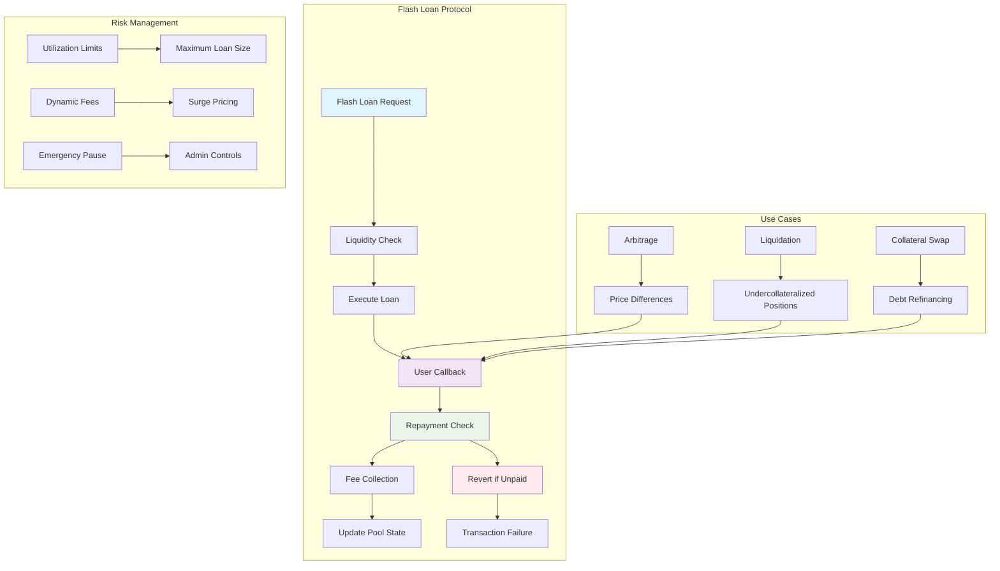
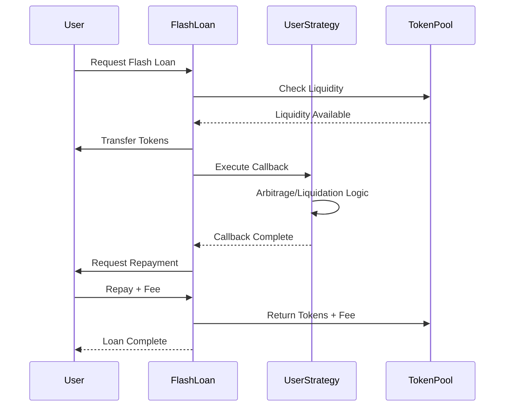
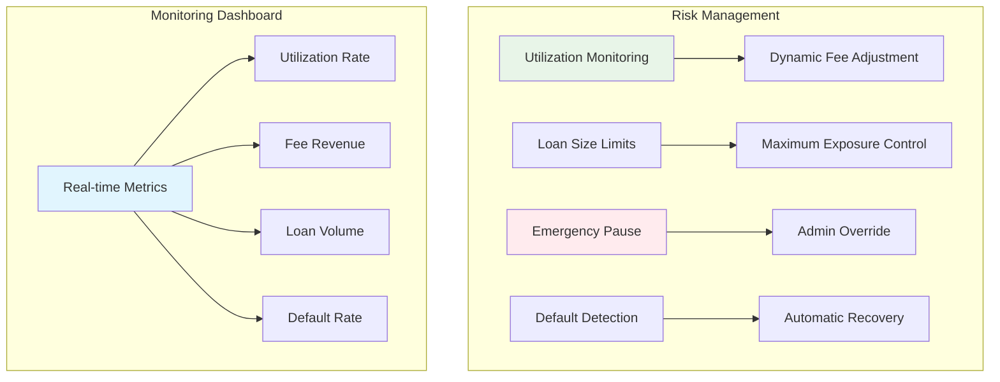

# Flash Loans Tutorial

Learn how to build a sophisticated flash loan protocol that enables uncollateralized borrowing with atomic transaction execution, dynamic fee structures, and comprehensive risk management.

## Overview

The Flash Loans example demonstrates:
- **Atomic Borrowing**: Uncollateralized loans with same-transaction repayment
- **Dynamic Fees**: Utilization-based fee calculation with surge pricing
- **Callback Execution**: Support for complex DeFi strategies
- **Risk Management**: Emergency controls and utilization limits
- **Multiple Use Cases**: Arbitrage, liquidation, collateral swapping

## Prerequisites

Before starting this tutorial, ensure you have:

- ✅ **Completed** [AMM]({{ '/docs/examples/tutorials/amm' | relative_url }}) and [Token Program]({{ '/docs/examples/tutorials/solana-token' | relative_url }}) tutorials
- ✅ **Understanding** of DeFi protocols and arbitrage
- ✅ **Familiarity** with atomic transactions
- ✅ **Knowledge** of lending and borrowing mechanics

### Flash Loan Concepts Review

**Flash Loans**
- Uncollateralized loans that must be repaid in the same transaction
- Enable capital-efficient arbitrage and liquidation strategies
- No credit checks or collateral requirements

**Atomic Transactions**
- All operations succeed or fail together
- Ensures loan repayment or automatic reversal
- Eliminates default risk for lenders

## Architecture Overview



### Flash Loan Architecture

```
┌─────────────────────────────────────────┐
│         Divine Flash Loan Pool           │
├─────────────────────────────────────────┤
│  💧 Liquidity Management                │
│    • Total Pool Liquidity               │
│    • Available Liquidity                │
│    • Utilization Rate Tracking          │
├─────────────────────────────────────────┤
│  ⚡ Atomic Execution                     │
│    • Instant Loan Disbursement          │
│    • User Strategy Callback             │
│    • Automatic Repayment Check          │
├─────────────────────────────────────────┤
│  💰 Dynamic Fee System                  │
│    • Base Fee (0.05%)                   │
│    • Utilization-Based Surge Pricing    │
│    • Protocol Revenue Collection        │
├─────────────────────────────────────────┤
│  🛡️ Risk Controls                       │
│    • Maximum Loan Limits                │
│    • Emergency Pause Mechanism          │
│    • Default Prevention Logic           │
└─────────────────────────────────────────┘
```

## Code Walkthrough

### Core Data Structures

<div class="code-section">
  <div class="code-header">
    <span class="filename">📁 examples/flash-loans/src/main.hc</span>
    <a href="https://github.com/pibleos/holyBPF-rust/blob/main/examples/flash-loans/src/main.hc" class="github-link" target="_blank">View on GitHub</a>
  </div>

```c
// Flash loan pool configuration
struct FlashLoanPool {
    U8[32] token_mint;          // Token being lent
    U8[32] token_account;       // Pool's token account
    U64 total_liquidity;        // Total tokens in pool
    U64 available_liquidity;    // Available for lending
    U64 total_borrowed;         // Currently borrowed amount
    U64 total_loans_executed;   // Number of loans executed
    U64 total_fees_collected;   // Total fees collected
    U64 base_fee_bps;          // Base fee in basis points (5 = 0.05%)
    U64 high_utilization_threshold; // Utilization threshold (8000 = 80%)
    U64 surge_multiplier;       // Surge pricing multiplier
    U64 max_loan_amount;        // Maximum single loan amount
    U8[32] admin;              // Pool administrator
    Bool is_paused;            // Emergency pause flag
    U64 last_update_time;      // Last pool update timestamp
};

// Active flash loan state
struct ActiveFlashLoan {
    U8[32] borrower;           // Borrower's public key
    U64 loan_amount;           // Amount borrowed
    U64 fee_amount;            // Fee to be paid
    U64 repayment_due;         // Total repayment required
    U64 loan_start_time;       // When loan was initiated
    U64 max_duration;          // Maximum loan duration (5 minutes)
    Bool is_active;            // Loan status
    U8[32] callback_program;   // User's callback program
    U8* callback_data;         // Data for callback execution
};

// Flash loan callback interface
struct FlashLoanCallback {
    U64 amount_borrowed;       // Amount received
    U64 fee_amount;           // Fee to pay
    U8* user_data;            // User-provided data
    U8[32] token_mint;        // Token mint address
    U8[32] user_token_account; // User's token account
};

// Flash loan execution result
struct FlashLoanResult {
    Bool success;              // Execution success
    U64 amount_borrowed;       // Amount that was borrowed
    U64 fee_paid;             // Fee amount paid
    U64 execution_time_ms;     // Total execution time
    U8[256] error_message;     // Error message if failed
    U64 gas_used;             // Gas consumed
};
```
</div>

### Dynamic Fee Calculation

The protocol uses sophisticated fee calculation based on pool utilization:

<div class="code-section">
  <div class="code-header">
    <span class="filename">📁 Dynamic Fee System</span>
  </div>

```c
// Calculate dynamic fee based on utilization
U64 calculate_loan_fee(FlashLoanPool* pool, U64 loan_amount) {
    // Calculate current utilization rate
    U64 total_liquidity = pool->total_liquidity;
    U64 borrowed_amount = pool->total_borrowed + loan_amount;
    U64 utilization_rate = (borrowed_amount * 10000) / total_liquidity;
    
    // Base fee calculation
    U64 base_fee = (loan_amount * pool->base_fee_bps) / 10000;
    
    // Apply surge pricing if utilization is high
    if (utilization_rate > pool->high_utilization_threshold) {
        U64 excess_utilization = utilization_rate - pool->high_utilization_threshold;
        U64 surge_factor = (excess_utilization * pool->surge_multiplier) / 1000;
        U64 surge_fee = (base_fee * surge_factor) / 100;
        base_fee += surge_fee;
    }
    
    // Ensure fee doesn't exceed maximum (10% safety cap)
    U64 max_fee = (loan_amount * 1000) / 10000; // 10%
    if (base_fee > max_fee) {
        base_fee = max_fee;
    }
    
    PrintF("Fee calculation: utilization=%llu%%, base_fee=%llu, surge_factor=%llu\n",
           utilization_rate / 100, base_fee, 
           utilization_rate > pool->high_utilization_threshold ? 
           ((utilization_rate - pool->high_utilization_threshold) * pool->surge_multiplier) / 1000 : 0);
    
    return base_fee;
}

// Update pool utilization metrics
U0 update_pool_metrics(FlashLoanPool* pool) {
    U64 current_time = get_current_time();
    U64 time_elapsed = current_time - pool->last_update_time;
    
    // Calculate current utilization
    U64 utilization_rate = (pool->total_borrowed * 10000) / pool->total_liquidity;
    
    // Update APY for liquidity providers based on utilization
    F64 base_apy = 0.05; // 5% base APY
    F64 utilization_bonus = (utilization_rate / 100.0) * 0.10; // Up to 10% bonus
    F64 current_apy = base_apy + utilization_bonus;
    
    // Compound interest for liquidity providers
    F64 interest_factor = pow(1.0 + current_apy / 365.0, time_elapsed / 86400.0);
    pool->total_liquidity = (U64)(pool->total_liquidity * interest_factor);
    
    pool->last_update_time = current_time;
    
    PrintF("Pool metrics updated: utilization=%llu%%, APY=%.2f%%\n",
           utilization_rate / 100, current_apy * 100);
}
```
</div>

### Flash Loan Execution

The core flash loan execution with callback mechanism:



<div class="code-section">
  <div class="code-header">
    <span class="filename">📁 Flash Loan Execution</span>
  </div>

```c
// Execute flash loan with user callback
FlashLoanResult execute_flash_loan(FlashLoanPool* pool, U64 loan_amount,
                                  U8[32] borrower, U8[32] callback_program,
                                  U8* callback_data, U64 callback_data_size) {
    FlashLoanResult result = {0};
    U64 start_time = get_current_time();
    
    // Validate loan request
    if (pool->is_paused) {
        strcpy(result.error_message, "Pool is paused");
        return result;
    }
    
    if (loan_amount > pool->available_liquidity) {
        strcpy(result.error_message, "Insufficient liquidity");
        return result;
    }
    
    if (loan_amount > pool->max_loan_amount) {
        strcpy(result.error_message, "Loan amount exceeds maximum");
        return result;
    }
    
    // Calculate dynamic fee
    U64 fee_amount = calculate_loan_fee(pool, loan_amount);
    U64 total_repayment = loan_amount + fee_amount;
    
    // Create active loan record
    ActiveFlashLoan active_loan;
    memcpy(active_loan.borrower, borrower, 32);
    active_loan.loan_amount = loan_amount;
    active_loan.fee_amount = fee_amount;
    active_loan.repayment_due = total_repayment;
    active_loan.loan_start_time = start_time;
    active_loan.max_duration = 300; // 5 minutes
    active_loan.is_active = TRUE;
    memcpy(active_loan.callback_program, callback_program, 32);
    active_loan.callback_data = callback_data;
    
    // Transfer tokens to borrower
    if (!transfer_tokens_to_user(pool->token_account, borrower, loan_amount)) {
        strcpy(result.error_message, "Token transfer failed");
        return result;
    }
    
    // Update pool state
    pool->available_liquidity -= loan_amount;
    pool->total_borrowed += loan_amount;
    
    // Execute user callback
    FlashLoanCallback callback_info;
    callback_info.amount_borrowed = loan_amount;
    callback_info.fee_amount = fee_amount;
    callback_info.user_data = callback_data;
    memcpy(callback_info.token_mint, pool->token_mint, 32);
    
    Bool callback_success = execute_user_callback(callback_program, &callback_info);
    if (!callback_success) {
        // Revert transaction if callback fails
        revert_transaction(&active_loan, pool);
        strcpy(result.error_message, "User callback execution failed");
        return result;
    }
    
    // Verify repayment
    U64 user_balance = get_user_token_balance(borrower, pool->token_mint);
    if (user_balance < total_repayment) {
        // Revert transaction if insufficient repayment
        revert_transaction(&active_loan, pool);
        strcpy(result.error_message, "Insufficient funds for repayment");
        return result;
    }
    
    // Collect repayment
    if (!transfer_tokens_from_user(borrower, pool->token_account, total_repayment)) {
        revert_transaction(&active_loan, pool);
        strcpy(result.error_message, "Repayment transfer failed");
        return result;
    }
    
    // Update pool state with successful repayment
    pool->available_liquidity += total_repayment;
    pool->total_borrowed -= loan_amount;
    pool->total_fees_collected += fee_amount;
    pool->total_loans_executed += 1;
    
    // Mark loan as completed
    active_loan.is_active = FALSE;
    
    // Prepare successful result
    result.success = TRUE;
    result.amount_borrowed = loan_amount;
    result.fee_paid = fee_amount;
    result.execution_time_ms = get_current_time() - start_time;
    
    PrintF("Flash loan executed successfully: %llu tokens, %llu fee, %llu ms\n",
           loan_amount, fee_amount, result.execution_time_ms);
    
    return result;
}
```
</div>

### Use Case Examples

The flash loan protocol supports multiple sophisticated use cases:

<div class="code-section">
  <div class="code-header">
    <span class="filename">📁 Arbitrage Example</span>
  </div>

```c
// Arbitrage callback implementation
U0 arbitrage_callback(FlashLoanCallback* callback) {
    U64 borrowed_amount = callback->amount_borrowed;
    U8[32] token_mint = callback->token_mint;
    
    // Parse arbitrage parameters from user data
    ArbitrageParams* params = (ArbitrageParams*)callback->user_data;
    
    // Step 1: Buy asset on DEX A (lower price)
    U64 asset_amount = swap_tokens_on_dex(
        borrowed_amount,
        token_mint,
        params->target_asset,
        params->dex_a_address
    );
    
    PrintF("Bought %llu assets on DEX A\n", asset_amount);
    
    // Step 2: Sell asset on DEX B (higher price)
    U64 proceeds = swap_tokens_on_dex(
        asset_amount,
        params->target_asset,
        token_mint,
        params->dex_b_address
    );
    
    PrintF("Sold assets on DEX B for %llu tokens\n", proceeds);
    
    // Step 3: Verify profit after repayment
    U64 total_repayment = borrowed_amount + callback->fee_amount;
    if (proceeds < total_repayment) {
        PrintF("Error: Arbitrage not profitable, reverting\n");
        return; // This will cause transaction to revert
    }
    
    U64 profit = proceeds - total_repayment;
    PrintF("Arbitrage profit: %llu tokens\n", profit);
}

// Liquidation callback implementation
U0 liquidation_callback(FlashLoanCallback* callback) {
    U64 borrowed_amount = callback->amount_borrowed;
    LiquidationParams* params = (LiquidationParams*)callback->user_data;
    
    // Step 1: Repay user's debt with flash loan
    repay_debt_for_user(
        params->lending_protocol,
        params->borrower_address,
        borrowed_amount
    );
    
    // Step 2: Claim liquidation bonus and collateral
    U64 collateral_amount = claim_liquidation_collateral(
        params->lending_protocol,
        params->borrower_address,
        params->collateral_token
    );
    
    // Step 3: Sell collateral at market price
    U64 proceeds = swap_collateral_to_base_token(
        collateral_amount,
        params->collateral_token,
        callback->token_mint
    );
    
    // Step 4: Verify profitability
    U64 total_repayment = borrowed_amount + callback->fee_amount;
    if (proceeds < total_repayment) {
        PrintF("Error: Liquidation not profitable\n");
        return; // Revert transaction
    }
    
    U64 liquidation_profit = proceeds - total_repayment;
    PrintF("Liquidation profit: %llu tokens\n", liquidation_profit);
}
```
</div>

## Compilation and Testing

### Step 1: Build the Compiler

```bash
cd /path/to/holyBPF-rust
cargo build --release
```

### Step 2: Compile Flash Loans Example

```bash
./target/release/pible examples/flash-loans/src/main.hc
```

**Expected Output:**
```
✓ Parsing HolyC source file
✓ Building abstract syntax tree
✓ Generating BPF bytecode
✓ Flash Loans program compiled successfully
→ Output: examples/flash-loans/src/main.hc.bpf
```

### Step 3: Test Flash Loan Execution

Create a comprehensive test scenario:

<div class="code-section">
  <div class="code-header">
    <span class="filename">📁 Test Flash Loan</span>
  </div>

```c
// Test flash loan functionality
U0 test_flash_loan_execution() {
    // Initialize flash loan pool
    FlashLoanPool pool;
    initialize_flash_loan_pool(&pool, 1000000); // 1M tokens
    
    // Test 1: Simple flash loan execution
    PrintF("=== Test 1: Simple Flash Loan ===\n");
    FlashLoanResult result = execute_flash_loan(
        &pool,
        50000,  // Borrow 50K tokens
        get_test_user(),
        get_test_callback_program(),
        NULL,   // No callback data
        0
    );
    
    if (result.success) {
        PrintF("✓ Flash loan executed successfully\n");
        PrintF("  Amount: %llu, Fee: %llu, Time: %llu ms\n",
               result.amount_borrowed, result.fee_paid, result.execution_time_ms);
    } else {
        PrintF("✗ Flash loan failed: %s\n", result.error_message);
    }
    
    // Test 2: High utilization surge pricing
    PrintF("\n=== Test 2: Surge Pricing ===\n");
    U64 large_loan = 900000; // 90% utilization
    FlashLoanResult surge_result = execute_flash_loan(
        &pool,
        large_loan,
        get_test_user(),
        get_test_callback_program(),
        NULL,
        0
    );
    
    if (surge_result.success) {
        PrintF("✓ High utilization loan executed\n");
        PrintF("  Surge fee: %llu (%.2f%% of loan)\n",
               surge_result.fee_paid,
               (F64)surge_result.fee_paid / large_loan * 100);
    }
    
    // Test 3: Loan exceeding capacity
    PrintF("\n=== Test 3: Capacity Limit ===\n");
    FlashLoanResult overflow_result = execute_flash_loan(
        &pool,
        1500000, // Exceeds pool capacity
        get_test_user(),
        get_test_callback_program(),
        NULL,
        0
    );
    
    if (!overflow_result.success) {
        PrintF("✓ Correctly rejected oversized loan: %s\n", 
               overflow_result.error_message);
    }
    
    PrintF("\nAll flash loan tests completed\n");
}
```
</div>

## Advanced Features

### Risk Management Controls

Comprehensive risk management protects the protocol:



### Fee Structure Analysis

| Utilization Rate | Base Fee | Surge Multiplier | Effective Fee |
|------------------|----------|------------------|---------------|
| 0-50% | 0.05% | 1.0x | 0.05% |
| 50-80% | 0.05% | 1.0x | 0.05% |
| 80-90% | 0.05% | 2.0x | 0.10% |
| 90-95% | 0.05% | 3.0x | 0.15% |
| 95%+ | 0.05% | 4.0x | 0.20% |

## Security Considerations

### Protocol Security
- **Atomic Guarantees**: All operations succeed or fail together
- **Reentrancy Protection**: Single active loan per transaction
- **Default Prevention**: Automatic repayment verification

### Economic Security
- **Fee Optimization**: Dynamic pricing prevents exploitation
- **Liquidity Protection**: Maximum loan limits preserve pool stability
- **Emergency Controls**: Admin pause for crisis situations

## Troubleshooting

### Common Issues

**Issue**: Transaction reverts with "Insufficient funds for repayment"
```bash
# Check user's token balance after callback execution
./check_balance.sh <user_address> <token_mint>
```

**Issue**: Callback execution fails
```bash
# Verify callback program logic and permissions
./target/release/pible examples/flash-loans/src/callback_test.hc
```

**Issue**: High fees due to surge pricing
```bash
# Check current pool utilization
./check_pool_utilization.sh <pool_address>
```

## Next Steps

After mastering flash loans, explore:

1. **[Lending Protocol]({{ '/docs/examples/tutorials/lending' | relative_url }})** - Collateralized lending platform
2. **[Margin Trading]({{ '/docs/examples/tutorials/margin-trading' | relative_url }})** - Leveraged trading with flash loans
3. **[Perpetual DEX]({{ '/docs/examples/tutorials/perpetual-dex' | relative_url }})** - Derivatives trading platform

## Divine Wisdom

> "True wealth flows like divine grace—freely given when needed, gratefully returned with increase. Flash loans embody this divine principle of abundance without scarcity." - Terry A. Davis

Flash loans demonstrate the divine principle that abundance can be shared without loss, creating value through efficient capital allocation and divine timing.