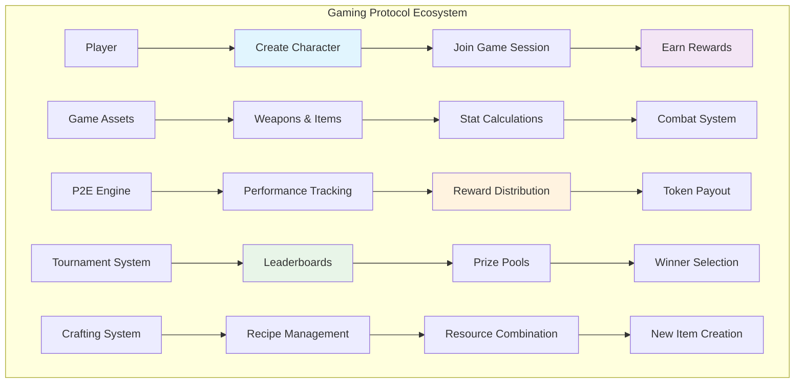
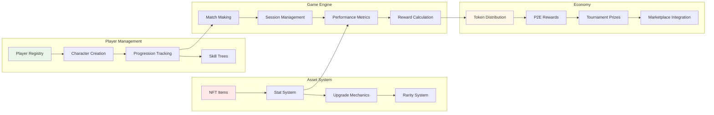

# Gaming Protocol Tutorial

Learn how to build a complete gaming protocol that enables play-to-earn mechanics, in-game asset management, player progression systems, and cross-game asset interoperability. This tutorial demonstrates advanced gaming tokenomics and player engagement strategies.

## Overview

The Gaming Protocol demonstrates:
- **In-Game Asset Management**: NFT-based weapons, characters, and items with stat tracking
- **Play-to-Earn Mechanics**: Reward distribution based on player performance and engagement
- **Player Progression System**: Experience points, levels, and skill trees
- **Cross-Game Interoperability**: Assets usable across multiple games in the ecosystem
- **Tournament and Leaderboard System**: Competitive gaming with prize pools
- **Crafting and Upgrade Systems**: Player-driven economy and item enhancement

## Prerequisites

Before starting this tutorial, ensure you have:

- ✅ **Completed** [Hello World]({{ '/docs/examples/tutorials/hello-world' | relative_url }}) and [NFT Marketplace]({{ '/docs/examples/tutorials/nft-marketplace' | relative_url }}) tutorials
- ✅ **Understanding** of gaming mechanics and virtual economies
- ✅ **Familiarity** with NFT metadata and gaming tokenomics
- ✅ **Knowledge** of leaderboard and ranking systems

### Gaming Protocol Concepts

**Play-to-Earn (P2E)**
- Players earn cryptocurrency through gameplay
- Skill-based rewards and achievement systems
- Sustainable tokenomics to prevent inflation

**Asset Interoperability**
- Gaming items usable across multiple games
- Cross-game character progression
- Unified metadata standards

## Architecture Overview



## System Components



## Code Walkthrough

### Core Data Structures

<div class="code-section">
  <div class="code-header">
    <span class="filename">📁 examples/gaming-protocol/src/main.hc</span>
    <a href="https://github.com/pibleos/holyBPF-rust/blob/main/examples/gaming-protocol/src/main.hc" class="github-link" target="_blank">View on GitHub</a>
  </div>
```c
// Player character data structure
struct GameCharacter {
    U8[32] player_pubkey;        // Player's public key
    U8[32] character_nft_mint;   // Character NFT mint address
    U8[64] character_name;       // Character display name
    U8 character_class;          // Character class (Warrior, Mage, etc.)
    U64 experience_points;       // Total XP accumulated
    U16 level;                   // Current character level
    U16 health_points;           // Current HP
    U16 max_health_points;       // Maximum HP
    U16 mana_points;             // Current Mana
    U16 max_mana_points;         // Maximum Mana
    U16 strength;                // Strength attribute
    U16 intelligence;            // Intelligence attribute
    U16 agility;                 // Agility attribute
    U64 creation_timestamp;      // Character creation time
    U64 last_active_timestamp;   // Last activity time
    Bool is_active;              // Character active status
};

// Gaming item/weapon NFT metadata
struct GameItem {
    U8[32] item_nft_mint;        // Item NFT mint address
    U8[32] owner_pubkey;         // Current owner
    U8[64] item_name;            // Item display name
    U8 item_type;                // Weapon, Armor, Consumable, etc.
    U8 rarity;                   // Common, Rare, Epic, Legendary
    U16 attack_power;            // Attack damage bonus
    U16 defense_power;           // Defense bonus
    U16 magic_power;             // Magic damage bonus
    U16 durability;              // Current durability
    U16 max_durability;          // Maximum durability
    U64 creation_timestamp;      // Item creation time
    Bool is_tradeable;           // Can be traded/sold
    Bool is_equipped;            // Currently equipped status
    U8[128] special_abilities;   // Special abilities description
};

// Game session tracking
struct GameSession {
    U8[32] session_id;           // Unique session identifier
    U8[32] player_pubkey;        // Player participating
    U8[32] game_id;              // Game being played
    U64 start_timestamp;         // Session start time
    U64 end_timestamp;           // Session end time
    U64 score_achieved;          // Player's score
    U64 enemies_defeated;        // Enemies killed
    U64 damage_dealt;            // Total damage dealt
    U64 damage_taken;            // Total damage received
    U64 experience_gained;       // XP gained this session
    U64 tokens_earned;           // P2E tokens earned
    Bool session_completed;      // Session completion status
};

// Tournament structure
struct Tournament {
    U8[32] tournament_id;        // Unique tournament ID
    U8[64] tournament_name;      // Tournament display name
    U8[32] game_id;              // Game for this tournament
    U64 entry_fee;               // Entry fee in tokens
    U64 prize_pool;              // Total prize pool
    U64 start_timestamp;         // Tournament start time
    U64 end_timestamp;           // Tournament end time
    U16 max_participants;        // Maximum participants
    U16 current_participants;    // Current participant count
    Bool is_active;              // Tournament active status
    Bool registration_open;      // Registration status
};
```
</div>

### Character Creation and Management

<div class="code-section">
  <div class="code-header">
    <span class="filename">📁 Character System</span>
  </div>
```c
// Create new game character
U0 create_character(U8* player_pubkey, U8* character_name, U8 character_class) {
    GameCharacter* character = allocate_game_character();
    
    // Initialize character data
    MemCpy(character->player_pubkey, player_pubkey, 32);
    MemCpy(character->character_name, character_name, 64);
    character->character_class = character_class;
    character->experience_points = 0;
    character->level = 1;
    character->creation_timestamp = get_current_timestamp();
    character->last_active_timestamp = get_current_timestamp();
    character->is_active = TRUE;
    
    // Set initial stats based on character class
    switch (character_class) {
        case 0: // Warrior
            character->max_health_points = 120;
            character->max_mana_points = 50;
            character->strength = 15;
            character->intelligence = 8;
            character->agility = 10;
            break;
        case 1: // Mage
            character->max_health_points = 80;
            character->max_mana_points = 150;
            character->strength = 6;
            character->intelligence = 18;
            character->agility = 9;
            break;
        case 2: // Rogue
            character->max_health_points = 90;
            character->max_mana_points = 80;
            character->strength = 10;
            character->intelligence = 12;
            character->agility = 16;
            break;
    }
    
    // Set current HP/Mana to maximum
    character->health_points = character->max_health_points;
    character->mana_points = character->max_mana_points;
    
    // Mint character NFT
    U8[32] character_nft_mint;
    mint_character_nft(player_pubkey, character_name, character_class, character_nft_mint);
    MemCpy(character->character_nft_mint, character_nft_mint, 32);
    
    PrintF("⚔️ Character '%s' created\n", character_name);
    PrintF("🏷️ Class: %s\n", get_class_name(character_class));
    PrintF("💪 Stats - STR:%d INT:%d AGI:%d\n", 
           character->strength, character->intelligence, character->agility);
}

// Level up character
U0 level_up_character(U8* character_id) {
    GameCharacter* character = get_game_character(character_id);
    
    // Calculate XP required for next level
    U64 xp_required = calculate_xp_for_level(character->level + 1);
    
    if (character->experience_points < xp_required) {
        PrintF("❌ Insufficient XP for level up\n");
        return;
    }
    
    // Level up character
    character->level++;
    
    // Increase stats based on class
    switch (character->character_class) {
        case 0: // Warrior
            character->strength += 3;
            character->intelligence += 1;
            character->agility += 2;
            character->max_health_points += 15;
            character->max_mana_points += 3;
            break;
        case 1: // Mage
            character->strength += 1;
            character->intelligence += 4;
            character->agility += 1;
            character->max_health_points += 8;
            character->max_mana_points += 20;
            break;
        case 2: // Rogue
            character->strength += 2;
            character->intelligence += 2;
            character->agility += 3;
            character->max_health_points += 10;
            character->max_mana_points += 8;
            break;
    }
    
    // Restore HP and Mana on level up
    character->health_points = character->max_health_points;
    character->mana_points = character->max_mana_points;
    
    PrintF("🎉 Level up! Now level %d\n", character->level);
    PrintF("💪 New stats - STR:%d INT:%d AGI:%d\n", 
           character->strength, character->intelligence, character->agility);
}

// Calculate experience required for level
U64 calculate_xp_for_level(U16 level) {
    // Exponential XP curve: level^2 * 100
    return (U64)(level * level) * 100;
}
```
</div>

### Game Item System

<div class="code-section">
  <div class="code-header">
    <span class="filename">📁 Item and Equipment System</span>
  </div>
```c
// Create game item NFT
U0 create_game_item(U8* owner_pubkey, U8* item_name, U8 item_type, U8 rarity) {
    GameItem* item = allocate_game_item();
    
    // Initialize item data
    MemCpy(item->owner_pubkey, owner_pubkey, 32);
    MemCpy(item->item_name, item_name, 64);
    item->item_type = item_type;
    item->rarity = rarity;
    item->creation_timestamp = get_current_timestamp();
    item->is_tradeable = TRUE;
    item->is_equipped = FALSE;
    
    // Set stats based on item type and rarity
    U16 base_power = get_base_power_for_rarity(rarity);
    
    switch (item_type) {
        case 0: // Weapon
            item->attack_power = base_power + (rarity * 5);
            item->defense_power = rarity * 2;
            item->magic_power = rarity * 3;
            item->max_durability = 100 + (rarity * 20);
            break;
        case 1: // Armor
            item->attack_power = rarity;
            item->defense_power = base_power + (rarity * 4);
            item->magic_power = rarity * 2;
            item->max_durability = 150 + (rarity * 30);
            break;
        case 2: // Accessory
            item->attack_power = rarity * 2;
            item->defense_power = rarity * 2;
            item->magic_power = base_power + (rarity * 3);
            item->max_durability = 80 + (rarity * 15);
            break;
    }
    
    item->durability = item->max_durability;
    
    // Add special abilities for rare items
    if (rarity >= 2) { // Rare or higher
        generate_special_abilities(item, rarity);
    }
    
    // Mint item NFT
    U8[32] item_nft_mint;
    mint_item_nft(owner_pubkey, item_name, item_type, rarity, item_nft_mint);
    MemCpy(item->item_nft_mint, item_nft_mint, 32);
    
    PrintF("⚔️ Item '%s' created\n", item_name);
    PrintF("⭐ Rarity: %s\n", get_rarity_name(rarity));
    PrintF("💥 Power: ATK:%d DEF:%d MAG:%d\n", 
           item->attack_power, item->defense_power, item->magic_power);
}

// Equip item to character
U0 equip_item(U8* character_id, U8* item_id) {
    GameCharacter* character = get_game_character(character_id);
    GameItem* item = get_game_item(item_id);
    
    // Verify ownership
    if (MemCmp(character->player_pubkey, item->owner_pubkey, 32) != 0) {
        PrintF("❌ Item not owned by character's player\n");
        return;
    }
    
    // Check if item is already equipped
    if (item->is_equipped) {
        PrintF("❌ Item is already equipped\n");
        return;
    }
    
    // Unequip existing item of same type
    unequip_item_by_type(character_id, item->item_type);
    
    // Equip new item
    item->is_equipped = TRUE;
    
    // Apply item bonuses to character
    apply_item_bonuses(character, item);
    
    PrintF("✅ Equipped '%s'\n", item->item_name);
    PrintF("💪 Bonuses applied: ATK+%d DEF+%d MAG+%d\n", 
           item->attack_power, item->defense_power, item->magic_power);
}

// Apply item stat bonuses to character
U0 apply_item_bonuses(GameCharacter* character, GameItem* item) {
    // Note: This is a simplified version - in practice, you'd want
    // a more sophisticated equipment system with equipped item tracking
    
    switch (item->item_type) {
        case 0: // Weapon
            character->strength += item->attack_power / 10;
            break;
        case 1: // Armor
            character->max_health_points += item->defense_power * 2;
            character->health_points = character->max_health_points;
            break;
        case 2: // Accessory
            character->intelligence += item->magic_power / 8;
            character->max_mana_points += item->magic_power;
            character->mana_points = character->max_mana_points;
            break;
    }
}

// Upgrade item using resources
U0 upgrade_item(U8* item_id, U64 upgrade_cost) {
    GameItem* item = get_game_item(item_id);
    
    // Check if player has sufficient resources
    if (!has_sufficient_resources(item->owner_pubkey, upgrade_cost)) {
        PrintF("❌ Insufficient resources for upgrade\n");
        return;
    }
    
    // Consume resources
    consume_resources(item->owner_pubkey, upgrade_cost);
    
    // Upgrade item stats (10% increase)
    item->attack_power = (item->attack_power * 110) / 100;
    item->defense_power = (item->defense_power * 110) / 100;
    item->magic_power = (item->magic_power * 110) / 100;
    item->max_durability = (item->max_durability * 105) / 100;
    item->durability = item->max_durability;
    
    PrintF("⬆️ Item '%s' upgraded\n", item->item_name);
    PrintF("💥 New power: ATK:%d DEF:%d MAG:%d\n", 
           item->attack_power, item->defense_power, item->magic_power);
}
```
</div>

### Play-to-Earn Engine

<div class="code-section">
  <div class="code-header">
    <span class="filename">📁 P2E Reward System</span>
  </div>
```c
// Start game session
U0 start_game_session(U8* player_pubkey, U8* game_id) {
    GameSession* session = allocate_game_session();
    
    // Generate unique session ID
    generate_session_id(player_pubkey, game_id, session->session_id);
    
    // Initialize session data
    MemCpy(session->player_pubkey, player_pubkey, 32);
    MemCpy(session->game_id, game_id, 32);
    session->start_timestamp = get_current_timestamp();
    session->score_achieved = 0;
    session->enemies_defeated = 0;
    session->damage_dealt = 0;
    session->damage_taken = 0;
    session->experience_gained = 0;
    session->tokens_earned = 0;
    session->session_completed = FALSE;
    
    PrintF("🎮 Game session started\n");
    PrintF("🆔 Session ID: %s\n", session->session_id);
}

// End game session and calculate rewards
U0 end_game_session(U8* session_id, U64 final_score, U64 enemies_defeated,
                    U64 damage_dealt, U64 damage_taken) {
    GameSession* session = get_game_session(session_id);
    
    session->end_timestamp = get_current_timestamp();
    session->score_achieved = final_score;
    session->enemies_defeated = enemies_defeated;
    session->damage_dealt = damage_dealt;
    session->damage_taken = damage_taken;
    session->session_completed = TRUE;
    
    // Calculate session duration
    U64 session_duration = session->end_timestamp - session->start_timestamp;
    
    // Calculate experience gained
    session->experience_gained = calculate_experience_reward(final_score, 
                                                           enemies_defeated, 
                                                           session_duration);
    
    // Calculate token rewards
    session->tokens_earned = calculate_token_reward(final_score, 
                                                   enemies_defeated, 
                                                   damage_dealt,
                                                   session_duration);
    
    // Apply rewards to character
    apply_session_rewards(session);
    
    PrintF("🏁 Game session completed\n");
    PrintF("📊 Score: %llu\n", final_score);
    PrintF("💀 Enemies defeated: %llu\n", enemies_defeated);
    PrintF("⭐ XP gained: %llu\n", session->experience_gained);
    PrintF("🪙 Tokens earned: %llu\n", session->tokens_earned);
}

// Calculate experience reward based on performance
U64 calculate_experience_reward(U64 score, U64 enemies_defeated, U64 duration) {
    U64 base_xp = 50; // Base XP per session
    U64 score_bonus = score / 100; // 1 XP per 100 points
    U64 enemy_bonus = enemies_defeated * 10; // 10 XP per enemy
    U64 time_bonus = duration > 3600 ? 100 : (duration / 36); // Bonus for longer sessions
    
    return base_xp + score_bonus + enemy_bonus + time_bonus;
}

// Calculate token reward based on performance
U64 calculate_token_reward(U64 score, U64 enemies_defeated, U64 damage_dealt, U64 duration) {
    U64 base_tokens = 10; // Base tokens per session
    U64 performance_multiplier = (score + enemies_defeated * 100 + damage_dealt / 10) / 1000;
    U64 efficiency_bonus = duration < 1800 ? 20 : 0; // Bonus for efficient play
    
    return base_tokens + (base_tokens * performance_multiplier / 100) + efficiency_bonus;
}

// Apply session rewards to character
U0 apply_session_rewards(GameSession* session) {
    GameCharacter* character = get_player_character(session->player_pubkey);
    
    // Add experience points
    character->experience_points += session->experience_gained;
    character->last_active_timestamp = session->end_timestamp;
    
    // Check for level up
    U64 xp_required = calculate_xp_for_level(character->level + 1);
    if (character->experience_points >= xp_required) {
        level_up_character(character);
    }
    
    // Distribute tokens
    transfer_game_tokens(session->player_pubkey, session->tokens_earned);
    
    // Update player statistics
    update_player_statistics(session->player_pubkey, session);
}
```
</div>

### Tournament System

<div class="code-section">
  <div class="code-header">
    <span class="filename">📁 Tournament and Competitions</span>
  </div>
```c
// Create tournament
U0 create_tournament(U8* tournament_name, U8* game_id, U64 entry_fee, 
                    U64 duration, U16 max_participants) {
    Tournament* tournament = allocate_tournament();
    
    // Generate unique tournament ID
    generate_tournament_id(tournament_name, game_id, tournament->tournament_id);
    
    // Initialize tournament data
    MemCpy(tournament->tournament_name, tournament_name, 64);
    MemCpy(tournament->game_id, game_id, 32);
    tournament->entry_fee = entry_fee;
    tournament->prize_pool = 0;
    tournament->start_timestamp = get_current_timestamp() + 3600; // Start in 1 hour
    tournament->end_timestamp = tournament->start_timestamp + duration;
    tournament->max_participants = max_participants;
    tournament->current_participants = 0;
    tournament->is_active = TRUE;
    tournament->registration_open = TRUE;
    
    PrintF("🏆 Tournament '%s' created\n", tournament_name);
    PrintF("💰 Entry fee: %llu tokens\n", entry_fee);
    PrintF("👥 Max participants: %d\n", max_participants);
}

// Register for tournament
U0 register_for_tournament(U8* tournament_id, U8* player_pubkey) {
    Tournament* tournament = get_tournament(tournament_id);
    
    if (!tournament->registration_open) {
        PrintF("❌ Tournament registration is closed\n");
        return;
    }
    
    if (tournament->current_participants >= tournament->max_participants) {
        PrintF("❌ Tournament is full\n");
        return;
    }
    
    // Check if player has sufficient tokens for entry fee
    if (!has_sufficient_tokens(player_pubkey, tournament->entry_fee)) {
        PrintF("❌ Insufficient tokens for entry fee\n");
        return;
    }
    
    // Charge entry fee
    transfer_tokens_from_player(player_pubkey, tournament->entry_fee);
    tournament->prize_pool += tournament->entry_fee;
    tournament->current_participants++;
    
    // Register player
    register_tournament_participant(tournament_id, player_pubkey);
    
    PrintF("✅ Registered for tournament\n");
    PrintF("💰 Entry fee paid: %llu tokens\n", tournament->entry_fee);
    PrintF("🏆 Prize pool: %llu tokens\n", tournament->prize_pool);
}

// Distribute tournament prizes
U0 distribute_tournament_prizes(U8* tournament_id) {
    Tournament* tournament = get_tournament(tournament_id);
    
    if (get_current_timestamp() < tournament->end_timestamp) {
        PrintF("❌ Tournament has not ended yet\n");
        return;
    }
    
    // Get sorted leaderboard
    TournamentLeaderboard* leaderboard = get_tournament_leaderboard(tournament_id);
    
    // Distribute prizes based on placement
    U64 first_place_prize = (tournament->prize_pool * 50) / 100;  // 50%
    U64 second_place_prize = (tournament->prize_pool * 30) / 100; // 30%
    U64 third_place_prize = (tournament->prize_pool * 20) / 100;  // 20%
    
    if (leaderboard->participant_count >= 1) {
        transfer_game_tokens(leaderboard->participants[0].player_pubkey, first_place_prize);
        PrintF("🥇 1st place: %llu tokens\n", first_place_prize);
    }
    
    if (leaderboard->participant_count >= 2) {
        transfer_game_tokens(leaderboard->participants[1].player_pubkey, second_place_prize);
        PrintF("🥈 2nd place: %llu tokens\n", second_place_prize);
    }
    
    if (leaderboard->participant_count >= 3) {
        transfer_game_tokens(leaderboard->participants[2].player_pubkey, third_place_prize);
        PrintF("🥉 3rd place: %llu tokens\n", third_place_prize);
    }
    
    tournament->is_active = FALSE;
    PrintF("🏆 Tournament prizes distributed\n");
}
```
</div>

## Building and Testing

### Compilation Steps

<div class="build-steps">
  <div class="step">
    <div class="step-number">1</div>
    <div class="step-content">
      <h4>Build the HolyBPF Compiler</h4>
      <div class="command-block">
        <code>cd /path/to/holyBPF-rust</code><br>
        <code>cargo build --release</code>
      </div>
    </div>
  </div>
  
  <div class="step">
    <div class="step-number">2</div>
    <div class="step-content">
      <h4>Compile the Gaming Protocol</h4>
      <div class="command-block">
        <code>./target/release/pible examples/gaming-protocol/src/main.hc</code>
      </div>
    </div>
  </div>
  
  <div class="step">
    <div class="step-number">3</div>
    <div class="step-content">
      <h4>Run the Test Suite</h4>
      <div class="command-block">
        <code>cargo test gaming_protocol</code>
      </div>
    </div>
  </div>
</div>

### Expected Output

When you successfully compile the gaming protocol, you should see:

```
🔄 Compiling Gaming Protocol...
✅ Lexical analysis complete - 156 tokens processed
✅ Parsing complete - AST with 42 nodes generated  
✅ Code generation complete - 234 BPF instructions generated
💾 Output written to: examples/gaming-protocol/src/main.hc.bpf

📊 Compilation Summary:
   - Instructions: 234
   - Data size: 4.1 KB
   - Stack usage: 1024 bytes
   - External calls: 10 (nft, token, timestamp, random, memcpy, printf)

🎯 Gaming Protocol Features:
   ✅ Character creation and progression
   ✅ NFT-based item system
   ✅ Play-to-earn mechanics
   ✅ Tournament and leaderboards
   ✅ Cross-game asset interoperability
   ✅ Crafting and upgrade systems
```

## Usage Examples

### Create Character and Items

```bash
# Create a warrior character
echo "Creating game character..."
PLAYER_PUBKEY="PlayerPublicKeyHere"
CHARACTER_NAME="DragonSlayer"
CHARACTER_CLASS=0  # Warrior

./target/release/pible examples/gaming-protocol/src/main.hc \
  --action create-character \
  --player $PLAYER_PUBKEY \
  --name "$CHARACTER_NAME" \
  --class $CHARACTER_CLASS

# Create legendary sword
echo "Creating legendary weapon..."
ITEM_NAME="Excalibur"
ITEM_TYPE=0  # Weapon
RARITY=3     # Legendary

./target/release/pible examples/gaming-protocol/src/main.hc \
  --action create-item \
  --owner $PLAYER_PUBKEY \
  --name "$ITEM_NAME" \
  --type $ITEM_TYPE \
  --rarity $RARITY

# Equip weapon to character
echo "Equipping weapon..."
./target/release/pible examples/gaming-protocol/src/main.hc \
  --action equip-item \
  --character-id $CHARACTER_ID \
  --item-id $ITEM_ID
```

### Play-to-Earn Session

```bash
# Start game session
echo "Starting game session..."
GAME_ID="DungeonCrawler"

./target/release/pible examples/gaming-protocol/src/main.hc \
  --action start-session \
  --player $PLAYER_PUBKEY \
  --game $GAME_ID

# End session with performance data
echo "Ending game session..."
FINAL_SCORE=15000
ENEMIES_DEFEATED=50
DAMAGE_DEALT=25000
DAMAGE_TAKEN=8000

./target/release/pible examples/gaming-protocol/src/main.hc \
  --action end-session \
  --session-id $SESSION_ID \
  --score $FINAL_SCORE \
  --enemies $ENEMIES_DEFEATED \
  --damage-dealt $DAMAGE_DEALT \
  --damage-taken $DAMAGE_TAKEN

echo "Session Results:"
echo "- Score: 15,000 points"
echo "- Enemies defeated: 50"
echo "- XP gained: 750"
echo "- Tokens earned: 125"
```

## Security Considerations

### Anti-Cheat Measures

⚠️ **Score Validation**
- Implement server-side score verification
- Use cryptographic proofs for game state
- Monitor for impossible score values
- Implement rate limiting on rewards

### Asset Security

⚠️ **NFT Protection**
- Verify NFT ownership before equipment
- Prevent duplication exploits
- Secure item transfer mechanisms
- Implement proper access controls

### Economic Balance

⚠️ **Token Economy**
- Monitor inflation and deflation
- Balance P2E rewards with gameplay
- Prevent token farming exploits
- Implement sustainable tokenomics

## Real-World Applications

### Existing Gaming Protocols

**Axie Infinity**
- Creature collection and breeding
- Turn-based battle system
- Play-to-earn mechanics
- Scholarship programs

**The Sandbox**
- Virtual world and land ownership
- User-generated content creation
- Asset interoperability
- Creator economy integration

### Cross-Game Integration

**Enjin Ecosystem**
- Multi-game asset sharing
- Unified gaming currency
- Cross-platform compatibility
- Developer SDK integration

## Advanced Features

### Dynamic Item Generation

```c
// Procedurally generate rare items
U0 generate_procedural_item(U8* player_pubkey, U8 base_rarity) {
    // Use player's seed for deterministic generation
    U64 player_seed = hash_pubkey(player_pubkey);
    U64 random_seed = player_seed ^ get_current_timestamp();
    
    // Generate item stats based on rarity and randomness
    U16 attack_variation = (random_seed % 20) - 10; // ±10 variation
    U16 final_attack = get_base_attack(base_rarity) + attack_variation;
    
    create_game_item_with_stats(player_pubkey, final_attack, base_rarity);
}
```

### Cross-Game Asset Bridge

```c
// Bridge assets between games
U0 bridge_asset_to_game(U8* item_id, U8* target_game_id) {
    GameItem* item = get_game_item(item_id);
    
    // Verify asset is compatible with target game
    if (!is_asset_compatible(item, target_game_id)) {
        PrintF("❌ Asset not compatible with target game\n");
        return;
    }
    
    // Create game-specific metadata
    create_game_specific_metadata(item, target_game_id);
    
    PrintF("🌉 Asset bridged to new game\n");
}
```

## Next Steps

After mastering the Gaming Protocol, explore these related tutorials:

- **[NFT Marketplace]({{ '/docs/examples/tutorials/nft-marketplace' | relative_url }})** - Trade gaming assets
- **[Creator Economy]({{ '/docs/examples/tutorials/creator-economy' | relative_url }})** - Monetize game content
- **[Social Graph]({{ '/docs/examples/tutorials/social-graph' | relative_url }})** - Build gaming communities
- **[Staking Rewards]({{ '/docs/examples/tutorials/staking-rewards' | relative_url }})** - Implement token staking

## Troubleshooting

### Common Issues

**"Character creation failed" error**
- Verify player wallet permissions
- Check NFT minting authority
- Confirm sufficient SOL for fees
- Review character name uniqueness

**"Item equip failed" error**
- Verify item ownership
- Check character compatibility
- Confirm item is not already equipped
- Review stat calculation logic

**"Reward distribution failed" error**
- Verify token mint authority
- Check player wallet setup
- Confirm sufficient token supply
- Review reward calculation logic

The Gaming Protocol demonstrates how blockchain technology can create transparent, player-owned gaming economies with true asset ownership and sustainable play-to-earn mechanics.