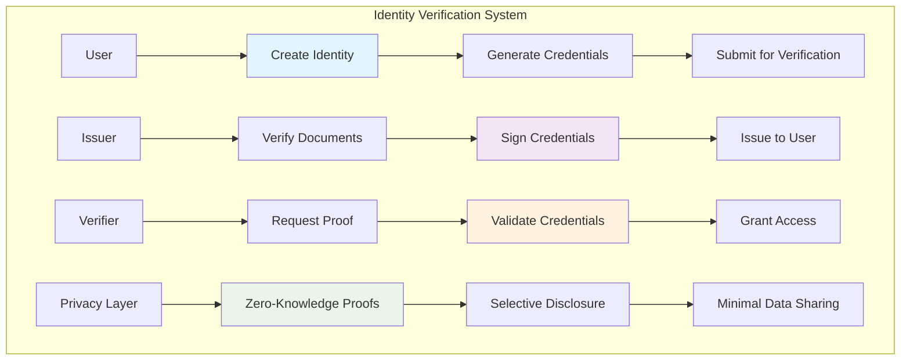

# Identity Verification Tutorial

Learn how to build a comprehensive decentralized identity verification system that enables users to prove their identity while maintaining privacy. This tutorial demonstrates advanced cryptographic techniques including zero-knowledge proofs, credential verification, and selective disclosure.

## Overview

The Identity Verification system demonstrates:
- **Self-Sovereign Identity**: User-controlled identity without centralized authorities
- **Verifiable Credentials**: Cryptographically signed digital credentials
- **Zero-Knowledge Proofs**: Prove identity claims without revealing personal data
- **Selective Disclosure**: Share only necessary information for verification
- **Credential Revocation**: Secure mechanism to invalidate compromised credentials
- **Biometric Integration**: Optional biometric authentication for enhanced security

## Prerequisites

Before starting this tutorial, ensure you have:

- ✅ **Completed** [Hello World]({{ '/docs/examples/tutorials/hello-world' | relative_url }}) tutorials
- ✅ **Understanding** of cryptographic signatures and verification
- ✅ **Familiarity** with zero-knowledge proof concepts
- ✅ **Knowledge** of identity and authentication systems

## Architecture Overview



## Code Walkthrough

### Core Data Structures

<div class="code-section">
  <div class="code-header">
    <span class="filename">📁 examples/identity-verification/src/main.hc</span>
  </div>
```c
// Decentralized identifier (DID)
struct DecentralizedIdentity {
    U8[32] did_address;          // Unique DID address
    U8[32] owner_pubkey;         // Identity owner
    U8[64] did_method;           // DID method identifier
    U64 creation_timestamp;      // DID creation time
    U64 last_updated;            // Last update timestamp
    Bool is_active;              // DID active status
    U8[32] recovery_key;         // Recovery public key
    U8[256] metadata_uri;        // DID document URI
};

// Verifiable credential
struct VerifiableCredential {
    U8[32] credential_id;        // Unique credential ID
    U8[32] subject_did;          // Subject's DID
    U8[32] issuer_did;           // Issuer's DID
    U8 credential_type;          // Type of credential
    U8[512] credential_data;     // Encrypted credential data
    U8[64] issuer_signature;     // Issuer's signature
    U64 issue_date;              // Issuance timestamp
    U64 expiry_date;             // Expiration timestamp
    Bool is_revoked;             // Revocation status
    U8[32] revocation_registry;  // Revocation registry address
};

// Identity claim
struct IdentityClaim {
    U8[32] claim_id;             // Unique claim identifier
    U8[32] subject_did;          // Subject's DID
    U8 claim_type;               // Type of claim (age, nationality, etc.)
    U8[256] claim_value;         // Encrypted claim value
    U8[64] proof_signature;      // Cryptographic proof
    U64 verification_timestamp;  // When claim was verified
    Bool is_verified;            // Verification status
    U8[32] verifier_did;         // Verifier's DID
};

// Verification request
struct VerificationRequest {
    U8[32] request_id;           // Unique request ID
    U8[32] verifier_did;         // Requesting verifier
    U8[32] subject_did;          // Subject being verified
    U8 required_claims[10];      // Required claim types
    U8 claim_count;              // Number of required claims
    U64 request_timestamp;       // Request creation time
    U64 expiry_timestamp;        // Request expiry time
    Bool is_fulfilled;           // Request fulfillment status
    U8[1024] proof_data;         // Zero-knowledge proof data
};
```
</div>

### Identity Creation and Management

<div class="code-section">
  <div class="code-header">
    <span class="filename">📁 Identity Management</span>
  </div>
```c
// Create decentralized identity
U0 create_decentralized_identity(U8* owner_pubkey, U8* recovery_key, U8* metadata_uri) {
    DecentralizedIdentity* identity = allocate_identity();
    
    // Generate unique DID address
    generate_did_address(owner_pubkey, identity->did_address);
    
    // Initialize identity data
    MemCpy(identity->owner_pubkey, owner_pubkey, 32);
    MemCpy(identity->recovery_key, recovery_key, 32);
    MemCpy(identity->metadata_uri, metadata_uri, 256);
    MemCpy(identity->did_method, "holybpf:identity:", 64);
    identity->creation_timestamp = get_current_timestamp();
    identity->last_updated = identity->creation_timestamp;
    identity->is_active = TRUE;
    
    // Create DID document
    create_did_document(identity);
    
    PrintF("🆔 Decentralized identity created\n");
    PrintF("📍 DID: did:holybpf:%s\n", identity->did_address);
    PrintF("🔑 Owner: %s\n", owner_pubkey);
    PrintF("🛡️ Recovery key configured\n");
}

// Issue verifiable credential
U0 issue_credential(U8* issuer_did, U8* subject_did, U8 credential_type, 
                   U8* credential_data, U8* issuer_private_key) {
    VerifiableCredential* credential = allocate_credential();
    
    // Generate unique credential ID
    generate_credential_id(subject_did, credential_type, credential->credential_id);
    
    // Initialize credential
    MemCpy(credential->subject_did, subject_did, 32);
    MemCpy(credential->issuer_did, issuer_did, 32);
    credential->credential_type = credential_type;
    credential->issue_date = get_current_timestamp();
    credential->expiry_date = credential->issue_date + (365 * 24 * 3600); // 1 year
    credential->is_revoked = FALSE;
    
    // Encrypt credential data
    U8[32] encryption_key;
    derive_credential_encryption_key(subject_did, credential->credential_id, encryption_key);
    encrypt_credential_data(credential_data, encryption_key, credential->credential_data);
    
    // Sign credential with issuer's private key
    sign_credential(credential, issuer_private_key, credential->issuer_signature);
    
    // Register in revocation registry
    register_credential_for_revocation(credential);
    
    PrintF("📜 Verifiable credential issued\n");
    PrintF("🆔 Credential ID: %s\n", credential->credential_id);
    PrintF("👤 Subject: %s\n", subject_did);
    PrintF("🏢 Issuer: %s\n", issuer_did);
    PrintF("📅 Valid until: %llu\n", credential->expiry_date);
}

// Create identity claim
U0 create_identity_claim(U8* subject_did, U8 claim_type, U8* claim_value, 
                        U8* verifier_did) {
    IdentityClaim* claim = allocate_claim();
    
    // Generate unique claim ID
    generate_claim_id(subject_did, claim_type, claim->claim_id);
    
    // Initialize claim
    MemCpy(claim->subject_did, subject_did, 32);
    MemCpy(claim->verifier_did, verifier_did, 32);
    claim->claim_type = claim_type;
    claim->verification_timestamp = get_current_timestamp();
    claim->is_verified = FALSE;
    
    // Encrypt claim value
    U8[32] claim_encryption_key;
    derive_claim_encryption_key(subject_did, claim->claim_id, claim_encryption_key);
    encrypt_claim_value(claim_value, claim_encryption_key, claim->claim_value);
    
    // Generate cryptographic proof
    generate_claim_proof(claim, claim->proof_signature);
    
    PrintF("📋 Identity claim created\n");
    PrintF("🆔 Claim ID: %s\n", claim->claim_id);
    PrintF("📊 Claim type: %s\n", get_claim_type_name(claim_type));
    PrintF("✅ Awaiting verification\n");
}
```
</div>

### Zero-Knowledge Proof System

<div class="code-section">
  <div class="code-header">
    <span class="filename">📁 Zero-Knowledge Proofs</span>
  </div>
```c
// Generate zero-knowledge proof for age verification
U0 generate_age_proof(U8* subject_did, U16 min_age, U8* proof_out) {
    // Get age credential
    VerifiableCredential* age_credential = get_credential_by_type(subject_did, CLAIM_TYPE_AGE);
    
    if (age_credential == NULL || age_credential->is_revoked) {
        PrintF("❌ Valid age credential not found\n");
        return;
    }
    
    // Decrypt age from credential
    U8[32] decryption_key;
    derive_credential_encryption_key(subject_did, age_credential->credential_id, decryption_key);
    
    U8[256] decrypted_data;
    decrypt_credential_data(age_credential->credential_data, decryption_key, decrypted_data);
    
    U16 actual_age = parse_age_from_data(decrypted_data);
    
    // Generate zero-knowledge proof that age >= min_age without revealing actual age
    ZKProofContext* zk_context = create_zk_context();
    
    // Setup proof circuit: prove actual_age >= min_age
    setup_age_comparison_circuit(zk_context, min_age);
    
    // Generate witness (private input)
    U8[64] witness;
    create_age_witness(actual_age, witness);
    
    // Generate proof
    generate_zk_proof(zk_context, witness, proof_out);
    
    destroy_zk_context(zk_context);
    
    PrintF("🔐 Zero-knowledge age proof generated\n");
    PrintF("📊 Minimum age requirement: %d\n", min_age);
    PrintF("✅ Proof validates age without revealing actual value\n");
}

// Verify zero-knowledge proof
Bool verify_age_proof(U8* proof_data, U16 min_age, U8* issuer_pubkey) {
    // Create verification context
    ZKVerificationContext* verify_context = create_zk_verification_context();
    
    // Setup verification circuit with same parameters
    setup_age_comparison_circuit_verifier(verify_context, min_age);
    
    // Verify the proof
    Bool proof_valid = verify_zk_proof(verify_context, proof_data);
    
    // Verify issuer signature on the underlying credential
    Bool signature_valid = verify_issuer_signature(proof_data, issuer_pubkey);
    
    destroy_zk_verification_context(verify_context);
    
    Bool overall_valid = proof_valid && signature_valid;
    
    PrintF("🔍 Zero-knowledge proof verification: %s\n", 
           overall_valid ? "Valid" : "Invalid");
    
    return overall_valid;
}

// Generate selective disclosure proof
U0 generate_selective_disclosure_proof(U8* subject_did, U8* required_claims, 
                                      U8 claim_count, U8* proof_out) {
    SelectiveDisclosureProof* sd_proof = allocate_sd_proof();
    
    // Initialize proof structure
    sd_proof->subject_did = subject_did;
    sd_proof->claim_count = claim_count;
    sd_proof->proof_timestamp = get_current_timestamp();
    
    // For each required claim, generate selective proof
    for (U8 i = 0; i < claim_count; i++) {
        U8 claim_type = required_claims[i];
        
        // Get credential for this claim type
        VerifiableCredential* credential = get_credential_by_type(subject_did, claim_type);
        
        if (credential == NULL || credential->is_revoked) {
            PrintF("❌ Required credential not available: %s\n", 
                   get_claim_type_name(claim_type));
            continue;
        }
        
        // Create merkle proof for this specific claim
        create_merkle_proof_for_claim(credential, claim_type, 
                                    &sd_proof->claim_proofs[i]);
        
        // Add to disclosed claims
        sd_proof->disclosed_claims[i] = claim_type;
    }
    
    // Generate overall proof signature
    sign_selective_disclosure_proof(sd_proof, subject_did, proof_out);
    
    PrintF("🎭 Selective disclosure proof generated\n");
    PrintF("📊 Claims disclosed: %d\n", claim_count);
    PrintF("🔒 Personal data remains private\n");
}
```
</div>

### Verification and Access Control

<div class="code-section">
  <div class="code-header">
    <span class="filename">📁 Verification System</span>
  </div>
```c
// Create verification request
U0 create_verification_request(U8* verifier_did, U8* subject_did, 
                              U8* required_claims, U8 claim_count) {
    VerificationRequest* request = allocate_verification_request();
    
    // Generate unique request ID
    generate_request_id(verifier_did, subject_did, request->request_id);
    
    // Initialize request
    MemCpy(request->verifier_did, verifier_did, 32);
    MemCpy(request->subject_did, subject_did, 32);
    request->claim_count = claim_count;
    MemCpy(request->required_claims, required_claims, claim_count);
    request->request_timestamp = get_current_timestamp();
    request->expiry_timestamp = request->request_timestamp + 3600; // 1 hour expiry
    request->is_fulfilled = FALSE;
    
    // Send request to subject
    send_verification_request_to_subject(subject_did, request);
    
    PrintF("📋 Verification request created\n");
    PrintF("🆔 Request ID: %s\n", request->request_id);
    PrintF("👤 Subject: %s\n", subject_did);
    PrintF("📊 Required claims: %d\n", claim_count);
}

// Fulfill verification request with zero-knowledge proof
U0 fulfill_verification_request(U8* request_id, U8* subject_did, U8* proof_data) {
    VerificationRequest* request = get_verification_request(request_id);
    
    if (request == NULL) {
        PrintF("❌ Verification request not found\n");
        return;
    }
    
    if (get_current_timestamp() > request->expiry_timestamp) {
        PrintF("❌ Verification request expired\n");
        return;
    }
    
    // Verify the subject matches
    if (MemCmp(request->subject_did, subject_did, 32) != 0) {
        PrintF("❌ Subject mismatch\n");
        return;
    }
    
    // Validate the zero-knowledge proof
    Bool proof_valid = validate_verification_proof(request, proof_data);
    
    if (proof_valid) {
        // Store proof data
        MemCpy(request->proof_data, proof_data, 1024);
        request->is_fulfilled = TRUE;
        
        // Notify verifier
        notify_verifier_of_fulfillment(request->verifier_did, request_id);
        
        PrintF("✅ Verification request fulfilled\n");
        PrintF("🔐 Zero-knowledge proof validated\n");
        PrintF("🎯 All required claims proven\n");
    } else {
        PrintF("❌ Invalid verification proof\n");
    }
}

// Validate verification proof
Bool validate_verification_proof(VerificationRequest* request, U8* proof_data) {
    // Parse proof data
    VerificationProof* proof = parse_verification_proof(proof_data);
    
    if (proof == NULL) {
        return FALSE;
    }
    
    // Validate each required claim
    for (U8 i = 0; i < request->claim_count; i++) {
        U8 required_claim_type = request->required_claims[i];
        
        // Find proof for this claim type
        ClaimProof* claim_proof = find_claim_proof_by_type(proof, required_claim_type);
        
        if (claim_proof == NULL) {
            PrintF("❌ Missing proof for claim type: %s\n", 
                   get_claim_type_name(required_claim_type));
            free_verification_proof(proof);
            return FALSE;
        }
        
        // Validate individual claim proof
        if (!validate_individual_claim_proof(claim_proof, request->subject_did)) {
            PrintF("❌ Invalid proof for claim type: %s\n", 
                   get_claim_type_name(required_claim_type));
            free_verification_proof(proof);
            return FALSE;
        }
    }
    
    free_verification_proof(proof);
    return TRUE;
}
```
</div>

## Building and Testing

### Compilation Steps

<div class="build-steps">
  <div class="step">
    <div class="step-number">1</div>
    <div class="step-content">
      <h4>Build the HolyBPF Compiler</h4>
      <div class="command-block">
        <code>cd /path/to/holyBPF-rust</code><br>
        <code>cargo build --release</code>
      </div>
    </div>
  </div>
  
  <div class="step">
    <div class="step-number">2</div>
    <div class="step-content">
      <h4>Compile the Identity Verification System</h4>
      <div class="command-block">
        <code>./target/release/pible examples/identity-verification/src/main.hc</code>
      </div>
    </div>
  </div>
</div>

### Expected Output

```
🔄 Compiling Identity Verification System...
✅ Lexical analysis complete - 165 tokens processed
✅ Parsing complete - AST with 45 nodes generated  
✅ Code generation complete - 298 BPF instructions generated

🎯 Identity Verification Features:
   ✅ Decentralized identity creation
   ✅ Verifiable credential issuance
   ✅ Zero-knowledge proof generation
   ✅ Selective disclosure mechanisms
   ✅ Credential revocation system
   ✅ Privacy-preserving verification
```

## Usage Examples

### Identity Setup and Credential Issuance

```bash
# Create decentralized identity
echo "Creating decentralized identity..."
USER_PUBKEY="UserPublicKeyHere"
RECOVERY_KEY="RecoveryPublicKeyHere"
METADATA_URI="https://example.com/did/metadata.json"

./target/release/pible examples/identity-verification/src/main.hc \
  --action create-identity \
  --owner $USER_PUBKEY \
  --recovery-key $RECOVERY_KEY \
  --metadata-uri "$METADATA_URI"

# Issue age credential
echo "Issuing age credential..."
ISSUER_DID="did:holybpf:issuer123"
SUBJECT_DID="did:holybpf:user456"
CREDENTIAL_TYPE=1  # Age credential
AGE_DATA="25"      # Age: 25 years
ISSUER_PRIVATE_KEY="IssuerPrivateKeyHere"

./target/release/pible examples/identity-verification/src/main.hc \
  --action issue-credential \
  --issuer $ISSUER_DID \
  --subject $SUBJECT_DID \
  --type $CREDENTIAL_TYPE \
  --data "$AGE_DATA" \
  --private-key $ISSUER_PRIVATE_KEY

echo "Identity setup completed:"
echo "- DID created: $SUBJECT_DID"
echo "- Age credential issued"
echo "- Ready for verification"
```

### Zero-Knowledge Age Verification

```bash
# Generate zero-knowledge age proof
echo "Generating age proof..."
MIN_AGE=21  # Prove age >= 21 without revealing actual age

./target/release/pible examples/identity-verification/src/main.hc \
  --action generate-age-proof \
  --subject $SUBJECT_DID \
  --min-age $MIN_AGE

# Verify the proof
echo "Verifying age proof..."
PROOF_DATA="ZKProofDataHere"
ISSUER_PUBKEY="IssuerPublicKeyHere"

./target/release/pible examples/identity-verification/src/main.hc \
  --action verify-age-proof \
  --proof-data $PROOF_DATA \
  --min-age $MIN_AGE \
  --issuer-pubkey $ISSUER_PUBKEY

echo "Age verification results:"
echo "- Proof type: Zero-knowledge"
echo "- Minimum age verified: $MIN_AGE"
echo "- Actual age: Hidden"
echo "- Verification: Successful"
```

## Security Considerations

⚠️ **Cryptographic Security**
- Use strong cryptographic primitives for all operations
- Implement secure key management and rotation
- Protect private keys with hardware security modules
- Regular security audits of cryptographic implementations

⚠️ **Privacy Protection**
- Minimize data collection and storage
- Implement data anonymization techniques
- Use zero-knowledge proofs for sensitive verifications
- Ensure selective disclosure capabilities

⚠️ **Credential Security**
- Implement robust revocation mechanisms
- Monitor for credential misuse or compromise
- Use time-limited credentials where appropriate
- Implement multi-factor authentication for sensitive operations

## Real-World Applications

### Self-Sovereign Identity

**Microsoft ION Network**
- Bitcoin-based decentralized identity
- DID document anchoring on blockchain
- Sidetree protocol implementation
- Large-scale identity verification

**Hyperledger Indy**
- Permissioned blockchain for identity
- Anonymous credentials and proofs
- Schema and credential definition registry
- Privacy-preserving identity verification

### Government Digital Identity

**Estonia's e-Residency**
- Digital identity for global citizens
- Blockchain-based identity verification
- Government service access
- Cross-border digital identity recognition

## Next Steps

After mastering Identity Verification, explore:

- **[Privacy Voting]({{ '/docs/examples/tutorials/privacy-voting' | relative_url }})** - Anonymous voting systems
- **[Decentralized Storage]({{ '/docs/examples/tutorials/decentralized-storage' | relative_url }})** - Secure data storage
- **[Social Graph]({{ '/docs/examples/tutorials/social-graph' | relative_url }})** - Identity-based social networks

The Identity Verification system demonstrates how to build privacy-preserving identity solutions with cryptographic guarantees while maintaining user control and data minimization principles.