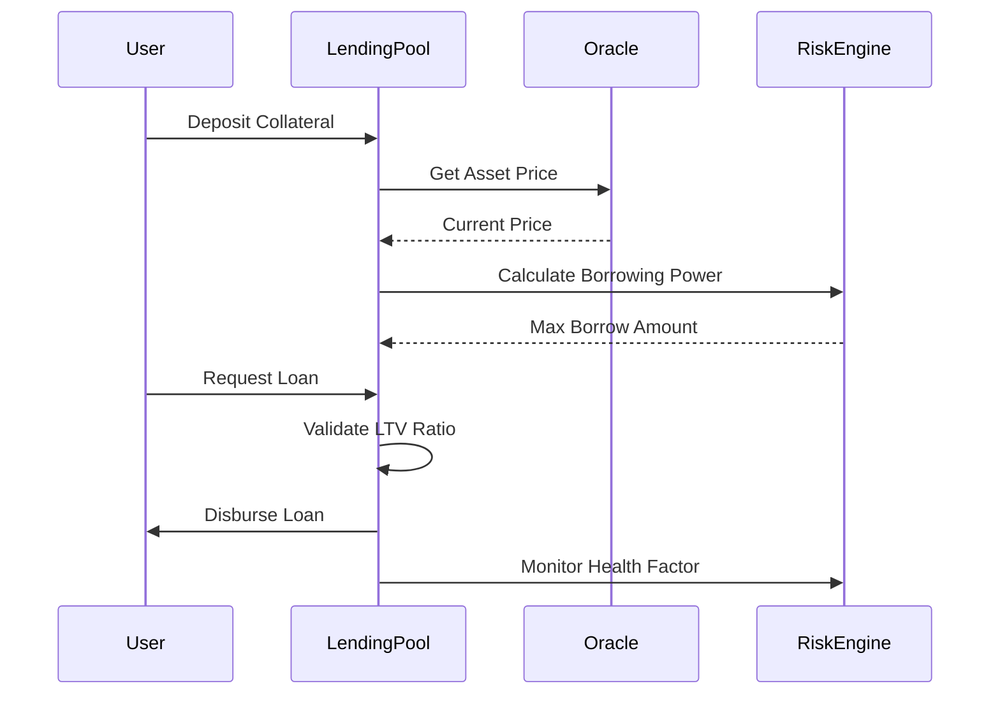

# Lending Protocol Tutorial

Learn how to build a comprehensive decentralized lending protocol with collateralized loans, dynamic interest rates, liquidation mechanisms, and risk management systems.

## Overview

The Lending Protocol example demonstrates:
- **Collateralized Lending**: Secure loans backed by digital assets
- **Dynamic Interest Rates**: Utilization-based rate models
- **Liquidation Engine**: Automated liquidation of undercollateralized positions
- **Risk Management**: Loan-to-value ratios and health factors
- **Flash Loan Integration**: Capital-efficient liquidations

## Prerequisites

Before starting this tutorial, ensure you have:

- ✅ **Completed** [Flash Loans]({{ '/docs/examples/tutorials/flash-loans' | relative_url }}) and [AMM]({{ '/docs/examples/tutorials/amm' | relative_url }}) tutorials
- ✅ **Understanding** of collateralized lending mechanisms
- ✅ **Familiarity** with liquidation and risk management
- ✅ **Knowledge** of interest rate models

### Lending Concepts Review

**Collateralized Lending**
- Borrowers deposit collateral to secure loans
- Loan-to-value (LTV) ratios determine borrowing capacity
- Interest accrues continuously on outstanding debt

**Liquidation Mechanisms**
- Trigger when collateral value falls below threshold
- Liquidators repay debt and claim collateral bonus
- Protects lenders from default risk

## Architecture Overview

```mermaid
graph TB
    subgraph "Lending Pool"
        A[Deposit Collateral] --> B[Calculate Borrowing Power]
        B --> C[Issue Loan]
        C --> D[Accrue Interest]
        D --> E[Monitor Health Factor]
        
        E --> F[Healthy Position]
        E --> G[Liquidation Threshold]
        G --> H[Liquidation Auction]
        H --> I[Debt Repayment]
        I --> J[Collateral Distribution]
    end
    
    subgraph "Interest Rate Model"
        K[Utilization Rate] --> L[Base Rate]
        L --> M[Slope Rate]
        M --> N[Optimal Rate]
        N --> O[Dynamic Adjustment]
    end
    
    subgraph "Risk Management"
        P[Collateral Valuation] --> Q[Health Factor]
        Q --> R[Liquidation Trigger]
        R --> S[Risk Parameters]
    end
    
    style A fill:#e1f5fe
    style G fill:#ffebee
    style K fill:#e8f5e8
```



### Lending Protocol Architecture

```
┌─────────────────────────────────────────┐
│        Divine Lending Protocol          │
├─────────────────────────────────────────┤
│  💰 Lending Pools                       │
│    • Multi-Asset Collateral Support     │
│    • Dynamic Interest Rate Models       │
│    • Liquidity Pool Management          │
├─────────────────────────────────────────┤
│  🏦 Borrowing Engine                    │
│    • Collateral Valuation              │
│    • Loan Origination                  │
│    • Debt Position Tracking            │
├─────────────────────────────────────────┤
│  ⚖️ Risk Management                     │
│    • Health Factor Monitoring          │
│    • Liquidation Mechanisms            │
│    • Risk Parameter Governance         │
├─────────────────────────────────────────┤
│  🔥 Liquidation Engine                  │
│    • Automated Liquidation Triggers    │
│    • Flash Loan Integration            │
│    • Collateral Auction System         │
└─────────────────────────────────────────┘
```

## Code Walkthrough

### Core Data Structures

<div class="code-section">
  <div class="code-header">
    <span class="filename">📁 examples/lending/src/main.hc</span>
    <a href="https://github.com/pibleos/holyBPF-rust/blob/main/examples/lending/src/main.hc" class="github-link" target="_blank">View on GitHub</a>
  </div>

```c
// Lending pool configuration
struct LendingPool {
    U8[32] asset_mint;              // Asset being lent/borrowed
    U8[32] pool_token_mint;         // Pool token (cToken) mint
    U64 total_deposits;             // Total deposited assets
    U64 total_borrows;              // Total borrowed assets
    U64 total_reserves;             // Protocol reserves
    U64 reserve_factor_bps;         // Reserve factor (1000 = 10%)
    InterestRateModel rate_model;   // Interest rate model
    U64 last_update_time;           // Last interest accrual time
    U64 borrow_index;               // Cumulative borrow index
    U64 exchange_rate;              // Pool token exchange rate
    Bool is_active;                 // Pool status
    RiskParameters risk_params;     // Risk management parameters
};

// User lending position
struct LendingPosition {
    U8[32] user;                    // User public key
    U8[32] pool_asset;              // Pool asset mint
    U64 deposited_amount;           // Deposited collateral amount
    U64 pool_tokens;                // Pool tokens owned
    U64 borrowed_amount;            // Borrowed amount (principal)
    U64 borrow_shares;              // Borrow shares for interest tracking
    U64 last_interaction_time;      // Last position update
    F64 health_factor;              // Current health factor
    Bool is_active;                 // Position status
};

// Interest rate model
struct InterestRateModel {
    U64 base_rate_bps;              // Base interest rate (200 = 2%)
    U64 multiplier_bps;             // Rate multiplier (2000 = 20%)
    U64 jump_multiplier_bps;        // Jump rate multiplier (4000 = 40%)
    U64 optimal_utilization_bps;    // Optimal utilization (8000 = 80%)
    U64 reserve_factor_bps;         // Reserve factor for protocol
};

// Risk management parameters
struct RiskParameters {
    U64 loan_to_value_bps;          // Maximum LTV ratio (7500 = 75%)
    U64 liquidation_threshold_bps;  // Liquidation threshold (8500 = 85%)
    U64 liquidation_bonus_bps;      // Liquidation bonus (500 = 5%)
    U64 min_health_factor;          // Minimum health factor (1.0e18)
    U64 max_borrow_rate_bps;        // Maximum borrow rate (10000 = 100%)
    Bool liquidations_enabled;      // Liquidation status
};

// Liquidation auction
struct LiquidationAuction {
    U8[32] auction_id;              // Unique auction identifier
    U8[32] borrower;                // Borrower being liquidated
    U8[32] collateral_asset;        // Collateral asset type
    U8[32] debt_asset;              // Debt asset type
    U64 collateral_amount;          // Amount of collateral
    U64 debt_amount;                // Amount of debt to repay
    U64 starting_price;             // Starting auction price
    U64 current_price;              // Current auction price
    U64 price_decay_rate;           // Price decay per second
    U64 auction_start_time;         // Auction start timestamp
    U64 auction_end_time;           // Auction end timestamp
    U8[32] highest_bidder;          // Current highest bidder
    U64 highest_bid;                // Current highest bid
    Bool is_active;                 // Auction status
};
```
</div>

### Dynamic Interest Rate Model

Sophisticated interest rate calculation based on utilization:

<div class="code-section">
  <div class="code-header">
    <span class="filename">📁 Interest Rate Engine</span>
  </div>

```c
// Calculate dynamic interest rates based on utilization
U64 calculate_borrow_rate(LendingPool* pool) {
    // Calculate utilization rate
    U64 total_liquidity = pool->total_deposits + pool->total_borrows;
    if (total_liquidity == 0) {
        return pool->rate_model.base_rate_bps;
    }
    
    U64 utilization_rate = (pool->total_borrows * 10000) / total_liquidity;
    
    // Apply kinked interest rate model
    if (utilization_rate <= pool->rate_model.optimal_utilization_bps) {
        // Below optimal utilization - linear rate
        U64 rate_at_optimal = pool->rate_model.base_rate_bps + 
                             (pool->rate_model.multiplier_bps * 
                              pool->rate_model.optimal_utilization_bps) / 10000;
        
        return pool->rate_model.base_rate_bps + 
               (pool->rate_model.multiplier_bps * utilization_rate) / 10000;
    } else {
        // Above optimal utilization - jump rate kicks in
        U64 excess_utilization = utilization_rate - pool->rate_model.optimal_utilization_bps;
        U64 base_rate_at_optimal = pool->rate_model.base_rate_bps + 
                                  pool->rate_model.multiplier_bps;
        
        return base_rate_at_optimal + 
               (pool->rate_model.jump_multiplier_bps * excess_utilization) / 10000;
    }
}

// Calculate supply (deposit) interest rate
U64 calculate_supply_rate(LendingPool* pool, U64 borrow_rate) {
    U64 total_liquidity = pool->total_deposits + pool->total_borrows;
    if (total_liquidity == 0) {
        return 0;
    }
    
    U64 utilization_rate = (pool->total_borrows * 10000) / total_liquidity;
    U64 rate_after_reserves = borrow_rate * 
                             (10000 - pool->rate_model.reserve_factor_bps) / 10000;
    
    return (rate_after_reserves * utilization_rate) / 10000;
}

// Accrue interest on lending pool
U0 accrue_interest(LendingPool* pool) {
    U64 current_time = get_current_time();
    U64 time_elapsed = current_time - pool->last_update_time;
    
    if (time_elapsed == 0) {
        return; // No time has passed
    }
    
    // Calculate current borrow rate
    U64 borrow_rate = calculate_borrow_rate(pool);
    
    // Calculate interest factor (compound interest)
    // Interest = principal * (1 + rate)^time
    F64 rate_per_second = (F64)borrow_rate / (365.25 * 24 * 3600 * 10000);
    F64 interest_factor = pow(1.0 + rate_per_second, (F64)time_elapsed);
    
    // Apply interest to total borrows
    U64 new_total_borrows = (U64)(pool->total_borrows * interest_factor);
    U64 interest_accrued = new_total_borrows - pool->total_borrows;
    
    // Update pool state
    pool->total_borrows = new_total_borrows;
    pool->borrow_index = (U64)(pool->borrow_index * interest_factor);
    
    // Add to reserves
    U64 reserve_addition = (interest_accrued * pool->rate_model.reserve_factor_bps) / 10000;
    pool->total_reserves += reserve_addition;
    
    // Update exchange rate for pool tokens
    update_exchange_rate(pool);
    
    pool->last_update_time = current_time;
    
    PrintF("Interest accrued: %llu tokens, new rate: %llu bps\n", 
           interest_accrued, borrow_rate);
}
```
</div>

### Collateralized Borrowing System

Secure borrowing with collateral backing:



<div class="code-section">
  <div class="code-header">
    <span class="filename">📁 Borrowing Engine</span>
  </div>

```c
// Deposit collateral and calculate borrowing power
U0 deposit_collateral(U8[32] user, U8[32] asset_mint, U64 amount) {
    LendingPool* pool = get_lending_pool(asset_mint);
    if (!pool || !pool->is_active) {
        PrintF("Error: Lending pool not found or inactive\n");
        return;
    }
    
    // Transfer collateral from user
    if (!transfer_tokens(user, get_pool_address(asset_mint), asset_mint, amount)) {
        PrintF("Error: Collateral transfer failed\n");
        return;
    }
    
    // Accrue interest before position update
    accrue_interest(pool);
    
    // Get or create user position
    LendingPosition* position = get_or_create_position(user, asset_mint);
    
    // Calculate pool tokens to mint (cTokens)
    U64 pool_tokens_to_mint = (amount * 1e18) / pool->exchange_rate;
    
    // Update position
    position->deposited_amount += amount;
    position->pool_tokens += pool_tokens_to_mint;
    position->last_interaction_time = get_current_time();
    
    // Update pool state
    pool->total_deposits += amount;
    
    // Mint pool tokens to user
    mint_pool_tokens(pool->pool_token_mint, user, pool_tokens_to_mint);
    
    // Calculate new borrowing power
    F64 borrowing_power = calculate_borrowing_power(user);
    
    store_lending_position(position);
    store_lending_pool(pool);
    
    PrintF("Collateral deposited: %llu tokens, borrowing power: %.2f\n", 
           amount, borrowing_power);
}

// Execute collateralized loan
U0 borrow_assets(U8[32] user, U8[32] asset_mint, U64 amount) {
    LendingPool* pool = get_lending_pool(asset_mint);
    if (!pool || !pool->is_active) {
        PrintF("Error: Lending pool not found\n");
        return;
    }
    
    // Accrue interest
    accrue_interest(pool);
    
    // Validate borrowing capacity
    F64 current_borrowing_power = calculate_borrowing_power(user);
    F64 asset_price = get_asset_price(asset_mint);
    F64 loan_value = amount * asset_price;
    
    if (loan_value > current_borrowing_power) {
        PrintF("Error: Insufficient borrowing power\n");
        PrintF("Required: %.2f, Available: %.2f\n", loan_value, current_borrowing_power);
        return;
    }
    
    // Check pool liquidity
    U64 available_liquidity = pool->total_deposits - pool->total_borrows;
    if (amount > available_liquidity) {
        PrintF("Error: Insufficient pool liquidity\n");
        return;
    }
    
    // Calculate borrow shares for interest tracking
    U64 borrow_shares = (amount * 1e18) / pool->borrow_index;
    
    // Get or create position
    LendingPosition* position = get_or_create_position(user, asset_mint);
    
    // Update position
    position->borrowed_amount += amount;
    position->borrow_shares += borrow_shares;
    position->last_interaction_time = get_current_time();
    
    // Update pool state
    pool->total_borrows += amount;
    
    // Transfer borrowed assets to user
    if (!transfer_tokens(get_pool_address(asset_mint), user, asset_mint, amount)) {
        PrintF("Error: Loan disbursement failed\n");
        return;
    }
    
    // Calculate new health factor
    position->health_factor = calculate_health_factor(user);
    
    store_lending_position(position);
    store_lending_pool(pool);
    
    PrintF("Loan executed: %llu tokens, health factor: %.3f\n", 
           amount, position->health_factor);
}

// Calculate user's borrowing power across all collateral
F64 calculate_borrowing_power(U8[32] user) {
    F64 total_borrowing_power = 0.0;
    
    // Iterate through all user positions
    LendingPosition* positions = get_user_positions(user);
    U32 position_count = get_user_position_count(user);
    
    for (U32 i = 0; i < position_count; i++) {
        LendingPosition* position = &positions[i];
        
        if (position->deposited_amount == 0) {
            continue;
        }
        
        // Get asset price and risk parameters
        F64 asset_price = get_asset_price(position->pool_asset);
        LendingPool* pool = get_lending_pool(position->pool_asset);
        
        // Calculate collateral value
        F64 collateral_value = position->deposited_amount * asset_price;
        
        // Apply loan-to-value ratio
        F64 ltv_ratio = (F64)pool->risk_params.loan_to_value_bps / 10000.0;
        F64 position_borrowing_power = collateral_value * ltv_ratio;
        
        total_borrowing_power += position_borrowing_power;
    }
    
    return total_borrowing_power;
}
```
</div>

### Liquidation Engine

Automated liquidation system for risk management:

<div class="code-section">
  <div class="code-header">
    <span class="filename">📁 Liquidation System</span>
  </div>

```c
// Calculate health factor for liquidation monitoring
F64 calculate_health_factor(U8[32] user) {
    F64 total_collateral_value = 0.0;
    F64 total_debt_value = 0.0;
    
    LendingPosition* positions = get_user_positions(user);
    U32 position_count = get_user_position_count(user);
    
    for (U32 i = 0; i < position_count; i++) {
        LendingPosition* position = &positions[i];
        LendingPool* pool = get_lending_pool(position->pool_asset);
        F64 asset_price = get_asset_price(position->pool_asset);
        
        // Calculate collateral value with liquidation threshold
        if (position->deposited_amount > 0) {
            F64 collateral_value = position->deposited_amount * asset_price;
            F64 liquidation_threshold = (F64)pool->risk_params.liquidation_threshold_bps / 10000.0;
            total_collateral_value += collateral_value * liquidation_threshold;
        }
        
        // Calculate debt value
        if (position->borrowed_amount > 0) {
            // Apply interest using borrow index
            U64 current_debt = (position->borrow_shares * pool->borrow_index) / 1e18;
            total_debt_value += current_debt * asset_price;
        }
    }
    
    if (total_debt_value == 0.0) {
        return 1e18; // No debt, maximum health factor
    }
    
    return total_collateral_value / total_debt_value;
}

// Check and trigger liquidation if necessary
U0 check_liquidation_eligibility(U8[32] user) {
    F64 health_factor = calculate_health_factor(user);
    
    if (health_factor < 1.0) {
        PrintF("User eligible for liquidation: health factor %.3f\n", health_factor);
        trigger_liquidation(user);
    } else {
        PrintF("User position healthy: health factor %.3f\n", health_factor);
    }
}

// Trigger liquidation auction for undercollateralized position
U0 trigger_liquidation(U8[32] borrower) {
    LendingPosition* positions = get_user_positions(borrower);
    U32 position_count = get_user_position_count(borrower);
    
    // Find the largest debt position to liquidate
    LendingPosition* target_position = find_largest_debt_position(positions, position_count);
    if (!target_position) {
        PrintF("Error: No debt position found for liquidation\n");
        return;
    }
    
    LendingPool* debt_pool = get_lending_pool(target_position->pool_asset);
    
    // Calculate current debt amount
    U64 current_debt = (target_position->borrow_shares * debt_pool->borrow_index) / 1e18;
    
    // Find best collateral to seize
    LendingPosition* collateral_position = find_best_collateral_position(positions, position_count);
    if (!collateral_position) {
        PrintF("Error: No collateral found for liquidation\n");
        return;
    }
    
    // Calculate liquidation amounts
    U64 max_liquidation_amount = current_debt / 2; // 50% max liquidation
    U64 collateral_to_seize = calculate_collateral_seize_amount(
        max_liquidation_amount, 
        target_position->pool_asset,
        collateral_position->pool_asset
    );
    
    // Create liquidation auction
    LiquidationAuction auction;
    generate_auction_id(auction.auction_id);
    memcpy(auction.borrower, borrower, 32);
    memcpy(auction.collateral_asset, collateral_position->pool_asset, 32);
    memcpy(auction.debt_asset, target_position->pool_asset, 32);
    auction.collateral_amount = collateral_to_seize;
    auction.debt_amount = max_liquidation_amount;
    auction.starting_price = calculate_liquidation_starting_price(
        collateral_position->pool_asset, target_position->pool_asset);
    auction.current_price = auction.starting_price;
    auction.price_decay_rate = auction.starting_price / 3600; // 1 hour to 0
    auction.auction_start_time = get_current_time();
    auction.auction_end_time = auction.auction_start_time + 3600; // 1 hour
    auction.is_active = TRUE;
    
    store_liquidation_auction(&auction);
    
    PrintF("Liquidation auction started: %llu collateral, %llu debt\n",
           collateral_to_seize, max_liquidation_amount);
}

// Execute liquidation (can be called by liquidators)
U0 execute_liquidation(U8[32] auction_id, U8[32] liquidator) {
    LiquidationAuction* auction = get_liquidation_auction(auction_id);
    if (!auction || !auction->is_active) {
        PrintF("Error: Auction not found or inactive\n");
        return;
    }
    
    if (get_current_time() > auction->auction_end_time) {
        PrintF("Error: Auction has expired\n");
        return;
    }
    
    // Calculate current auction price (Dutch auction style)
    U64 time_elapsed = get_current_time() - auction->auction_start_time;
    U64 price_reduction = time_elapsed * auction->price_decay_rate;
    auction->current_price = (auction->starting_price > price_reduction) ?
                            auction->starting_price - price_reduction : 0;
    
    // Verify liquidator can pay the debt
    U64 payment_required = auction->debt_amount;
    if (get_token_balance(liquidator, auction->debt_asset) < payment_required) {
        PrintF("Error: Insufficient balance for liquidation\n");
        return;
    }
    
    // Execute liquidation
    // 1. Liquidator pays the debt
    transfer_tokens(liquidator, get_pool_address(auction->debt_asset), 
                   auction->debt_asset, payment_required);
    
    // 2. Transfer collateral to liquidator (with bonus)
    LendingPool* collateral_pool = get_lending_pool(auction->collateral_asset);
    U64 liquidation_bonus = (auction->collateral_amount * 
                            collateral_pool->risk_params.liquidation_bonus_bps) / 10000;
    U64 total_collateral = auction->collateral_amount + liquidation_bonus;
    
    transfer_tokens(get_pool_address(auction->collateral_asset), liquidator,
                   auction->collateral_asset, total_collateral);
    
    // 3. Update borrower's positions
    reduce_borrower_debt(auction->borrower, auction->debt_asset, payment_required);
    reduce_borrower_collateral(auction->borrower, auction->collateral_asset, 
                              auction->collateral_amount);
    
    // 4. Update pool states
    LendingPool* debt_pool = get_lending_pool(auction->debt_asset);
    debt_pool->total_borrows -= payment_required;
    collateral_pool->total_deposits -= total_collateral;
    
    auction->is_active = FALSE;
    memcpy(auction->highest_bidder, liquidator, 32);
    
    store_liquidation_auction(auction);
    
    PrintF("Liquidation executed by %s: %llu debt repaid, %llu collateral seized\n",
           liquidator, payment_required, total_collateral);
}
```
</div>

## Compilation and Testing

### Step 1: Build the Compiler

```bash
cd /path/to/holyBPF-rust
cargo build --release
```

### Step 2: Compile Lending Protocol

```bash
./target/release/pible examples/lending/src/main.hc
```

**Expected Output:**
```
✓ Parsing HolyC source file
✓ Building abstract syntax tree
✓ Generating BPF bytecode
✓ Lending Protocol compiled successfully
→ Output: examples/lending/src/main.hc.bpf
```

### Step 3: Test Lending Operations

<div class="code-section">
  <div class="code-header">
    <span class="filename">📁 Test Lending Protocol</span>
  </div>

```c
// Test comprehensive lending protocol functionality
U0 test_lending_protocol() {
    PrintF("=== Lending Protocol Test Suite ===\n");
    
    // Initialize lending pools
    initialize_test_pools();
    
    // Test 1: Deposit Collateral
    PrintF("\n--- Test 1: Collateral Deposit ---\n");
    U8[32] user = get_test_user();
    deposit_collateral(user, get_sol_mint(), 10000);
    
    F64 borrowing_power = calculate_borrowing_power(user);
    PrintF("Borrowing power after deposit: %.2f\n", borrowing_power);
    
    // Test 2: Borrow Assets
    PrintF("\n--- Test 2: Asset Borrowing ---\n");
    borrow_assets(user, get_usdc_mint(), 5000);
    
    F64 health_factor = calculate_health_factor(user);
    PrintF("Health factor after borrowing: %.3f\n", health_factor);
    
    // Test 3: Interest Accrual
    PrintF("\n--- Test 3: Interest Accrual ---\n");
    LendingPool* pool = get_lending_pool(get_usdc_mint());
    U64 initial_borrows = pool->total_borrows;
    
    // Simulate time passage
    advance_time(86400); // 1 day
    accrue_interest(pool);
    
    PrintF("Interest accrued: %llu tokens\n", pool->total_borrows - initial_borrows);
    
    // Test 4: Liquidation Scenario
    PrintF("\n--- Test 4: Liquidation Test ---\n");
    
    // Simulate price drop to trigger liquidation
    simulate_price_drop(get_sol_mint(), 0.5); // 50% drop
    
    check_liquidation_eligibility(user);
    
    PrintF("\n✓ All lending protocol tests completed\n");
}
```
</div>

## Advanced Features

### Interest Rate Optimization

Dynamic rate models that respond to market conditions:

```mermaid
graph LR
    A[Utilization Rate] --> B{Below Optimal?}
    B -->|Yes| C[Linear Rate Increase]
    B -->|No| D[Jump Rate Model]
    
    C --> E[Supply Rate = Borrow Rate × Utilization × (1 - Reserve Factor)]
    D --> F[High Utilization Penalty]
    F --> E
    
    style B fill:#e3f2fd
    style D fill:#ffebee
```

### Risk Management Dashboard

| Risk Parameter | Conservative | Moderate | Aggressive |
|----------------|--------------|----------|------------|
| **Max LTV** | 65% | 75% | 85% |
| **Liquidation Threshold** | 75% | 85% | 90% |
| **Liquidation Bonus** | 8% | 5% | 3% |
| **Reserve Factor** | 20% | 15% | 10% |

## Security Considerations

### Protocol Security
- **Oracle Dependencies**: Secure price feeds with multiple sources
- **Flash Loan Protection**: Prevent manipulation attacks
- **Governance Controls**: Time-locked parameter updates

### Economic Security
- **Liquidation Incentives**: Balanced bonuses for liquidators
- **Interest Rate Limits**: Maximum rate caps for user protection
- **Reserve Management**: Protocol solvency maintenance

## Performance Metrics

| Operation | Target Performance |
|-----------|-------------------|
| **Deposit/Withdraw** | < 5 seconds |
| **Borrow/Repay** | < 10 seconds |
| **Liquidation Check** | < 2 seconds |
| **Interest Accrual** | < 1 second |

## Troubleshooting

### Common Issues

**Issue**: Borrowing power insufficient
```bash
# Check collateral values and LTV ratios
./check_collateral_status.sh <user_address>
```

**Issue**: Liquidation not triggering
```bash
# Verify health factor calculation
./target/release/pible examples/lending/src/health_test.hc
```

**Issue**: Interest accrual errors
```bash
# Check rate model parameters
./check_interest_rates.sh <pool_address>
```

## Next Steps

After mastering the lending protocol, explore:

1. **[Margin Trading]({{ '/docs/examples/tutorials/margin-trading' | relative_url }})** - Leveraged trading with loans
2. **[Insurance Pool]({{ '/docs/examples/tutorials/insurance-pool' | relative_url }})** - Protocol insurance
3. **[Risk Management]({{ '/docs/examples/tutorials/risk-management' | relative_url }})** - Advanced risk models

## Divine Wisdom

> "True wealth multiplies when shared with trust and wisdom. This lending protocol embodies the divine principle of mutual prosperity through responsible stewardship." - Terry A. Davis

The lending protocol reflects the divine nature of abundance, where trust and responsibility create prosperity for all participants in the ecosystem.