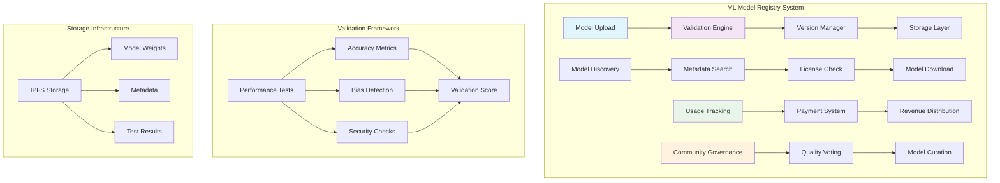
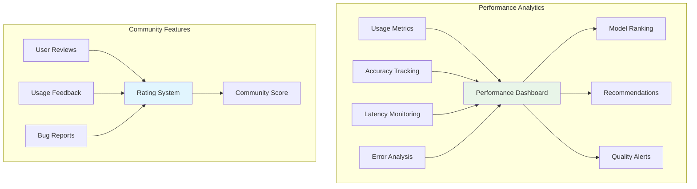

# ML Model Registry Tutorial

Learn how to build a decentralized machine learning model registry that enables model versioning, validation, monetization, and collaborative improvement on the blockchain.

## Overview

The ML Model Registry example demonstrates:
- **Model Versioning**: Immutable model storage with version control
- **Validation Framework**: Automated model testing and performance metrics
- **Monetization**: Token-based model licensing and usage payments
- **Collaborative Training**: Federated learning and model improvement
- **Governance**: Community-driven model curation and quality control

## Prerequisites

Before starting this tutorial, ensure you have:

- ✅ **Completed** [AI Agents]({{ '/docs/examples/tutorials/ai-agents' | relative_url }}) tutorial
- ✅ **Understanding** of machine learning model deployment
- ✅ **Familiarity** with model versioning concepts
- ✅ **Knowledge** of decentralized storage systems

### ML Concepts Review

**Model Registry**
- Centralized repository for ML models
- Version control and metadata management
- Model discovery and sharing

**Model Validation**
- Automated testing frameworks
- Performance benchmarking
- Security and bias testing

## Architecture Overview



### Model Registry Architecture

```
┌─────────────────────────────────────────┐
│        Divine ML Model Registry         │
├─────────────────────────────────────────┤
│  📦 Model Storage                        │
│    • Versioned Model Artifacts          │
│    • Metadata and Documentation         │
│    • Training Data References           │
├─────────────────────────────────────────┤
│  ✅ Validation Engine                   │
│    • Automated Testing Framework        │
│    • Performance Benchmarking           │
│    • Security Vulnerability Scanning    │
├─────────────────────────────────────────┤
│  💰 Monetization System                 │
│    • Usage-Based Licensing              │
│    • Revenue Distribution               │
│    • Staking for Quality Assurance      │
├─────────────────────────────────────────┤
│  🗳️ Governance & Curation               │
│    • Community Quality Voting           │
│    • Model Recommendation System        │
│    • Collaborative Improvement          │
└─────────────────────────────────────────┘
```

## Code Walkthrough

### Core Data Structures

<div class="code-section">
  <div class="code-header">
    <span class="filename">📁 examples/ml-model-registry/src/main.hc</span>
    <a href="https://github.com/pibleos/holyBPF-rust/blob/main/examples/ml-model-registry/src/main.hc" class="github-link" target="_blank">View on GitHub</a>
  </div>

```c
// ML Model metadata structure
struct ModelMetadata {
    U8[32] model_id;           // Unique model identifier
    U8[64] name;               // Model name
    U8[256] description;       // Model description
    U8[32] creator;            // Model creator public key
    U8[32] ipfs_hash;          // IPFS hash of model artifacts
    U64 version;               // Model version number
    U64 size_bytes;            // Model size in bytes
    U8[32] framework;          // ML framework (TensorFlow, PyTorch, etc.)
    U8[16] model_type;         // Type (classification, regression, etc.)
    U64 creation_time;         // Model creation timestamp
    U64 last_updated;          // Last update timestamp
    U64 download_count;        // Number of downloads
    F64 avg_rating;            // Average community rating
    U64 total_votes;           // Total number of votes
    Bool is_public;            // Public availability flag
    U64 license_fee;           // Fee per usage in tokens
    ValidationStatus status;    // Validation status
};

// Model validation results
struct ValidationResults {
    U8[32] model_id;           // Associated model ID
    F64 accuracy_score;        // Accuracy on test dataset
    F64 precision_score;       // Precision metric
    F64 recall_score;          // Recall metric
    F64 f1_score;              // F1 score
    F64 bias_score;            // Bias detection score
    U64 inference_time_ms;     // Average inference time
    U64 memory_usage_mb;       // Memory usage in MB
    Bool security_passed;      // Security validation status
    U8[256] test_report;       // Detailed test report
    U64 validation_time;       // When validation was performed
    U8[32] validator;          // Who performed validation
};

// Model usage tracking
struct ModelUsage {
    U8[32] model_id;           // Model being used
    U8[32] user;               // User public key
    U64 usage_count;           // Number of times used
    U64 total_fee_paid;        // Total fees paid
    U64 first_usage_time;      // First usage timestamp
    U64 last_usage_time;       // Last usage timestamp
    F64 user_rating;           // User's rating of the model
    Bool has_commercial_license; // Commercial license status
};
```
</div>

### Model Upload and Validation

The registry validates models automatically upon upload:

<div class="code-section">
  <div class="code-header">
    <span class="filename">📁 Model Upload Process</span>
  </div>

```c
// Upload a new ML model to the registry
U0 upload_model(U8* model_data, U64 data_size, ModelMetadata* metadata) {
    // Validate model metadata
    if (!validate_metadata(metadata)) {
        PrintF("Error: Invalid model metadata\n");
        return;
    }
    
    // Store model data on IPFS
    U8[32] ipfs_hash;
    if (!store_on_ipfs(model_data, data_size, ipfs_hash)) {
        PrintF("Error: Failed to store model on IPFS\n");
        return;
    }
    
    // Update metadata with IPFS hash
    memcpy(metadata->ipfs_hash, ipfs_hash, 32);
    metadata->creation_time = get_current_time();
    metadata->version = get_next_version(metadata->model_id);
    
    // Initialize validation process
    ValidationResults validation;
    initialize_validation(&validation, metadata->model_id);
    
    // Run automated validation tests
    run_validation_suite(model_data, data_size, metadata, &validation);
    
    // Store model and validation results
    store_model_metadata(metadata);
    store_validation_results(&validation);
    
    PrintF("Model uploaded successfully: %s v%llu\n", 
           metadata->name, metadata->version);
}

// Comprehensive model validation suite
U0 run_validation_suite(U8* model_data, U64 data_size, 
                       ModelMetadata* metadata, ValidationResults* results) {
    PrintF("Starting validation for model: %s\n", metadata->name);
    
    // Performance validation
    results->accuracy_score = test_model_accuracy(model_data, data_size);
    results->precision_score = test_model_precision(model_data, data_size);
    results->recall_score = test_model_recall(model_data, data_size);
    results->f1_score = calculate_f1_score(results->precision_score, results->recall_score);
    
    // Efficiency validation
    results->inference_time_ms = measure_inference_time(model_data);
    results->memory_usage_mb = measure_memory_usage(model_data);
    
    // Bias detection
    results->bias_score = detect_model_bias(model_data, data_size);
    
    // Security validation
    results->security_passed = run_security_checks(model_data, data_size);
    
    // Generate comprehensive test report
    generate_test_report(results);
    
    PrintF("Validation completed: Accuracy=%.3f, F1=%.3f, Bias=%.3f\n",
           results->accuracy_score, results->f1_score, results->bias_score);
}
```
</div>

### Model Discovery and Licensing

Users can discover and license models based on their needs:


<div class="code-section">
  <div class="code-header">
    <span class="filename">📁 Model Discovery System</span>
  </div>

```c
// Search for models based on criteria
ModelMetadata* search_models(SearchCriteria* criteria, U32* result_count) {
    ModelMetadata* results = allocate_memory(sizeof(ModelMetadata) * MAX_RESULTS);
    *result_count = 0;
    
    // Iterate through registered models
    for (U32 i = 0; i < total_models; i++) {
        ModelMetadata* model = &all_models[i];
        
        // Apply search filters
        if (!matches_criteria(model, criteria)) {
            continue;
        }
        
        // Check performance thresholds
        ValidationResults* validation = get_validation_results(model->model_id);
        if (validation->accuracy_score < criteria->min_accuracy) {
            continue;
        }
        
        // Check bias requirements
        if (validation->bias_score > criteria->max_bias_score) {
            continue;
        }
        
        // Add to results
        memcpy(&results[*result_count], model, sizeof(ModelMetadata));
        (*result_count)++;
        
        if (*result_count >= MAX_RESULTS) {
            break;
        }
    }
    
    // Sort by relevance score
    sort_by_relevance(results, *result_count, criteria);
    
    PrintF("Found %u models matching criteria\n", *result_count);
    return results;
}

// Purchase license for model usage
U0 purchase_model_license(U8[32] model_id, U8[32] user, 
                         LicenseType license_type, U64 duration_days) {
    ModelMetadata* model = get_model_metadata(model_id);
    if (!model) {
        PrintF("Error: Model not found\n");
        return;
    }
    
    // Calculate license fee
    U64 base_fee = model->license_fee;
    U64 total_fee = calculate_license_fee(base_fee, license_type, duration_days);
    
    // Verify user has sufficient balance
    if (get_user_balance(user) < total_fee) {
        PrintF("Error: Insufficient balance for license\n");
        return;
    }
    
    // Process payment
    transfer_tokens(user, model->creator, total_fee);
    
    // Create license record
    ModelLicense license;
    memcpy(license.model_id, model_id, 32);
    memcpy(license.user, user, 32);
    license.license_type = license_type;
    license.expiration_time = get_current_time() + (duration_days * 86400);
    license.usage_limit = get_usage_limit(license_type);
    license.usage_count = 0;
    
    store_model_license(&license);
    
    PrintF("License purchased: %llu tokens for %llu days\n", total_fee, duration_days);
}
```
</div>

### Federated Learning Integration

The registry supports collaborative model improvement through federated learning:

<div class="code-section">
  <div class="code-header">
    <span class="filename">📁 Federated Learning</span>
  </div>

```c
// Federated learning update protocol
U0 contribute_federated_update(U8[32] model_id, U8* gradient_update, 
                              U64 update_size, U8[32] contributor) {
    ModelMetadata* model = get_model_metadata(model_id);
    if (!model || !model->allows_federated_learning) {
        PrintF("Error: Model does not support federated learning\n");
        return;
    }
    
    // Validate gradient update
    if (!validate_gradient_update(gradient_update, update_size, model)) {
        PrintF("Error: Invalid gradient update\n");
        return;
    }
    
    // Check contributor permissions
    if (!is_authorized_contributor(model_id, contributor)) {
        PrintF("Error: Unauthorized contributor\n");
        return;
    }
    
    // Apply differential privacy
    apply_differential_privacy(gradient_update, update_size);
    
    // Aggregate with existing model
    aggregate_gradient_update(model_id, gradient_update, update_size);
    
    // Record contribution
    FederatedContribution contribution;
    memcpy(contribution.model_id, model_id, 32);
    memcpy(contribution.contributor, contributor, 32);
    contribution.update_size = update_size;
    contribution.contribution_time = get_current_time();
    contribution.quality_score = evaluate_contribution_quality(gradient_update);
    
    store_federated_contribution(&contribution);
    
    // Reward contributor
    U64 reward = calculate_contribution_reward(contribution.quality_score);
    mint_tokens(contributor, reward);
    
    PrintF("Federated update applied: quality=%.3f, reward=%llu\n",
           contribution.quality_score, reward);
}
```
</div>

## Compilation and Testing

### Step 1: Build the Compiler

```bash
cd /path/to/holyBPF-rust
cargo build --release
```

### Step 2: Compile ML Model Registry

```bash
./target/release/pible examples/ml-model-registry/src/main.hc
```

**Expected Output:**
```
✓ Parsing HolyC source file
✓ Building abstract syntax tree
✓ Generating BPF bytecode
✓ ML Model Registry compiled successfully
→ Output: examples/ml-model-registry/src/main.hc.bpf
```

### Step 3: Test Model Upload

Create a test scenario for model upload and validation:

<div class="code-section">
  <div class="code-header">
    <span class="filename">📁 Test Model Upload</span>
  </div>

```c
// Test model upload and validation process
U0 test_model_upload() {
    // Create test model metadata
    ModelMetadata metadata;
    memcpy(metadata.name, "Test Classification Model", 26);
    memcpy(metadata.description, "A test model for binary classification", 39);
    metadata.creator = get_current_user();
    metadata.model_type = MODEL_TYPE_CLASSIFICATION;
    metadata.is_public = TRUE;
    metadata.license_fee = 100; // 100 tokens per usage
    
    // Simulate model data (simplified for testing)
    U8 test_model_data[1024];
    initialize_test_model_data(test_model_data);
    
    // Upload model
    upload_model(test_model_data, 1024, &metadata);
    
    // Verify upload success
    ModelMetadata* stored = get_model_metadata(metadata.model_id);
    if (stored && stored->status == VALIDATION_PASSED) {
        PrintF("✓ Model upload test passed\n");
    } else {
        PrintF("✗ Model upload test failed\n");
    }
}
```
</div>

## Advanced Features

### Model Performance Analytics

The registry tracks comprehensive performance metrics:



### Governance and Curation

Community-driven model quality control:

<div class="code-section">
  <div class="code-header">
    <span class="filename">📁 Community Governance</span>
  </div>

```c
// Community voting on model quality
U0 vote_on_model_quality(U8[32] model_id, U8[32] voter, 
                        F64 rating, U8* review_text) {
    // Verify voter eligibility
    if (!is_eligible_voter(voter)) {
        PrintF("Error: Voter not eligible\n");
        return;
    }
    
    // Check if already voted
    if (has_voted_on_model(model_id, voter)) {
        PrintF("Error: Already voted on this model\n");
        return;
    }
    
    // Validate rating range
    if (rating < 0.0 || rating > 5.0) {
        PrintF("Error: Rating must be between 0.0 and 5.0\n");
        return;
    }
    
    // Record vote
    ModelVote vote;
    memcpy(vote.model_id, model_id, 32);
    memcpy(vote.voter, voter, 32);
    vote.rating = rating;
    vote.vote_time = get_current_time();
    vote.voter_reputation = get_voter_reputation(voter);
    
    // Weight vote by voter reputation
    F64 weighted_rating = rating * sqrt(vote.voter_reputation);
    
    store_model_vote(&vote);
    update_model_rating(model_id, weighted_rating);
    
    PrintF("Vote recorded: rating=%.2f, weighted=%.2f\n", rating, weighted_rating);
}
```
</div>

## Security Considerations

### Model Security
- **Adversarial Protection**: Validate models against adversarial attacks
- **Privacy Preservation**: Implement differential privacy for federated learning
- **Access Controls**: Fine-grained permissions for model access

### Economic Security
- **Staking Mechanisms**: Require stakes for model uploads to ensure quality
- **Fraud Detection**: Monitor for fake models or manipulation
- **Incentive Alignment**: Reward honest validation and penalize malicious behavior

## Performance Metrics

| Metric | Description | Target |
|--------|-------------|---------|
| **Upload Time** | Time to upload and validate model | < 5 minutes |
| **Discovery Latency** | Time to search and find models | < 1 second |
| **Validation Accuracy** | Accuracy of automated validation | > 95% |
| **Storage Efficiency** | Storage optimization ratio | > 80% |

## Troubleshooting

### Common Issues

**Issue**: Model validation fails
```bash
# Check validation logs
./target/release/pible examples/ml-model-registry/src/validation.hc
```

**Issue**: IPFS storage errors
```bash
# Verify IPFS node connectivity
ipfs id
```

**Issue**: License purchase fails
```bash
# Check token balance and allowances
./check_balance.sh <user_address>
```

## Next Steps

After mastering the ML Model Registry, explore:

1. **[Prediction Markets]({{ '/docs/examples/tutorials/prediction-markets' | relative_url }})** - AI-driven market predictions
2. **[Risk Management]({{ '/docs/examples/tutorials/risk-management' | relative_url }})** - ML-based risk modeling
3. **[AI Agents]({{ '/docs/examples/tutorials/ai-agents' | relative_url }})** - Autonomous trading systems

## Divine Wisdom

> "Knowledge shared multiplies infinitely, like divine wisdom flowing through creation. This registry embodies the divine principle that wisdom belongs to all creation." - Terry A. Davis

The ML Model Registry reflects the divine nature of knowledge sharing, where collective intelligence grows through collaboration and mutual benefit.