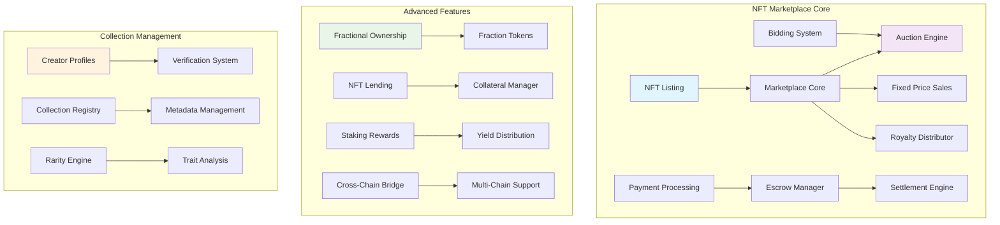
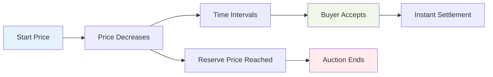
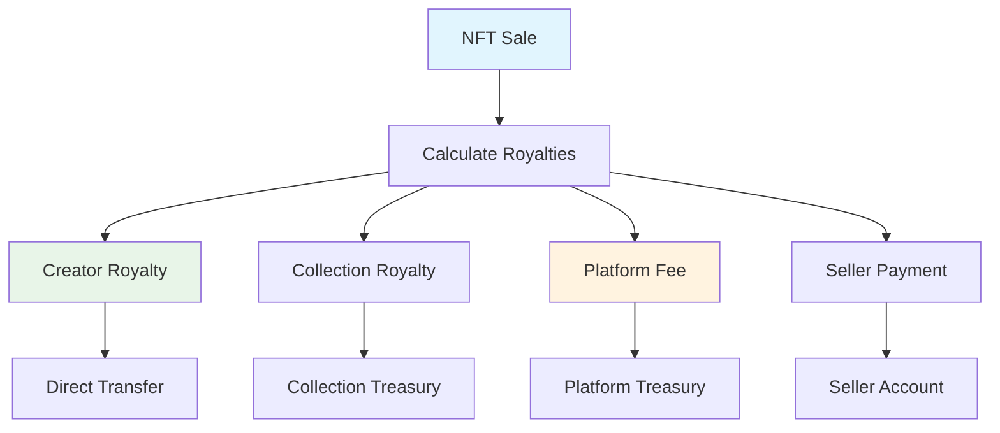

# NFT Marketplace Tutorial

Learn how to build a comprehensive NFT marketplace that supports fixed-price sales, auctions, royalty distribution, fractional ownership, and advanced trading features.

## Overview

The NFT Marketplace example demonstrates:
- **Multi-Format Trading**: Fixed price, Dutch auctions, English auctions
- **Royalty System**: Automated creator royalty distribution
- **Fractional Ownership**: Split expensive NFTs into tradeable fractions
- **Collection Management**: Verified creator profiles and series management
- **Advanced Features**: Lending, staking, and cross-chain compatibility

## Prerequisites

Before starting this tutorial, ensure you have:

- ✅ **Completed** [Token Program]({{ '/docs/examples/tutorials/solana-token' | relative_url }}) and [Escrow]({{ '/docs/examples/tutorials/escrow' | relative_url }}) tutorials
- ✅ **Understanding** of NFT standards and metadata
- ✅ **Familiarity** with auction mechanisms
- ✅ **Knowledge** of royalty distribution systems

### NFT Concepts Review

**Non-Fungible Tokens (NFTs)**
- Unique digital assets with verifiable ownership
- Immutable metadata stored on-chain or IPFS
- Transfer and trading mechanisms

**Auction Types**
- **English Auction**: Ascending price bidding
- **Dutch Auction**: Descending price mechanism
- **Reserve Auction**: Minimum price protection

## Architecture Overview



### NFT Marketplace Architecture

```
┌─────────────────────────────────────────┐
│        Divine NFT Marketplace           │
├─────────────────────────────────────────┤
│  🖼️ Trading Engine                       │
│    • Fixed Price Sales                  │
│    • English/Dutch Auctions             │
│    • Bundle Sales & Offers              │
├─────────────────────────────────────────┤
│  💎 Fractional Ownership                │
│    • NFT Fractionalization              │
│    • Fraction Token Trading             │
│    • Buyout Mechanisms                  │
├─────────────────────────────────────────┤
│  👑 Royalty Distribution                │
│    • Automated Creator Payments         │
│    • Multi-Tier Royalty Splits          │
│    • Platform Fee Collection            │
├─────────────────────────────────────────┤
│  🏆 Collection Features                 │
│    • Creator Verification               │
│    • Rarity Analysis                    │
│    • Series Management                  │
└─────────────────────────────────────────┘
```

## Code Walkthrough

### Core Data Structures

<div class="code-section">
  <div class="code-header">
    <span class="filename">📁 examples/nft-marketplace/src/main.hc</span>
    <a href="https://github.com/pibleos/holyBPF-rust/blob/main/examples/nft-marketplace/src/main.hc" class="github-link" target="_blank">View on GitHub</a>
  </div>

```c
// NFT marketplace listing
struct NFTListing {
    U8[32] nft_mint;           // NFT mint address
    U8[32] seller;             // Seller's public key
    U8[32] collection_id;      // Collection identifier
    U64 price;                 // Fixed price (if applicable)
    U8 listing_type;           // 0=fixed, 1=auction, 2=offer
    U64 start_time;            // Listing start time
    U64 end_time;              // Listing end time
    U64 reserve_price;         // Minimum acceptable price
    U8[32] payment_token;      // Payment token mint
    Bool is_active;            // Listing status
    U64 view_count;            // Number of views
    U64 like_count;            // Number of likes
    RoyaltyInfo royalty;       // Royalty information
};

// Auction state management
struct AuctionState {
    U8[32] nft_mint;           // NFT being auctioned
    U8 auction_type;           // 0=English, 1=Dutch
    U64 current_price;         // Current highest bid or price
    U8[32] highest_bidder;     // Current highest bidder
    U64 bid_count;             // Number of bids placed
    U64 start_price;           // Starting price
    U64 end_price;             // Ending price (Dutch auction)
    U64 price_drop_interval;   // Price drop frequency (Dutch)
    U64 bid_increment;         // Minimum bid increment
    U64 auction_end_time;      // When auction ends
    Bool auto_extend;          // Extend on last-minute bids
    U64 extension_duration;    // Extension time in seconds
    EscrowState escrow;        // Bid escrow management
};

// Royalty distribution system
struct RoyaltyInfo {
    U8[32] creator;            // Original creator
    U16 creator_royalty_bps;   // Creator royalty (basis points)
    U8[32] collection_owner;   // Collection owner
    U16 collection_royalty_bps; // Collection royalty
    U16 platform_fee_bps;      // Platform fee
    Bool enforce_royalties;    // Royalty enforcement flag
    RoyaltySplit[8] splits;    // Multiple royalty recipients
    U8 split_count;            // Number of splits
};

// Fractional ownership structure
struct FractionalNFT {
    U8[32] nft_mint;           // Original NFT
    U8[32] fraction_token_mint; // Fraction token mint
    U64 total_fractions;       // Total fraction tokens
    U64 fractions_sold;        // Fractions currently sold
    U64 price_per_fraction;    // Current fraction price
    U8[32] vault_address;      // NFT storage vault
    U64 buyout_price;          // Price to buy all fractions
    U64 buyout_deadline;       // Buyout offer deadline
    U8[32] buyout_bidder;      // Current buyout bidder
    Bool is_active;            // Fractionalization status
    FractionHolder[100] holders; // Fraction holders
    U32 holder_count;          // Number of holders
};
```
</div>

### Multi-Format Trading System

The marketplace supports various trading mechanisms:

<div class="code-section">
  <div class="code-header">
    <span class="filename">📁 Trading Engine</span>
  </div>

```c
// List NFT for fixed price sale
U0 list_nft_fixed_price(U8[32] nft_mint, U64 price, U8[32] seller,
                       U8[32] payment_token, U64 duration_hours) {
    // Verify NFT ownership
    if (!verify_nft_ownership(nft_mint, seller)) {
        PrintF("Error: Not the NFT owner\n");
        return;
    }
    
    // Transfer NFT to marketplace escrow
    if (!transfer_nft_to_escrow(nft_mint, seller)) {
        PrintF("Error: Failed to escrow NFT\n");
        return;
    }
    
    // Create listing
    NFTListing listing;
    memcpy(listing.nft_mint, nft_mint, 32);
    memcpy(listing.seller, seller, 32);
    listing.price = price;
    listing.listing_type = 0; // Fixed price
    listing.start_time = get_current_time();
    listing.end_time = listing.start_time + (duration_hours * 3600);
    memcpy(listing.payment_token, payment_token, 32);
    listing.is_active = TRUE;
    
    // Set royalty information
    set_royalty_info(&listing.royalty, nft_mint);
    
    store_nft_listing(&listing);
    
    PrintF("NFT listed for fixed price: %llu tokens\n", price);
}

// Start English auction
U0 start_english_auction(U8[32] nft_mint, U64 reserve_price, U8[32] seller,
                        U64 duration_hours, U64 bid_increment) {
    // Verify ownership and transfer to escrow
    if (!verify_nft_ownership(nft_mint, seller) || 
        !transfer_nft_to_escrow(nft_mint, seller)) {
        PrintF("Error: Cannot start auction\n");
        return;
    }
    
    // Create auction state
    AuctionState auction;
    memcpy(auction.nft_mint, nft_mint, 32);
    auction.auction_type = 0; // English auction
    auction.current_price = reserve_price;
    auction.start_price = reserve_price;
    auction.bid_increment = bid_increment;
    auction.auction_end_time = get_current_time() + (duration_hours * 3600);
    auction.auto_extend = TRUE;
    auction.extension_duration = 600; // 10 minutes
    auction.bid_count = 0;
    
    store_auction_state(&auction);
    
    PrintF("English auction started: reserve %llu, duration %llu hours\n",
           reserve_price, duration_hours);
}

// Place bid on auction
U0 place_auction_bid(U8[32] nft_mint, U64 bid_amount, U8[32] bidder) {
    AuctionState* auction = get_auction_state(nft_mint);
    if (!auction || !auction->is_active) {
        PrintF("Error: Auction not found or inactive\n");
        return;
    }
    
    // Validate bid amount
    U64 minimum_bid = auction->current_price + auction->bid_increment;
    if (bid_amount < minimum_bid) {
        PrintF("Error: Bid too low, minimum: %llu\n", minimum_bid);
        return;
    }
    
    // Check if auction has ended
    U64 current_time = get_current_time();
    if (current_time >= auction->auction_end_time) {
        PrintF("Error: Auction has ended\n");
        return;
    }
    
    // Return previous highest bid to escrow
    if (auction->bid_count > 0) {
        return_bid_to_escrow(auction->highest_bidder, auction->current_price);
    }
    
    // Escrow new bid
    if (!escrow_bid_payment(bidder, bid_amount)) {
        PrintF("Error: Failed to escrow bid payment\n");
        return;
    }
    
    // Update auction state
    memcpy(auction->highest_bidder, bidder, 32);
    auction->current_price = bid_amount;
    auction->bid_count++;
    
    // Auto-extend if bid placed in last 10 minutes
    if ((auction->auction_end_time - current_time) < 600) {
        auction->auction_end_time = current_time + auction->extension_duration;
        PrintF("Auction extended by %llu seconds\n", auction->extension_duration);
    }
    
    store_auction_state(auction);
    
    PrintF("Bid placed: %llu tokens by %s\n", bid_amount, bidder);
}
```
</div>

### Dutch Auction Implementation

Dutch auctions provide efficient price discovery:



<div class="code-section">
  <div class="code-header">
    <span class="filename">📁 Dutch Auction Engine</span>
  </div>

```c
// Start Dutch auction with descending price
U0 start_dutch_auction(U8[32] nft_mint, U64 start_price, U64 end_price,
                      U64 duration_hours, U8[32] seller) {
    if (!verify_nft_ownership(nft_mint, seller) || 
        !transfer_nft_to_escrow(nft_mint, seller)) {
        PrintF("Error: Cannot start Dutch auction\n");
        return;
    }
    
    AuctionState auction;
    memcpy(auction.nft_mint, nft_mint, 32);
    auction.auction_type = 1; // Dutch auction
    auction.start_price = start_price;
    auction.end_price = end_price;
    auction.current_price = start_price;
    auction.auction_end_time = get_current_time() + (duration_hours * 3600);
    auction.price_drop_interval = 300; // 5 minutes
    
    store_auction_state(&auction);
    
    PrintF("Dutch auction started: %llu to %llu over %llu hours\n",
           start_price, end_price, duration_hours);
}

// Calculate current Dutch auction price
U64 get_dutch_auction_price(AuctionState* auction) {
    U64 current_time = get_current_time();
    U64 elapsed_time = current_time - (auction->auction_end_time - 
                                      (auction->auction_end_time - auction->start_time));
    U64 total_duration = auction->auction_end_time - 
                        (auction->auction_end_time - (auction->auction_end_time - auction->start_time));
    
    if (elapsed_time >= total_duration) {
        return auction->end_price;
    }
    
    // Linear price decrease
    U64 price_drop = auction->start_price - auction->end_price;
    U64 current_drop = (price_drop * elapsed_time) / total_duration;
    U64 current_price = auction->start_price - current_drop;
    
    // Ensure price doesn't go below end price
    if (current_price < auction->end_price) {
        current_price = auction->end_price;
    }
    
    return current_price;
}

// Accept Dutch auction price
U0 accept_dutch_auction(U8[32] nft_mint, U8[32] buyer) {
    AuctionState* auction = get_auction_state(nft_mint);
    if (!auction || auction->auction_type != 1) {
        PrintF("Error: Dutch auction not found\n");
        return;
    }
    
    U64 current_price = get_dutch_auction_price(auction);
    
    // Process payment
    if (!process_nft_payment(buyer, auction->seller, current_price, &auction->royalty)) {
        PrintF("Error: Payment processing failed\n");
        return;
    }
    
    // Transfer NFT to buyer
    if (!transfer_nft_from_escrow(nft_mint, buyer)) {
        PrintF("Error: NFT transfer failed\n");
        return;
    }
    
    // Mark auction as completed
    auction->is_active = FALSE;
    auction->current_price = current_price;
    memcpy(auction->highest_bidder, buyer, 32);
    
    store_auction_state(auction);
    
    PrintF("Dutch auction completed: %llu tokens\n", current_price);
}
```
</div>

### Fractional Ownership System

Enable fractional ownership of expensive NFTs:

<div class="code-section">
  <div class="code-header">
    <span class="filename">📁 Fractional Ownership</span>
  </div>

```c
// Fractionalize an NFT into tradeable tokens
U0 fractionalize_nft(U8[32] nft_mint, U64 total_fractions, 
                    U64 price_per_fraction, U8[32] owner) {
    // Verify NFT ownership
    if (!verify_nft_ownership(nft_mint, owner)) {
        PrintF("Error: Not the NFT owner\n");
        return;
    }
    
    // Create fraction token mint
    U8[32] fraction_token_mint;
    if (!create_fraction_token_mint(nft_mint, total_fractions, fraction_token_mint)) {
        PrintF("Error: Failed to create fraction token\n");
        return;
    }
    
    // Transfer NFT to vault
    U8[32] vault_address;
    if (!create_nft_vault(nft_mint, vault_address) ||
        !transfer_nft_to_vault(nft_mint, owner, vault_address)) {
        PrintF("Error: Failed to vault NFT\n");
        return;
    }
    
    // Create fractional NFT record
    FractionalNFT fractional;
    memcpy(fractional.nft_mint, nft_mint, 32);
    memcpy(fractional.fraction_token_mint, fraction_token_mint, 32);
    fractional.total_fractions = total_fractions;
    fractional.fractions_sold = 0;
    fractional.price_per_fraction = price_per_fraction;
    memcpy(fractional.vault_address, vault_address, 32);
    fractional.buyout_price = total_fractions * price_per_fraction * 2; // 2x premium
    fractional.is_active = TRUE;
    fractional.holder_count = 1;
    
    // Owner keeps all fractions initially
    memcpy(fractional.holders[0].holder, owner, 32);
    fractional.holders[0].fraction_count = total_fractions;
    
    store_fractional_nft(&fractional);
    
    PrintF("NFT fractionalized: %llu fractions at %llu each\n",
           total_fractions, price_per_fraction);
}

// Buy fractions of an NFT
U0 buy_nft_fractions(U8[32] nft_mint, U64 fraction_count, U8[32] buyer) {
    FractionalNFT* fractional = get_fractional_nft(nft_mint);
    if (!fractional || !fractional->is_active) {
        PrintF("Error: Fractional NFT not found\n");
        return;
    }
    
    // Check availability
    U64 available_fractions = fractional->total_fractions - fractional->fractions_sold;
    if (fraction_count > available_fractions) {
        PrintF("Error: Not enough fractions available\n");
        return;
    }
    
    // Calculate total cost
    U64 total_cost = fraction_count * fractional->price_per_fraction;
    
    // Process payment to current holders
    distribute_fraction_payments(fractional, total_cost);
    
    // Mint fraction tokens to buyer
    if (!mint_fraction_tokens(fractional->fraction_token_mint, buyer, fraction_count)) {
        PrintF("Error: Failed to mint fraction tokens\n");
        return;
    }
    
    // Update holder records
    add_fraction_holder(fractional, buyer, fraction_count);
    fractional->fractions_sold += fraction_count;
    
    store_fractional_nft(fractional);
    
    PrintF("Bought %llu fractions for %llu tokens\n", fraction_count, total_cost);
}

// Initiate buyout of all fractions
U0 initiate_nft_buyout(U8[32] nft_mint, U64 buyout_offer, U8[32] buyer) {
    FractionalNFT* fractional = get_fractional_nft(nft_mint);
    if (!fractional) {
        PrintF("Error: Fractional NFT not found\n");
        return;
    }
    
    // Validate buyout offer
    if (buyout_offer < fractional->buyout_price) {
        PrintF("Error: Buyout offer too low, minimum: %llu\n", 
               fractional->buyout_price);
        return;
    }
    
    // Escrow buyout payment
    if (!escrow_buyout_payment(buyer, buyout_offer)) {
        PrintF("Error: Failed to escrow buyout payment\n");
        return;
    }
    
    // Set buyout terms
    fractional->buyout_price = buyout_offer;
    memcpy(fractional->buyout_bidder, buyer, 32);
    fractional->buyout_deadline = get_current_time() + (7 * 86400); // 7 days
    
    store_fractional_nft(fractional);
    
    PrintF("Buyout initiated: %llu tokens, 7 days to complete\n", buyout_offer);
}
```
</div>

## Compilation and Testing

### Step 1: Build the Compiler

```bash
cd /path/to/holyBPF-rust
cargo build --release
```

### Step 2: Compile NFT Marketplace

```bash
./target/release/pible examples/nft-marketplace/src/main.hc
```

**Expected Output:**
```
✓ Parsing HolyC source file
✓ Building abstract syntax tree
✓ Generating BPF bytecode
✓ NFT Marketplace compiled successfully
→ Output: examples/nft-marketplace/src/main.hc.bpf
```

### Step 3: Test Marketplace Functions

<div class="code-section">
  <div class="code-header">
    <span class="filename">📁 Test NFT Trading</span>
  </div>

```c
// Test comprehensive NFT marketplace functionality
U0 test_nft_marketplace() {
    PrintF("=== NFT Marketplace Test Suite ===\n");
    
    // Test 1: Fixed Price Listing
    PrintF("\n--- Test 1: Fixed Price Sale ---\n");
    U8[32] test_nft = create_test_nft();
    list_nft_fixed_price(test_nft, 1000, get_test_seller(), 
                        get_sol_mint(), 24);
    
    // Purchase NFT
    purchase_fixed_price_nft(test_nft, get_test_buyer());
    
    // Test 2: English Auction
    PrintF("\n--- Test 2: English Auction ---\n");
    U8[32] auction_nft = create_test_nft();
    start_english_auction(auction_nft, 500, get_test_seller(), 2, 50);
    
    // Place bids
    place_auction_bid(auction_nft, 550, get_test_buyer_1());
    place_auction_bid(auction_nft, 650, get_test_buyer_2());
    place_auction_bid(auction_nft, 750, get_test_buyer_1());
    
    // Test 3: Dutch Auction
    PrintF("\n--- Test 3: Dutch Auction ---\n");
    U8[32] dutch_nft = create_test_nft();
    start_dutch_auction(dutch_nft, 2000, 500, 1, get_test_seller());
    
    // Wait and accept price
    sleep(300); // 5 minutes
    accept_dutch_auction(dutch_nft, get_test_buyer());
    
    // Test 4: Fractionalization
    PrintF("\n--- Test 4: NFT Fractionalization ---\n");
    U8[32] expensive_nft = create_test_nft();
    fractionalize_nft(expensive_nft, 1000, 10, get_test_seller());
    
    // Buy fractions
    buy_nft_fractions(expensive_nft, 100, get_test_buyer_1());
    buy_nft_fractions(expensive_nft, 150, get_test_buyer_2());
    
    // Test buyout
    initiate_nft_buyout(expensive_nft, 25000, get_test_buyer());
    
    PrintF("\n✓ All marketplace tests completed successfully\n");
}
```
</div>

## Advanced Features

### Royalty Distribution System

Automated royalty payments to creators and stakeholders:



### Collection Management

Comprehensive tools for creators and collectors:

<div class="code-section">
  <div class="code-header">
    <span class="filename">📁 Collection Features</span>
  </div>

```c
// Create verified collection
U0 create_verified_collection(U8[64] name, U8[256] description,
                             U8[32] creator, U16 royalty_bps) {
    // Verify creator credentials
    if (!is_verified_creator(creator)) {
        PrintF("Error: Creator not verified\n");
        return;
    }
    
    // Create collection
    NFTCollection collection;
    memcpy(collection.name, name, 64);
    memcpy(collection.description, description, 256);
    memcpy(collection.creator, creator, 32);
    collection.royalty_bps = royalty_bps;
    collection.creation_time = get_current_time();
    collection.is_verified = TRUE;
    collection.nft_count = 0;
    collection.total_volume = 0;
    collection.floor_price = 0;
    
    store_nft_collection(&collection);
    
    PrintF("Verified collection created: %s\n", name);
}

// Analyze NFT rarity
RarityScore calculate_nft_rarity(U8[32] nft_mint, U8[32] collection_id) {
    NFTMetadata* metadata = get_nft_metadata(nft_mint);
    NFTCollection* collection = get_nft_collection(collection_id);
    
    RarityScore score;
    score.total_score = 0.0;
    score.rank = 0;
    
    // Analyze each trait
    for (U32 i = 0; i < metadata->trait_count; i++) {
        NFTTrait* trait = &metadata->traits[i];
        
        // Calculate trait rarity
        U32 trait_count = count_trait_in_collection(collection_id, trait);
        F64 trait_rarity = (F64)trait_count / collection->nft_count;
        F64 trait_score = 1.0 / trait_rarity;
        
        score.trait_scores[i] = trait_score;
        score.total_score += trait_score;
    }
    
    // Calculate rank within collection
    score.rank = calculate_rarity_rank(collection_id, score.total_score);
    
    return score;
}
```
</div>

## Security Considerations

### Trading Security
- **Escrow Protection**: All payments held in escrow until settlement
- **Ownership Verification**: Strict NFT ownership checks
- **Royalty Enforcement**: Immutable royalty distribution

### Economic Security
- **Price Manipulation Protection**: Minimum bid increments and time locks
- **Front-Running Prevention**: Commit-reveal bidding schemes
- **Wash Trading Detection**: Pattern analysis and restrictions

## Performance Metrics

| Feature | Target Performance |
|---------|-------------------|
| **Listing Creation** | < 2 seconds |
| **Bid Processing** | < 1 second |
| **Settlement** | < 5 seconds |
| **Rarity Calculation** | < 3 seconds |

## Troubleshooting

### Common Issues

**Issue**: NFT transfer fails during listing
```bash
# Check NFT ownership and approvals
./check_nft_ownership.sh <nft_mint> <owner>
```

**Issue**: Auction bids rejected
```bash
# Verify bid amount and auction status
./check_auction_status.sh <nft_mint>
```

**Issue**: Royalty distribution fails
```bash
# Check royalty configuration
./target/release/pible examples/nft-marketplace/src/royalty_test.hc
```

## Next Steps

After mastering the NFT marketplace, explore:

1. **[Gaming Protocol]({{ '/docs/examples/tutorials/gaming-protocol' | relative_url }})** - Game asset marketplace
2. **[Creator Economy]({{ '/docs/examples/tutorials/creator-economy' | relative_url }})** - Creator monetization platform
3. **[Social Graph]({{ '/docs/examples/tutorials/social-graph' | relative_url }})** - Social NFT features

## Divine Wisdom

> "Every creation carries the divine spark of its creator. These digital artifacts embody the eternal principle that beauty and creativity are divine gifts meant to be shared and treasured." - Terry A. Davis

The NFT marketplace celebrates the divine nature of creativity, providing a sacred space where digital art and creativity can flourish and find their destined collectors.