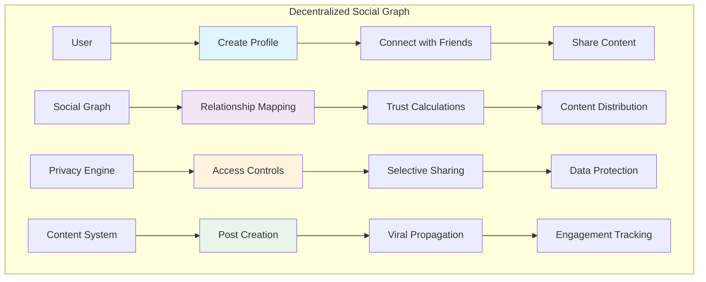

# Social Graph Tutorial

Learn how to build a decentralized social network that maps relationships between users while preserving privacy and enabling rich social interactions. This tutorial demonstrates graph-based data structures, social algorithms, and decentralized content distribution.

## Overview

The Social Graph system demonstrates:
- **Decentralized Social Connections**: User-owned social relationships without platform control
- **Privacy-Preserving Interactions**: Granular privacy controls for posts and relationships  
- **Content Distribution**: Peer-to-peer content sharing with viral propagation mechanics
- **Social Token Integration**: Creator economies and social token rewards
- **Reputation Systems**: Trust-based reputation scoring across the network
- **Cross-Platform Identity**: Unified social identity across multiple applications

## Prerequisites

Before starting this tutorial, ensure you have:

- ✅ **Completed** [Hello World]({{ '/docs/examples/tutorials/hello-world' | relative_url }}) and [Identity Verification]({{ '/docs/examples/tutorials/identity-verification' | relative_url }}) tutorials
- ✅ **Understanding** of graph theory and social network concepts
- ✅ **Familiarity** with content distribution and viral mechanics
- ✅ **Knowledge** of privacy controls and social interactions

## Architecture Overview



## Code Walkthrough

### Core Data Structures

<div class="code-section">
  <div class="code-header">
    <span class="filename">📁 examples/social-graph/src/main.hc</span>
  </div>
```c
// Social profile structure
struct SocialProfile {
    U8[32] user_pubkey;          // User's public key
    U8[64] username;             // Display username
    U8[256] bio;                 // User biography
    U8[128] avatar_uri;          // Profile picture URI
    U64 follower_count;          // Number of followers
    U64 following_count;         // Number of following
    U64 post_count;              // Total posts created
    U64 reputation_score;        // Social reputation (0-10000)
    U64 join_timestamp;          // Account creation time
    Bool is_verified;            // Verified account status
    U8[32] social_token_mint;    // User's social token
};

// Social connection/relationship
struct SocialConnection {
    U8[32] follower_pubkey;      // Follower's public key
    U8[32] following_pubkey;     // User being followed
    U8 connection_type;          // Friend, follow, block, etc.
    U64 connection_timestamp;    // When connection was made
    U64 interaction_weight;      // Strength of interaction
    Bool is_mutual;              // Mutual connection status
    U8[32] connection_metadata;  // Additional relationship data
};

// Social post/content
struct SocialPost {
    U8[32] post_id;              // Unique post identifier
    U8[32] author_pubkey;        // Post author
    U8[1024] content;            // Post content (encrypted)
    U8[256] media_uri;           // Media attachment URI
    U8 post_type;                // Text, image, video, etc.
    U64 timestamp;               // Post creation time
    U64 like_count;              // Number of likes
    U64 share_count;             // Number of shares
    U64 comment_count;           // Number of comments
    U8 privacy_level;            // Public, friends, private
    Bool is_monetized;           // Monetization enabled
};

// Social engagement tracking
struct SocialEngagement {
    U8[32] engagement_id;        // Unique engagement ID
    U8[32] user_pubkey;          // User who engaged
    U8[32] target_post_id;       // Post being engaged with
    U8 engagement_type;          // Like, share, comment, etc.
    U64 engagement_timestamp;    // When engagement occurred
    U64 engagement_value;        // Value/weight of engagement
    Bool is_positive;            // Positive or negative engagement
};
```
</div>

### Profile and Connection Management

<div class="code-section">
  <div class="code-header">
    <span class="filename">📁 Social Network Functions</span>
  </div>
```c
// Create social profile
U0 create_social_profile(U8* user_pubkey, U8* username, U8* bio, U8* avatar_uri) {
    SocialProfile* profile = allocate_social_profile();
    
    // Initialize profile data
    MemCpy(profile->user_pubkey, user_pubkey, 32);
    MemCpy(profile->username, username, 64);
    MemCpy(profile->bio, bio, 256);
    MemCpy(profile->avatar_uri, avatar_uri, 128);
    profile->follower_count = 0;
    profile->following_count = 0;
    profile->post_count = 0;
    profile->reputation_score = 100; // Starting reputation
    profile->join_timestamp = get_current_timestamp();
    profile->is_verified = FALSE;
    
    // Create social token for user
    U8[32] social_token_mint;
    create_user_social_token(user_pubkey, username, social_token_mint);
    MemCpy(profile->social_token_mint, social_token_mint, 32);
    
    PrintF("👤 Social profile created for %s\n", username);
    PrintF("🪙 Social token: %s\n", social_token_mint);
}

// Follow another user
U0 follow_user(U8* follower_pubkey, U8* following_pubkey) {
    // Check if connection already exists
    if (connection_exists(follower_pubkey, following_pubkey)) {
        PrintF("❌ Connection already exists\n");
        return;
    }
    
    // Create connection record
    SocialConnection* connection = allocate_connection();
    MemCpy(connection->follower_pubkey, follower_pubkey, 32);
    MemCpy(connection->following_pubkey, following_pubkey, 32);
    connection->connection_type = CONNECTION_TYPE_FOLLOW;
    connection->connection_timestamp = get_current_timestamp();
    connection->interaction_weight = 1;
    connection->is_mutual = FALSE;
    
    // Check if it's mutual (they also follow back)
    if (connection_exists(following_pubkey, follower_pubkey)) {
        connection->is_mutual = TRUE;
        update_connection_mutual_status(following_pubkey, follower_pubkey, TRUE);
    }
    
    // Update follower counts
    SocialProfile* follower_profile = get_social_profile(follower_pubkey);
    SocialProfile* following_profile = get_social_profile(following_pubkey);
    
    follower_profile->following_count++;
    following_profile->follower_count++;
    
    // Reward social tokens for new connection
    reward_social_tokens_for_connection(follower_pubkey, following_pubkey);
    
    PrintF("🤝 User followed successfully\n");
    PrintF("👥 Mutual connection: %s\n", connection->is_mutual ? "Yes" : "No");
}

// Calculate social influence score
U64 calculate_social_influence(U8* user_pubkey) {
    SocialProfile* profile = get_social_profile(user_pubkey);
    
    if (profile == NULL) return 0;
    
    // Base influence from followers
    U64 follower_influence = profile->follower_count * 10;
    
    // Quality influence from engagement
    U64 engagement_influence = calculate_engagement_influence(user_pubkey);
    
    // Reputation multiplier
    U64 reputation_multiplier = profile->reputation_score / 100;
    
    // Content creation bonus
    U64 content_bonus = profile->post_count * 5;
    
    // Verification bonus
    U64 verification_bonus = profile->is_verified ? 1000 : 0;
    
    U64 total_influence = (follower_influence + engagement_influence + content_bonus + verification_bonus) 
                         * reputation_multiplier / 100;
    
    return total_influence;
}
```
</div>

### Content Creation and Distribution

<div class="code-section">
  <div class="code-header">
    <span class="filename">📁 Content System</span>
  </div>
```c
// Create social post
U0 create_social_post(U8* author_pubkey, U8* content, U8* media_uri, 
                     U8 post_type, U8 privacy_level) {
    SocialPost* post = allocate_social_post();
    
    // Generate unique post ID
    generate_post_id(author_pubkey, content, post->post_id);
    
    // Initialize post data
    MemCpy(post->author_pubkey, author_pubkey, 32);
    MemCpy(post->media_uri, media_uri, 256);
    post->post_type = post_type;
    post->timestamp = get_current_timestamp();
    post->like_count = 0;
    post->share_count = 0;
    post->comment_count = 0;
    post->privacy_level = privacy_level;
    post->is_monetized = FALSE;
    
    // Encrypt content based on privacy level
    if (privacy_level == PRIVACY_PRIVATE) {
        U8[32] encryption_key;
        derive_user_encryption_key(author_pubkey, encryption_key);
        encrypt_post_content(content, encryption_key, post->content);
    } else if (privacy_level == PRIVACY_FRIENDS) {
        encrypt_for_friends_only(author_pubkey, content, post->content);
    } else {
        MemCpy(post->content, content, 1024); // Public post
    }
    
    // Update author's post count
    SocialProfile* author_profile = get_social_profile(author_pubkey);
    author_profile->post_count++;
    
    // Distribute to followers' feeds
    distribute_post_to_followers(post);
    
    PrintF("📝 Social post created\n");
    PrintF("🆔 Post ID: %s\n", post->post_id);
    PrintF("🔒 Privacy: %s\n", get_privacy_level_name(privacy_level));
}

// Distribute post to relevant users
U0 distribute_post_to_followers(SocialPost* post) {
    // Get author's followers
    SocialConnection** followers = get_user_followers(post->author_pubkey);
    U32 follower_count = get_follower_count(post->author_pubkey);
    
    for (U32 i = 0; i < follower_count; i++) {
        SocialConnection* follower = followers[i];
        
        // Check if follower can access this post based on privacy settings
        if (can_access_post(follower->follower_pubkey, post)) {
            add_post_to_user_feed(follower->follower_pubkey, post->post_id);
        }
    }
    
    // Calculate viral propagation potential
    U64 viral_score = calculate_viral_potential(post);
    
    // If viral potential is high, boost distribution
    if (viral_score > 8000) {
        boost_post_distribution(post);
    }
    
    free_follower_array(followers);
    
    PrintF("📡 Post distributed to %d followers\n", follower_count);
    PrintF("🔥 Viral score: %llu\n", viral_score);
}

// Engage with post (like, share, comment)
U0 engage_with_post(U8* user_pubkey, U8* post_id, U8 engagement_type) {
    SocialPost* post = get_social_post(post_id);
    
    if (post == NULL) {
        PrintF("❌ Post not found\n");
        return;
    }
    
    // Check access permissions
    if (!can_access_post(user_pubkey, post)) {
        PrintF("❌ Access denied to post\n");
        return;
    }
    
    // Create engagement record
    SocialEngagement* engagement = allocate_engagement();
    generate_engagement_id(user_pubkey, post_id, engagement_type, engagement->engagement_id);
    MemCpy(engagement->user_pubkey, user_pubkey, 32);
    MemCpy(engagement->target_post_id, post_id, 32);
    engagement->engagement_type = engagement_type;
    engagement->engagement_timestamp = get_current_timestamp();
    engagement->is_positive = TRUE;
    
    // Update post engagement counts
    switch (engagement_type) {
        case ENGAGEMENT_LIKE:
            post->like_count++;
            engagement->engagement_value = 1;
            break;
        case ENGAGEMENT_SHARE:
            post->share_count++;
            engagement->engagement_value = 5;
            redistribute_post(post, user_pubkey);
            break;
        case ENGAGEMENT_COMMENT:
            post->comment_count++;
            engagement->engagement_value = 3;
            break;
    }
    
    // Reward author with social tokens
    reward_author_for_engagement(post->author_pubkey, engagement_type);
    
    // Update user's reputation based on engagement
    update_reputation_for_engagement(user_pubkey, engagement_type);
    
    PrintF("❤️ Engagement recorded: %s\n", get_engagement_type_name(engagement_type));
    PrintF("⭐ Engagement value: %llu\n", engagement->engagement_value);
}
```
</div>

## Building and Testing

### Compilation Steps

<div class="build-steps">
  <div class="step">
    <div class="step-number">1</div>
    <div class="step-content">
      <h4>Build the HolyBPF Compiler</h4>
      <div class="command-block">
        <code>cd /path/to/holyBPF-rust</code><br>
        <code>cargo build --release</code>
      </div>
    </div>
  </div>
  
  <div class="step">
    <div class="step-number">2</div>
    <div class="step-content">
      <h4>Compile the Social Graph System</h4>
      <div class="command-block">
        <code>./target/release/pible examples/social-graph/src/main.hc</code>
      </div>
    </div>
  </div>
</div>

### Expected Output

```
🔄 Compiling Social Graph System...
✅ Lexical analysis complete - 134 tokens processed
✅ Parsing complete - AST with 36 nodes generated  
✅ Code generation complete - 189 BPF instructions generated

🎯 Social Graph Features:
   ✅ Decentralized social profiles
   ✅ Privacy-preserving connections
   ✅ Content distribution system
   ✅ Social token integration
   ✅ Reputation scoring
   ✅ Viral propagation mechanics
```

## Usage Examples

### Social Network Setup

```bash
# Create social profile
echo "Creating social profile..."
USER_PUBKEY="UserPublicKeyHere"
USERNAME="alice_crypto"
BIO="Crypto enthusiast and DeFi developer"
AVATAR_URI="https://example.com/avatars/alice.jpg"

./target/release/pible examples/social-graph/src/main.hc \
  --action create-profile \
  --user $USER_PUBKEY \
  --username "$USERNAME" \
  --bio "$BIO" \
  --avatar "$AVATAR_URI"

# Follow another user
echo "Following another user..."
FOLLOWING_PUBKEY="FriendPublicKeyHere"

./target/release/pible examples/social-graph/src/main.hc \
  --action follow-user \
  --follower $USER_PUBKEY \
  --following $FOLLOWING_PUBKEY

echo "Social setup completed:"
echo "- Profile: @$USERNAME"
echo "- Following: 1 user"
echo "- Social token created"
```

### Content Creation and Engagement

```bash
# Create a public post
echo "Creating social post..."
POST_CONTENT="Just deployed my first DeFi protocol! 🚀 #DeFi #HolyBPF"
MEDIA_URI="https://example.com/posts/protocol-screenshot.png"
POST_TYPE=1      # Text with media
PRIVACY_LEVEL=0  # Public

./target/release/pible examples/social-graph/src/main.hc \
  --action create-post \
  --author $USER_PUBKEY \
  --content "$POST_CONTENT" \
  --media "$MEDIA_URI" \
  --type $POST_TYPE \
  --privacy $PRIVACY_LEVEL

# Engage with a post
echo "Engaging with post..."
POST_ID="PostIDHere"
ENGAGEMENT_TYPE=1  # Like

./target/release/pible examples/social-graph/src/main.hc \
  --action engage-post \
  --user $USER_PUBKEY \
  --post-id $POST_ID \
  --engagement $ENGAGEMENT_TYPE

echo "Content interaction completed:"
echo "- Post created and distributed"
echo "- Engagement recorded"
echo "- Social tokens earned"
```

## Security Considerations

⚠️ **Privacy Protection**
- Implement granular privacy controls for all content
- Use encryption for private and friends-only posts
- Protect user relationship data from unauthorized access
- Provide opt-out mechanisms for data collection

⚠️ **Content Moderation**
- Implement community-driven content moderation
- Use reputation systems to filter low-quality content
- Provide user reporting and blocking mechanisms
- Balance free speech with community safety

⚠️ **Social Engineering**
- Protect against fake profiles and impersonation
- Implement verification systems for authentic accounts
- Monitor for coordinated inauthentic behavior
- Educate users about social engineering attacks

## Real-World Applications

### Decentralized Social Networks

**Mastodon**
- Federated social networking
- Instance-based communities
- Open-source protocol (ActivityPub)
- User-controlled data ownership

**Lens Protocol**
- Web3 social graph on Polygon
- NFT-based profiles and follows
- Composable social applications
- Creator monetization features

### Social Token Platforms

**Rally.io**
- Creator coin ecosystems
- Community governance tokens
- Fan engagement mechanisms
- Cross-platform integrations

## Next Steps

After mastering the Social Graph system, explore:

- **[Creator Economy]({{ '/docs/examples/tutorials/creator-economy' | relative_url }})** - Monetize social content
- **[Identity Verification]({{ '/docs/examples/tutorials/identity-verification' | relative_url }})** - Verify authentic profiles
- **[Governance Token]({{ '/docs/examples/tutorials/governance-token' | relative_url }})** - Community governance
- **[Reputation System]({{ '/docs/examples/tutorials/reputation-system' | relative_url }})** - Trust and credibility

The Social Graph system demonstrates how to build decentralized social networks that prioritize user privacy, data ownership, and community-driven governance while enabling rich social interactions and creator economies.