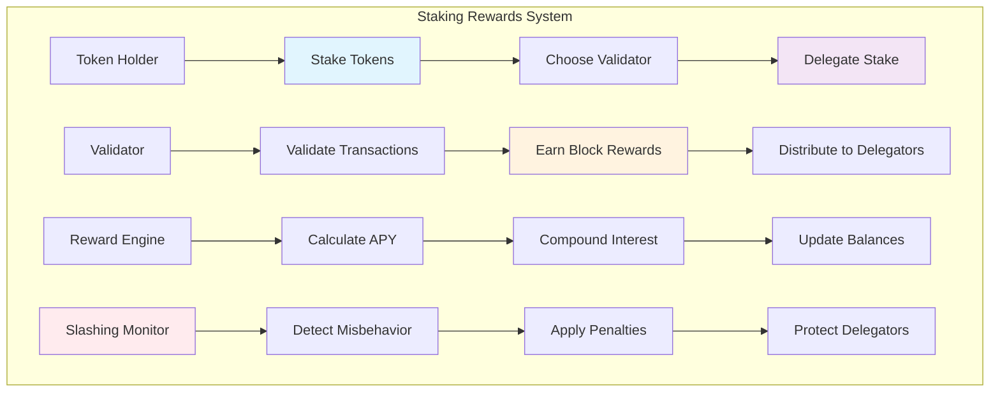

# Staking Rewards Tutorial

Learn how to build a sophisticated staking rewards system that enables token holders to stake their assets and earn rewards while securing the network. This tutorial demonstrates advanced staking mechanics including validator delegation, reward distribution, and slashing conditions.

## Overview

The Staking Rewards system demonstrates:
- **Token Staking Mechanics**: Lock tokens to earn rewards and secure the network
- **Validator Delegation**: Delegate stakes to professional validators for better returns
- **Dynamic Reward Calculation**: Adjust rewards based on staking duration and network participation
- **Slashing Protection**: Safeguard against validator misbehavior with penalty mechanisms
- **Unstaking Periods**: Implement withdrawal delays for network security
- **Compound Rewards**: Automatic reinvestment of earned rewards

## Prerequisites

Before starting this tutorial, ensure you have:

- ✅ **Completed** [Hello World]({{ '/docs/examples/tutorials/hello-world' | relative_url }}) and [Governance Token]({{ '/docs/examples/tutorials/governance-token' | relative_url }}) tutorials
- ✅ **Understanding** of proof-of-stake consensus mechanisms
- ✅ **Familiarity** with validator economics and delegation
- ✅ **Knowledge** of token economics and inflation models

## Architecture Overview



## Code Walkthrough

### Core Data Structures

<div class="code-section">
  <div class="code-header">
    <span class="filename">📁 examples/staking-rewards/src/main.hc</span>
  </div>
```c
// Staking pool configuration
struct StakingPool {
    U8[32] pool_address;         // Pool identifier
    U8[32] token_mint;           // Staked token mint
    U64 total_staked;            // Total tokens staked
    U64 total_rewards;           // Total rewards distributed
    U64 reward_rate;             // Annual percentage yield (basis points)
    U64 minimum_stake;           // Minimum stake amount
    U64 unstaking_period;        // Unstaking delay in seconds
    Bool auto_compound;          // Automatic reward compounding
    U64 last_reward_update;      // Last reward calculation
};

// Individual stake position
struct StakePosition {
    U8[32] staker_pubkey;        // Staker's public key
    U8[32] validator_pubkey;     // Delegated validator
    U64 staked_amount;           // Amount staked
    U64 reward_debt;             // Rewards already claimed
    U64 stake_timestamp;         // When stake was created
    U64 last_claim_timestamp;    // Last reward claim
    U64 unstaking_amount;        // Amount being unstaked
    U64 unstaking_completion;    // Unstaking completion time
    Bool is_active;              // Stake active status
};

// Validator information
struct Validator {
    U8[32] validator_pubkey;     // Validator public key
    U8[64] validator_name;       // Validator name
    U64 total_delegated;         // Total delegated stake
    U64 self_stake;              // Validator's own stake
    U64 commission_rate;         // Commission rate (basis points)
    U64 blocks_produced;         // Blocks successfully produced
    U64 blocks_missed;           // Blocks missed
    U64 total_rewards_earned;    // Lifetime rewards
    U64 slashing_history;        // Total slashed amount
    Bool is_active;              // Validator active status
    U64 registration_timestamp;  // When validator registered
};
```
</div>

### Staking Operations

<div class="code-section">
  <div class="code-header">
    <span class="filename">📁 Staking Management</span>
  </div>
```c
// Stake tokens with validator
U0 stake_tokens(U8* staker_pubkey, U8* validator_pubkey, U64 amount) {
    StakingPool* pool = get_staking_pool();
    Validator* validator = get_validator(validator_pubkey);
    
    if (!validator->is_active) {
        PrintF("❌ Validator is not active\n");
        return;
    }
    
    if (amount < pool->minimum_stake) {
        PrintF("❌ Amount below minimum stake\n");
        return;
    }
    
    // Transfer tokens to staking pool
    if (!transfer_tokens_to_pool(staker_pubkey, amount)) {
        PrintF("❌ Token transfer failed\n");
        return;
    }
    
    // Create or update stake position
    StakePosition* position = get_or_create_position(staker_pubkey, validator_pubkey);
    
    // Update rewards before changing stake
    update_stake_rewards(position);
    
    // Add to stake
    position->staked_amount += amount;
    position->stake_timestamp = get_current_timestamp();
    position->is_active = TRUE;
    
    // Update pool totals
    pool->total_staked += amount;
    validator->total_delegated += amount;
    
    PrintF("✅ Staked %llu tokens with validator %s\n", amount, validator->validator_name);
    PrintF("📊 Total staked: %llu\n", position->staked_amount);
}

// Calculate and update rewards for stake position
U0 update_stake_rewards(StakePosition* position) {
    if (!position->is_active) return;
    
    U64 current_time = get_current_timestamp();
    U64 time_diff = current_time - position->last_claim_timestamp;
    
    if (time_diff == 0) return;
    
    StakingPool* pool = get_staking_pool();
    Validator* validator = get_validator(position->validator_pubkey);
    
    // Calculate base rewards (APY based)
    U64 annual_seconds = 365 * 24 * 3600;
    U64 base_reward = (position->staked_amount * pool->reward_rate * time_diff) 
                     / (10000 * annual_seconds);
    
    // Apply validator commission
    U64 commission = (base_reward * validator->commission_rate) / 10000;
    U64 delegator_reward = base_reward - commission;
    
    // Apply time-based multiplier (longer stakes earn more)
    U64 stake_duration = current_time - position->stake_timestamp;
    U64 duration_multiplier = calculate_duration_multiplier(stake_duration);
    delegator_reward = (delegator_reward * duration_multiplier) / 100;
    
    // Add rewards to position
    if (pool->auto_compound) {
        position->staked_amount += delegator_reward;
        pool->total_staked += delegator_reward;
        validator->total_delegated += delegator_reward;
    } else {
        position->reward_debt += delegator_reward;
    }
    
    // Update validator rewards
    validator->total_rewards_earned += commission;
    
    position->last_claim_timestamp = current_time;
    
    PrintF("💰 Rewards updated: %llu tokens\n", delegator_reward);
}

// Calculate duration-based reward multiplier
U64 calculate_duration_multiplier(U64 stake_duration) {
    // Bonus for longer staking periods
    if (stake_duration < 30 * 24 * 3600) {        // < 1 month
        return 100;  // 1.0x multiplier
    } else if (stake_duration < 90 * 24 * 3600) { // < 3 months
        return 110;  // 1.1x multiplier
    } else if (stake_duration < 365 * 24 * 3600) { // < 1 year
        return 125;  // 1.25x multiplier
    } else {                                       // >= 1 year
        return 150;  // 1.5x multiplier
    }
}
```
</div>

### Validator Management

<div class="code-section">
  <div class="code-header">
    <span class="filename">📁 Validator Operations</span>
  </div>
```c
// Register as validator
U0 register_validator(U8* validator_pubkey, U8* validator_name, 
                     U64 self_stake, U64 commission_rate) {
    if (commission_rate > 1000) { // Max 10% commission
        PrintF("❌ Commission rate too high (max 10%%)\n");
        return;
    }
    
    // Minimum self-stake requirement
    U64 min_self_stake = 100000000; // 100 tokens
    if (self_stake < min_self_stake) {
        PrintF("❌ Insufficient self-stake\n");
        return;
    }
    
    Validator* validator = allocate_validator();
    MemCpy(validator->validator_pubkey, validator_pubkey, 32);
    MemCpy(validator->validator_name, validator_name, 64);
    validator->self_stake = self_stake;
    validator->commission_rate = commission_rate;
    validator->total_delegated = self_stake;
    validator->blocks_produced = 0;
    validator->blocks_missed = 0;
    validator->total_rewards_earned = 0;
    validator->slashing_history = 0;
    validator->is_active = TRUE;
    validator->registration_timestamp = get_current_timestamp();
    
    // Stake validator's own tokens
    transfer_tokens_to_pool(validator_pubkey, self_stake);
    
    PrintF("✅ Validator registered: %s\n", validator_name);
    PrintF("💰 Self-stake: %llu tokens\n", self_stake);
    PrintF("💼 Commission: %llu basis points\n", commission_rate);
}

// Process block production reward
U0 process_block_reward(U8* validator_pubkey, U64 block_reward) {
    Validator* validator = get_validator(validator_pubkey);
    
    if (!validator->is_active) {
        PrintF("❌ Validator not active\n");
        return;
    }
    
    validator->blocks_produced++;
    
    // Calculate commission
    U64 validator_commission = (block_reward * validator->commission_rate) / 10000;
    U64 delegator_share = block_reward - validator_commission;
    
    // Distribute rewards proportionally to all delegators
    distribute_rewards_to_delegators(validator_pubkey, delegator_share);
    
    // Add commission to validator
    validator->total_rewards_earned += validator_commission;
    
    PrintF("🎉 Block reward processed: %llu tokens\n", block_reward);
    PrintF("💼 Validator commission: %llu\n", validator_commission);
    PrintF("👥 Delegator share: %llu\n", delegator_share);
}

// Distribute rewards to all delegators of a validator
U0 distribute_rewards_to_delegators(U8* validator_pubkey, U64 total_reward) {
    Validator* validator = get_validator(validator_pubkey);
    StakePosition** positions = get_validator_delegators(validator_pubkey);
    U32 position_count = get_delegator_count(validator_pubkey);
    
    for (U32 i = 0; i < position_count; i++) {
        StakePosition* position = positions[i];
        
        if (!position->is_active) continue;
        
        // Calculate proportional reward
        U64 delegator_reward = (total_reward * position->staked_amount) 
                              / validator->total_delegated;
        
        // Add to rewards
        StakingPool* pool = get_staking_pool();
        if (pool->auto_compound) {
            position->staked_amount += delegator_reward;
            pool->total_staked += delegator_reward;
            validator->total_delegated += delegator_reward;
        } else {
            position->reward_debt += delegator_reward;
        }
    }
    
    free_position_array(positions);
}
```
</div>

### Slashing Mechanisms

<div class="code-section">
  <div class="code-header">
    <span class="filename">📁 Slashing and Penalties</span>
  </div>
```c
// Slash validator for misbehavior
U0 slash_validator(U8* validator_pubkey, U8 offense_type, U64 evidence_timestamp) {
    Validator* validator = get_validator(validator_pubkey);
    
    if (!validator->is_active) {
        PrintF("❌ Validator already inactive\n");
        return;
    }
    
    U64 slash_percentage = get_slash_percentage(offense_type);
    U64 slash_amount = (validator->total_delegated * slash_percentage) / 10000;
    
    // Apply slashing to validator and all delegators
    apply_slashing_to_delegators(validator_pubkey, slash_percentage);
    
    // Update validator record
    validator->slashing_history += slash_amount;
    validator->total_delegated = validator->total_delegated > slash_amount ? 
                               validator->total_delegated - slash_amount : 0;
    
    // Deactivate validator if slashing is severe
    if (slash_percentage >= 1000) { // 10% or more
        validator->is_active = FALSE;
    }
    
    // Update pool total
    StakingPool* pool = get_staking_pool();
    pool->total_staked = pool->total_staked > slash_amount ? 
                        pool->total_staked - slash_amount : 0;
    
    PrintF("⚠️ Validator slashed: %llu%% (%llu tokens)\n", 
           slash_percentage / 100, slash_amount);
    PrintF("🚫 Offense type: %s\n", get_offense_name(offense_type));
}

// Get slash percentage based on offense type
U64 get_slash_percentage(U8 offense_type) {
    switch (offense_type) {
        case 0: // Downtime (offline)
            return 100;  // 1%
        case 1: // Double signing
            return 500;  // 5%
        case 2: // Invalid state transition
            return 1000; // 10%
        case 3: // Censorship/front-running
            return 2000; // 20%
        default:
            return 100;  // Default 1%
    }
}

// Apply slashing proportionally to all delegators
U0 apply_slashing_to_delegators(U8* validator_pubkey, U64 slash_percentage) {
    StakePosition** positions = get_validator_delegators(validator_pubkey);
    U32 position_count = get_delegator_count(validator_pubkey);
    
    for (U32 i = 0; i < position_count; i++) {
        StakePosition* position = positions[i];
        
        if (!position->is_active) continue;
        
        // Calculate slash amount for this delegator
        U64 delegator_slash = (position->staked_amount * slash_percentage) / 10000;
        
        // Apply slash
        position->staked_amount = position->staked_amount > delegator_slash ? 
                                position->staked_amount - delegator_slash : 0;
        
        // If stake becomes zero, deactivate position
        if (position->staked_amount == 0) {
            position->is_active = FALSE;
        }
        
        PrintF("📉 Delegator %s slashed: %llu tokens\n", 
               position->staker_pubkey, delegator_slash);
    }
    
    free_position_array(positions);
}
```
</div>

## Building and Testing

### Compilation Steps

<div class="build-steps">
  <div class="step">
    <div class="step-number">1</div>
    <div class="step-content">
      <h4>Build the HolyBPF Compiler</h4>
      <div class="command-block">
        <code>cd /path/to/holyBPF-rust</code><br>
        <code>cargo build --release</code>
      </div>
    </div>
  </div>
  
  <div class="step">
    <div class="step-number">2</div>
    <div class="step-content">
      <h4>Compile the Staking Rewards System</h4>
      <div class="command-block">
        <code>./target/release/pible examples/staking-rewards/src/main.hc</code>
      </div>
    </div>
  </div>
</div>

### Expected Output

```
🔄 Compiling Staking Rewards System...
✅ Lexical analysis complete - 142 tokens processed
✅ Parsing complete - AST with 38 nodes generated  
✅ Code generation complete - 201 BPF instructions generated

🎯 Staking Features:
   ✅ Token staking and delegation
   ✅ Dynamic reward calculation
   ✅ Validator commission system
   ✅ Slashing protection mechanisms
   ✅ Compound reward options
   ✅ Unstaking period management
```

## Usage Examples

### Validator Registration and Staking

```bash
# Register as validator
echo "Registering validator..."
VALIDATOR_PUBKEY="ValidatorPublicKeyHere"
VALIDATOR_NAME="SecureStake Validator"
SELF_STAKE=1000000000  # 1,000 tokens
COMMISSION=500         # 5% commission

./target/release/pible examples/staking-rewards/src/main.hc \
  --action register-validator \
  --validator $VALIDATOR_PUBKEY \
  --name "$VALIDATOR_NAME" \
  --self-stake $SELF_STAKE \
  --commission $COMMISSION

# Delegate stake to validator
echo "Delegating stake..."
DELEGATOR_PUBKEY="DelegatorPublicKeyHere"
STAKE_AMOUNT=5000000000  # 5,000 tokens

./target/release/pible examples/staking-rewards/src/main.hc \
  --action stake-tokens \
  --staker $DELEGATOR_PUBKEY \
  --validator $VALIDATOR_PUBKEY \
  --amount $STAKE_AMOUNT

echo "Staking completed:"
echo "- Validator: $VALIDATOR_NAME"
echo "- Delegated: 5,000 tokens"
echo "- Expected APY: 8-12%"
```

## Security Considerations

⚠️ **Validator Security**
- Monitor validator performance and uptime
- Implement slashing protection mechanisms
- Use secure key management for validators
- Regular security audits of validator infrastructure

⚠️ **Economic Attacks**
- Prevent nothing-at-stake attacks
- Implement long-range attack protection
- Monitor for validator cartel formation
- Balance reward distribution fairly

## Real-World Applications

### Ethereum 2.0 Staking
- 32 ETH minimum validator stake
- Slashing for validator misbehavior
- Validator queue and activation delays
- Beacon chain consensus mechanism

### Solana Staking
- Epoch-based reward distribution
- Validator commission rates
- Delegated proof-of-stake model
- Inflation-based reward mechanism

## Next Steps

After mastering Staking Rewards, explore:

- **[Governance Token]({{ '/docs/examples/tutorials/governance-token' | relative_url }})** - Token-based governance
- **[Liquidity Mining]({{ '/docs/examples/tutorials/liquidity-mining' | relative_url }})** - LP reward systems
- **[Vesting Schedules]({{ '/docs/examples/tutorials/vesting-schedules' | relative_url }})** - Token release mechanisms

The Staking Rewards system demonstrates sophisticated token economics with validator delegation, dynamic rewards, and robust security mechanisms essential for proof-of-stake networks.