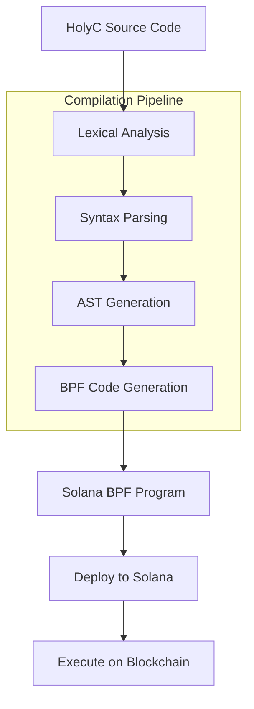
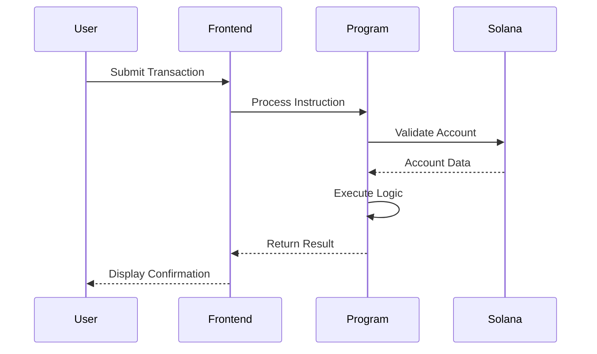
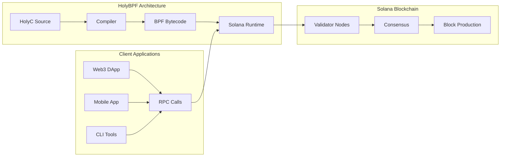

# Markdown & Mermaid Test Page

This page demonstrates the enhanced markdown rendering and mermaid diagram support implemented for the HolyBPF documentation website.

## Typography Tests

### Headings

# Heading 1
## Heading 2  
### Heading 3
#### Heading 4
##### Heading 5
###### Heading 6

### Text Formatting

This is **bold text** and this is *italic text*. You can also use ~~strikethrough~~ and `inline code`.

### Links and Emphasis

Here's a [link to GitHub](https://github.com/pibleos/holyBPF-rust) and here's some **important information** that should stand out.

## Code Examples

### Inline Code

Use `cargo build` to compile the project or call `solana deploy` for deployment.

### Code Blocks

```rust
// HolyC to Rust interop example
pub fn hello_world() -> Result<(), ProgramError> {
    msg!("Hello, World from HolyBPF!");
    Ok(())
}

#[derive(Debug, Clone, Copy)]
pub struct Account {
    pub owner: Pubkey,
    pub lamports: u64,
    pub data: Vec<u8>,
}
```

```holyc
// HolyC BPF Program
U0 main() {
    PrintF("Hello from HolyC!\n");
    return 0;
}

export U0 entrypoint(U8* input, U64 input_len) {
    process_instruction(input, input_len);
    return;
}
```

```bash
# Build and deploy commands
cargo build-bpf
solana program deploy target/deploy/program.so
solana logs --follow
```

## Lists

### Unordered Lists

- First item with **bold text**
- Second item with *italic text*
- Third item with `inline code`
  - Nested item one
  - Nested item two
    - Double nested item

### Ordered Lists

1. **Set up development environment**
   - Install Rust
   - Install Solana CLI
   - Configure keypair
2. **Write your program**
   - Define data structures
   - Implement business logic
   - Add error handling
3. **Test and deploy**
   - Run unit tests
   - Deploy to devnet
   - Verify functionality

### Task Lists

- [x] Enhanced markdown rendering
- [x] Mermaid diagram support
- [x] Improved typography
- [ ] Advanced code highlighting
- [ ] Interactive examples
- [ ] Video tutorials

## Tables

| Feature | Status | Priority | Notes |
|---------|--------|----------|--------|
| **Markdown Rendering** | ✅ Complete | High | All standard markdown supported |
| **Mermaid Diagrams** | ✅ Complete | High | Flowcharts, sequence, and more |
| **Code Highlighting** | ✅ Complete | Medium | Rust, HolyC, Bash support |
| **Responsive Design** | ✅ Complete | High | Mobile-friendly layouts |
| **Table Styling** | ✅ Complete | Medium | Enhanced visual presentation |

## Blockquotes

> **Important Note**: This is a blockquote demonstrating the enhanced styling with proper typography and visual hierarchy.

> The essence of programming is not the language but the logic and creativity that drives innovation. 
> 
> — Terry A. Davis (inspiration for HolyC)

## Mermaid Diagrams

### Flowchart Example



### Sequence Diagram



### Architecture Diagram



## Alert Boxes

<div class="alert alert-info">
<strong>Info:</strong> This is an informational alert showing important details about the implementation.
</div>

<div class="alert alert-warning">
<strong>Warning:</strong> Make sure to test your programs thoroughly before deploying to mainnet.
</div>

<div class="alert alert-success">
<strong>Success:</strong> Your markdown rendering is now working perfectly with enhanced styling!
</div>

<div class="alert alert-danger">
<strong>Danger:</strong> Never commit private keys or sensitive information to version control.
</div>

## Badges and Tags

<span class="badge badge-primary">New Feature</span>
<span class="badge badge-secondary">Documentation</span>
<span class="badge badge-primary">Mermaid</span>
<span class="badge badge-secondary">Markdown</span>

## Mathematical Expressions

While not implemented yet, mathematical expressions could be added with MathJax:

- `E = mc²`
- `f(x) = ax² + bx + c`
- Complex algorithms and proofs

## Images and Media


## Horizontal Rules

Content above the rule.

---

Content below the rule.

## Summary

This test page demonstrates:

1. **Enhanced Typography** - Better fonts, spacing, and hierarchy
2. **Improved Code Blocks** - Syntax highlighting and better styling  
3. **Rich Tables** - Professional table styling with hover effects
4. **Mermaid Diagrams** - Full support for flowcharts, sequences, and more
5. **Alert Boxes** - Styled notification blocks
6. **Task Lists** - Interactive checkboxes
7. **Responsive Design** - Mobile-friendly layouts

The documentation website now provides a professional, clean, and highly readable experience for developers learning HolyBPF.